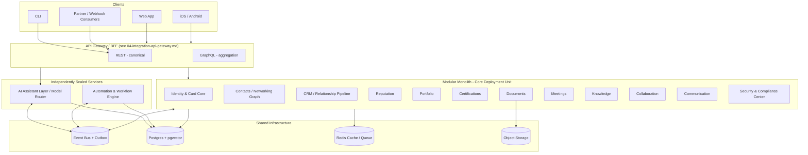

# System Architecture

> Status: v0.1 · Owner: Architecture · Last updated: 2026-06-30 · Formalized in [ADR-0004](../adr/0004-service-decomposition-boundary.md)

## 1. Decision: Modular Monolith with an Event-Bus Contract

### 1.1 Alternatives Considered

**Option A — Modular Monolith.** Single deployable; each of the twelve pillars (§Product Philosophy) is an internal module/package with enforced boundaries (lint-level "no reaching into another module's internals"); one database, schema-per-module.
- *Advantages*: simplest operations; cheap at low scale; cross-module transactions (e.g., CRM touching Contacts touching Identity) are trivial single-DB transactions; fastest path to v1.
- *Disadvantages*: scales as a whole, not per-module; a noisy module (e.g., AI inference) can starve others sharing the same process/host; team-scaling friction past roughly 15-20 engineers working in one codebase.

**Option B — Microservices per Module.** Each module is an independently deployed service with its own datastore, communicating over the network.
- *Advantages*: independent scaling and deploys; fault isolation; natural team-ownership boundaries.
- *Disadvantages*: distributed transactions/sagas required for cross-module consistency (deleting a Person must fan out to CRM, Networking, and the Security audit log); large operational surface (service mesh, per-service observability, latency budgets); premature complexity at low user counts — the majority of failure modes seen in early-stage platforms that pick this option are self-inflicted operational complexity, not genuine scale need.

**Option C — Modular Monolith with Event-Bus Contract (recommended).** Internally structured like Option A, but every module communicates with every other module *only* through (1) a small set of synchronous internal APIs for read-heavy cross-module lookups, and (2) an event bus with the transactional outbox pattern for everything else (state changes, automation triggers, audit logging, AI context invalidation).
- *Advantages*: the inter-module **contract** is microservice-shaped from day one (no module ever does a raw cross-schema join), while the **deployment** stays monolith-shaped until a specific module's load profile justifies extraction — which is usually the AI/inference workload first, because its latency and resource profile (GPU/long-running calls) differs sharply from CRUD modules. Extracting a module later is a deployment and infra change, not a contract rewrite.
- *Disadvantages*: requires sustained engineering discipline (a tempting shortcut DB join across module schemas must be caught in code review/lint); the outbox pattern adds a small latency/complexity tax even at small scale.

### 1.2 Recommendation

**Option C.** It is the only option that satisfies "scale from 1 user to 100M users without a major rewrite" (see [`06-scalability-strategy.md`](06-scalability-strategy.md)) without paying Option B's operational tax before the data justifies it, or accepting Option A's eventual scaling wall.

## 2. Service / Module Map

Identity & Card Core is drawn first because every other module reads from it; it is never extracted independently in v1 because nearly every request touches it (extraction would just relocate the bottleneck, not remove it).

## 3. Deployment Topology

- **v1 (0 – ~50K users)**: single-region, modular monolith deployed as a small number of horizontally-scaled stateless instances behind a load balancer; AI Assistant Layer and Automation Engine deployed as separate worker pools from day one (queue-driven, not request-driven) because their latency/resource profile already differs — this is the one extraction made early, since it costs little and prevents AI/automation load from ever degrading core CRUD latency.
- **v2 (~50K – 5M users)**: read replicas for the primary datastore; cache tier in front of hot reads (identity lookups, card renders); horizontal autoscaling tied to queue depth for AI/automation workers; see [`06-scalability-strategy.md`](06-scalability-strategy.md) for the full tiering model and triggers.
- **v3 (5M+ users / enterprise multi-region)**: selective extraction of any module whose load profile diverges (candidates ranked by likelihood: AI inference already extracted; Communication/notification fan-out next most likely; CRM/Networking least likely given their transactional coupling to Identity); multi-region data residency per [ADR-0012](../adr/0012-multi-region-data-residency.md).

## 4. Extension Points

- New pillar modules (the brief's "marketplace modules") register into the Core deployment unit using the same internal-API + event-bus contract as the original twelve — no special-cased integration path.
- Any module can be extracted to its own deployment without changing its public contract, because the contract was never a raw DB join to begin with.
- Future infrastructure (a different event bus, a different cache, a different cloud) swaps behind the `Infra` layer's abstractions without touching module code — see [`08-tech-stack-options-matrix.md`](08-tech-stack-options-matrix.md).

## 5. Complexity, Debt, and Risk Notes

- **Estimated complexity**: medium for v1 (modular monolith is the simpler operational choice); the complexity is front-loaded into *module boundary discipline*, not infrastructure.
- **Technical debt risk**: the realistic failure mode is boundary erosion — an engineer takes a shortcut cross-schema join under deadline pressure. Mitigation: schema-per-module with DB-user-level permission enforcement (not just lint/convention), so a violation fails at the database layer, not just code review.
- **Scalability**: addressed in depth in [`06-scalability-strategy.md`](06-scalability-strategy.md).
- **Security**: module boundary enforcement is also a security boundary — it limits blast radius of a compromised module. See [`05-security-privacy-compliance.md`](05-security-privacy-compliance.md).
