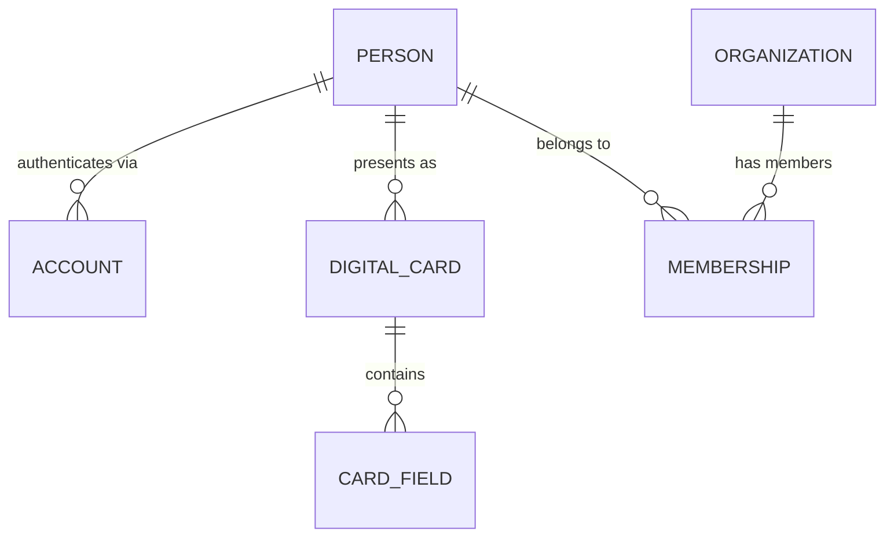

# Data Architecture

> Status: v0.1 · Owner: Architecture · Last updated: 2026-06-30 · Formalized in [ADR-0001](../adr/0001-multi-tenant-data-isolation.md) and [ADR-0002](../adr/0002-primary-datastore-and-vector-strategy.md)

## 1. Multi-Tenancy Strategy

### 1.1 Alternatives Considered

**Option A — Row-Level Security (RLS), shared schema.** Every tenant-scoped table carries a `tenant_id`; Postgres RLS policies enforce isolation at the database layer regardless of application-layer bugs.
- *Advantages*: cheapest to operate (one schema, one set of migrations); easiest cross-tenant analytics for platform operators; scales to a very large number of small tenants (the dominant case here: most tenants are individuals or small teams) without per-tenant provisioning overhead.
- *Disadvantages*: a single large/noisy tenant can affect others sharing the table; RLS policy bugs are a real, audited risk class; harder to give one enterprise tenant a bespoke retention or residency policy without extra plumbing.

**Option B — Schema-per-tenant.** Each tenant gets its own Postgres schema, same database.
- *Advantages*: stronger isolation than RLS without separate databases; per-tenant backup/restore is possible; easier to reason about for compliance audits.
- *Disadvantages*: migrations must run against every schema (operationally painful at thousands of tenants); connection/catalog overhead grows with tenant count; awkward for the individual-user-as-tenant case where most tenants are tiny.

**Option C — Database-per-tenant.** Each tenant (or each enterprise tenant) gets a dedicated database/cluster.
- *Advantages*: strongest isolation, simplest "delete all of this tenant's data" story, enables genuine per-tenant data residency.
- *Disadvantages*: highest operational cost; unworkable as the default for millions of individual-user tenants; connection pooling and cross-tenant platform features (e.g., global search an admin runs across their own org) become hard.

### 1.2 Recommendation: Tiered Hybrid

- **Default tier (individuals, small teams)**: Option A (RLS, shared schema) — this is the overwhelming majority of tenants and must be cheap to create and operate.
- **Enterprise tier (opt-in, contractual)**: Option C (database-per-tenant), selected explicitly for customers with hard data-residency or isolation requirements (a sales/compliance-gated decision, not a default). The data model is identical between tiers — only the physical placement differs, enforced by a tenant-routing layer the application code never bypasses.
- Option B is explicitly **not used** — it captures Option C's operational pain without Option A's economics or Option C's isolation guarantee; it is dominated by the hybrid of A and C.

This hybrid is what makes "1 user → 100M users" credible: the default path costs nothing extra per tenant, and the expensive path is opt-in and revenue-gated.

## 2. The Shared Core Entities

Owned exclusively by the **Identity & Card Core** module; every other module references these by ID, never duplicates their fields:

- **Person** — canonical record of a real human (distinct from login/auth identity).
- **Account** — an authentication identity (email+password, SSO, OAuth), many-to-one with Person (a person may have multiple login methods).
- **Organization** — a company/team entity.
- **Membership** — Person↔Organization join with role, title, and date range.
- **DigitalCard** — a presentable identity surface; a Person may hold multiple cards (e.g., "Sales card," "Personal card").



See [`03-data-model/er-overview.md`](../03-data-model/er-overview.md) for the full cross-module diagram.

## 3. The `EntityRef` Polymorphic Reference Pattern

Multiple modules need to point at "some record, in some other module, of some type" without creating a hard foreign-key coupling or duplicating data — e.g., an automation action targeting "this Deal" or "this Contact," or an audit log entry referencing "whatever was changed." Rather than inventing a bespoke polymorphic-reference mechanism per module, the platform defines **one** canonical shape, used everywhere this need arises:

```
EntityRef {
  module: string        // e.g. "crm", "networking", "documents"
  entityType: string     // e.g. "Deal", "Contact", "Document"
  entityId: UUID
}
```

Consumers resolve an `EntityRef` through a single internal **Entity Resolution Service** (a thin internal API, not a direct cross-schema join) that knows how to fetch a minimal display projection (title, URL, owner) for any registered entity type, plus full data when the caller has both the module dependency and the permission to read it. New modules register their entity types with this service; they do not need every other module to know about them.

This pattern is used by:
- **Automation & Workflow Engine** — `ActionNode.target: EntityRef` (see [`03-automation-workflow-engine.md`](03-automation-workflow-engine.md) and the module doc).
- **Security & Compliance Center** — `AuditLogEntry.subject: EntityRef` (see [`05-security-privacy-compliance.md`](05-security-privacy-compliance.md) and the module doc).
- **AI Assistant Layer** — `KnowledgeContextRef` extends `EntityRef` for RAG context sourcing (see [`02-ai-abstraction-layer.md`](02-ai-abstraction-layer.md)).

## 4. Sharding & Read/Write Separation

- **Sharding key**: `tenant_id` for the default (RLS) tier, once a single Postgres primary's write throughput becomes the bottleneck (not before — premature sharding is a common, avoidable source of complexity). Within a shard, all of a tenant's modules co-locate, preserving cheap cross-module transactions.
- **Read/write separation**: read replicas serve read-heavy, latency-tolerant paths (card rendering, network graph browsing, analytics) once replica lag is acceptable for that path; writes and read-your-write-sensitive paths (e.g., "I just created a Deal, show it to me") stay on the primary or use a session-pinned replica.
- **Trigger condition for sharding** (explicit, not hand-waved): when a single primary's sustained write throughput exceeds roughly 70% of provisioned capacity at peak, or when a single tenant's data volume materially degrades shared-tenant query latency — whichever comes first.

## 5. Vector / Embeddings Strategy

### 5.1 Alternatives Considered

**Option A — Postgres + pgvector (single engine) — recommended for v1.** Embeddings live alongside relational data in the same database.
- *Advantages*: one engine to operate; transactional consistency between a record and its embedding (no eventual-consistency window); lowest initial operational burden; reuses existing backup/HA tooling.
- *Disadvantages*: pgvector's ANN recall/performance trails purpose-built vector databases at very large corpus sizes with tight latency SLOs; vector and relational workloads scale together, not independently.

**Option B — Postgres (relational) + dedicated vector DB (e.g., Pinecone, Weaviate, Qdrant, Milvus).**
- *Advantages*: best-in-class ANN performance/recall at scale; independent scaling from relational workload.
- *Disadvantages*: two sources of truth that must stay in sync; added integration and eventual-consistency complexity; harder to do compound queries ("semantically similar AND tenant-scoped AND permission-filtered") in one round trip.

**Option C — Multi-model platform** (adds a wide-column/global store and/or analytics store alongside A or B as needed).
- *Advantages*: each workload gets the ideal tool.
- *Disadvantages*: highest operational complexity; requires a dedicated data-platform function; premature before real scale pressure exists.

### 5.2 Recommendation

Start with **Option A**, accessed exclusively through a **repository abstraction** (`EmbeddingStore` interface — see [`02-ai-abstraction-layer.md`](02-ai-abstraction-layer.md)) so the storage backend is a configuration/adapter choice, not an application-code dependency. Migrate to **Option B** when an explicit, documented trigger fires: a tenant-shard's embedding corpus exceeds ~50M vectors, or measured p99 semantic-search latency breaches its SLO. This is the concrete mechanism behind "never lock into today's technology" — the seam exists before it is needed, and the trigger for using it is a number, not a feeling.

Every embedding is stored with its **source model identifier and dimensionality** so re-embedding migrations (e.g., moving to a better embedding model) are explicit, tracked operations rather than silent drift.

## 6. Polyglot Persistence Beyond the Primary Store

- **Object storage** (S3-compatible) for binary content — Document module file bodies, card media, certification PDFs — never stored as DB blobs.
- **Cache/queue** (Redis-compatible) for hot-read caching, session state, and the Automation Engine's job queue.
- **Search**: Postgres full-text search by default; see [ADR-0011](../adr/0011-search-and-relevance-architecture.md) for the dedicated-search-engine migration path.

## 7. Privacy, Compliance, and Performance Notes

- Tenant data isolation (§1) is the primary control satisfying GDPR/SOC2 data-segregation expectations; see [`05-security-privacy-compliance.md`](05-security-privacy-compliance.md) for the full compliance posture.
- Right-to-erasure (GDPR Art. 17) is implementable because Person is a single owned record per module-reference pattern — deletion fans out through the event bus to every module via the same `EntityRef` mechanism used for automation/audit, rather than requiring bespoke per-module deletion logic.
- **Technical debt risk**: RLS policy coverage must be tested as rigorously as application logic (a missing policy on a new table is a tenant-isolation breach); this is called out explicitly so it is a checklist item in module delivery, not an afterthought.
