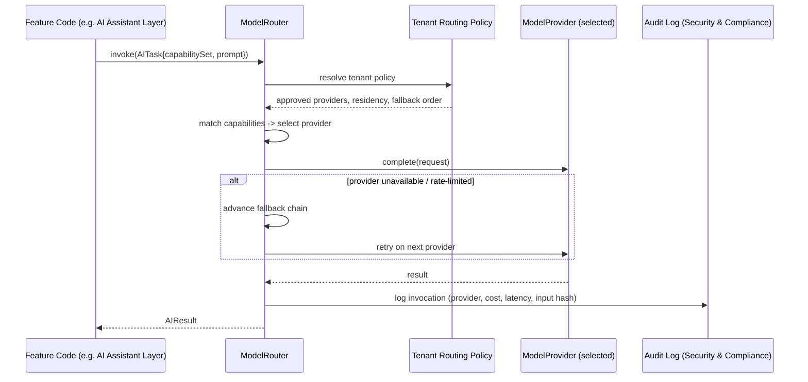

# AI Abstraction Layer

> Status: v0.1 · Owner: Architecture / AI · Last updated: 2026-06-30 · Formalized in [ADR-0005](../adr/0005-ai-model-abstraction-strategy.md)

## 1. Problem Statement

The brief requires support for OpenAI, Anthropic, Google, Meta, local/self-hosted models, enterprise-private models, and **models that do not exist yet**, with the ability to swap providers without rewriting application code, plus per-tenant policy control (an enterprise tenant may require "approved models only" for compliance, or a specific data-residency boundary). A naive integration (calling a provider SDK directly from feature code) makes every one of those requirements expensive to satisfy later. The abstraction layer exists so they are cheap.

## 2. Core Interfaces

```typescript
// Illustrative — not implementation-final; conveys contract shape, not a committed language/runtime.

interface CapabilitySet {
  streaming: boolean
  functionCalling: boolean
  vision: boolean
  jsonMode: boolean
  maxContextTokens: number
  embeddings: boolean
  costTier: "low" | "medium" | "high"
  dataResidency?: string[]        // e.g. ["eu"], constrains routing for residency-bound tenants
}

interface ModelProvider {
  id: string                      // "openai:gpt-4.1", "anthropic:claude-sonnet-4.6", "local:llama-3-70b"
  capabilities: CapabilitySet
  complete(request: CompletionRequest): Promise<CompletionResult | Stream<Chunk>>
  embed(request: EmbeddingRequest): Promise<EmbeddingVector[]>
  healthCheck(): Promise<ProviderHealth>
}

interface RoutingPolicy {
  tenantId: string
  approvedProviders?: string[]     // compliance allow-list, e.g. self-hosted only
  residencyConstraint?: string[]
  costCeiling?: number
  fallbackOrder?: string[]
}

interface ModelRouter {
  register(provider: ModelProvider, policy: RoutingPolicy): void
  route(task: AITask): ModelProvider
  invoke(task: AITask): Promise<AIResult>          // routes, invokes, applies fallback chain
  fallbackChain(task: AITask): ModelProvider[]
}
```



## 3. Capability Negotiation

Every AI task (summarize a meeting, extract fields from a business-card photo, draft a follow-up email, classify a contact's seniority) declares a `CapabilitySet` requirement rather than naming a provider. The router matches requirements against registered providers' declared capabilities **and** the tenant's `RoutingPolicy` — an enterprise tenant might restrict to a self-hosted model for compliance; an individual tenant might just want the cheapest provider that satisfies the capability bar. Provider selection is therefore a per-invocation, per-tenant decision, not a global constant.

## 4. Prompt & Context Management

A `PromptTemplate` + `ContextAssembler` layer sits in front of the router so that prompts are versioned and testable independent of provider: the same logical task ("draft follow-up") compiles to a provider-appropriate message shape (system/user structure differs subtly across providers) without callers writing provider-specific logic. This is also where **RAG context assembly** lives — pulling relevant records (a Contact's history, a Deal's notes, a Knowledge article) into the prompt within a token budget, ranked by relevance via the embeddings abstraction (§5), using `KnowledgeContextRef` (an `EntityRef` extension, see [`01-data-architecture.md`](01-data-architecture.md) §3) to cite sources without copying them.

## 5. Embeddings Abstraction

`EmbeddingProvider` is a separate interface from `ModelProvider` — a tenant may use one provider for completion and a different one for embeddings (e.g., for cost or residency reasons). Embeddings are versioned: every stored vector records its source model ID and dimensionality, so a future re-embedding migration (better model becomes available) is a tracked, explicit operation, not silent drift. The storage backend behind this abstraction is the `EmbeddingStore` referenced in [`01-data-architecture.md`](01-data-architecture.md) §5 (pgvector by default, swappable to a dedicated vector DB at the documented trigger).

## 6. Governance & Policy Layer

Joint with [`05-security-privacy-compliance.md`](05-security-privacy-compliance.md): per-tenant configuration of allowed providers, data-residency constraints, PII redaction before any third-party provider call, and an audit log entry for every AI invocation (input hash — not raw PII — provider used, cost, latency). This is what makes "AI-native" compatible with "enterprise-ready" — the same router that picks the cheapest capable model for an individual also enforces a regulated enterprise's model allow-list, from the same code path.

## 7. Extension Points

- **New provider** = implement `ModelProvider` + declare a `CapabilitySet` manifest. No router code changes.
- **New AI task type** = declare a required `CapabilitySet` + a `PromptTemplate`. No provider code changes.
- **New routing strategy** (e.g., cost-optimizing router, latency-optimizing router, multi-model ensemble/voting) = implement against the same `ModelRouter` contract; tenants can be migrated to a new routing strategy without touching provider integrations.
- **Local/self-hosted models** are first-class `ModelProvider` implementations, not a special case — this is what satisfies "future unknown models" and regulated-industry self-hosting requirements with the same interface.

## 8. Complexity, Risk, and Performance Notes

- **Estimated complexity**: medium-high — the router/policy/fallback logic is non-trivial, but it is built once and amortized across every AI feature in every module, versus the alternative of each module hand-rolling provider logic (much higher aggregate complexity and inconsistency risk).
- **Technical debt risk**: capability manifests drifting out of sync with actual provider behavior (a provider silently changes behavior) — mitigated by periodic automated capability-conformance tests against each registered provider, not just at integration time.
- **Performance**: fallback chains add worst-case latency (multiple sequential attempts); mitigate with aggressive per-provider timeouts and circuit breakers tracked in `ProviderHealth`, not unbounded retries.
- **Privacy**: redaction-before-send is a hard requirement for any non-self-hosted provider call in a regulated tenant — implemented as a pre-router middleware step, not optional per-feature logic.
