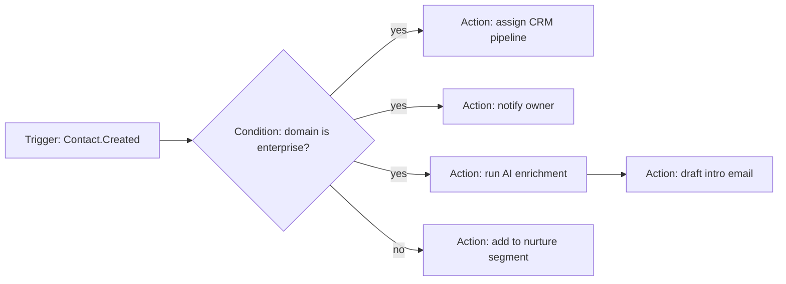

# Automation & Workflow Engine (Architecture)

> Status: v0.1 · Owner: Architecture · Last updated: 2026-06-30 · Formalized in [ADR-0006](../adr/0006-automation-engine-build-vs-adopt.md)
> See also: [`02-modules/automation-workflow-engine/automation-workflow-engine.md`](../02-modules/automation-workflow-engine/automation-workflow-engine.md) for the user-facing product surface built on this engine.

## 1. Core Model: Trigger → Condition → Action, as a DAG

Workflows are not flat single-trigger/single-action rules; they are directed acyclic graphs so they can branch and fan out:

**Trigger types**: event-driven (anything published to the event bus — `Contact.Created`, `Deal.StageChanged`), scheduled/cron, webhook-received (external system pushes in), manual/user-initiated, AI-detected (an AI task determines a condition is met, e.g., "this contact looks like a re-engagement opportunity" — bridging to [`02-ai-abstraction-layer.md`](02-ai-abstraction-layer.md)).

**Action targets** reference any module's entity generically via `EntityRef` (see [`01-data-architecture.md`](01-data-architecture.md) §3) — this is the concrete mechanism that lets the engine stay generic instead of every module building its own bespoke automation logic.

## 2. Build vs. Adopt

### 2.1 Alternatives Considered

**Option A — Temporal-style durable execution engine.**
- *Advantages*: battle-tested durability, retry, and versioning semantics for long-running workflows; strong story for "wait 3 days for a reply, then branch."
- *Disadvantages*: real operational weight (self-hosted Temporal cluster or a managed-Temporal vendor dependency); steeper learning curve; likely overkill when most workflows in this product are short/medium duration.

**Option B — Inngest/n8n-style event-driven function engine.**
- *Advantages*: lighter weight; good developer experience for simple trigger→action chains; some products in this category are embeddable.
- *Disadvantages*: weaker durable-execution guarantees for long-running, human-in-the-loop workflows; n8n in particular is closer to "a visual automation tool you point at your APIs" than "an engine you embed as a first-class platform primitive with deep permission/tenancy integration."

**Option C — Custom DAG executor on the platform's existing event bus + job queue — recommended.**
- *Advantages*: workflow definitions are first-class platform entities (queryable, permissioned, exportable) rather than external-tool configuration; tightest integration with the multi-tenancy and `EntityRef` model; no second source of truth for "what happened" (it's the same event bus and audit log as everything else); reuses infrastructure the modular-monolith architecture already requires (§System Architecture), so it is not "extra" infra.
- *Disadvantages*: durable-execution semantics (retries, effectively-once delivery, long waits) must be built and hardened in-house — genuine engineering investment and a genuine risk of reinventing Temporal's hard-won lessons badly if under-resourced.

### 2.2 Recommendation

**Option C**, explicitly scoped for v1 to short/medium-duration workflows (seconds to a few days) — covering the large majority of relationship-automation use cases (enrichment, follow-up reminders, pipeline assignment). A documented **extension point/escape hatch** swaps the execution backend to Temporal (Option A) once workflow durability needs (very long waits, complex compensation/saga logic across modules) exceed what the custom executor can responsibly handle, without changing the workflow *definition* format users and AI agents already author against. This mirrors the same "defer the expensive decision, keep the seam real" pattern used for the vector-database decision in [`01-data-architecture.md`](01-data-architecture.md) §5 — both decisions name a concrete trigger condition rather than relying on intuition about when to migrate.

**Trigger condition for migrating to Option A**: sustained need for workflow steps that durably wait longer than ~7 days, or workflows requiring multi-step compensation/rollback semantics the custom executor cannot express safely.

## 3. Execution Model

- **WorkflowDefinition** compiles to a DAG of `TriggerConfig` → `ConditionNode` → `ActionNode`.
- **WorkflowRun** is one execution instance, with a `RunStepLog` per node for observability and debugging (surfaced in the module's UX — see the module doc's UX Flow section).
- Execution is queue-driven (the same job-queue infrastructure as AI inference workers — see [`00-system-architecture.md`](00-system-architecture.md) §3), horizontally scalable independent of the core CRUD modules.
- Idempotency: every `ActionNode` execution carries an idempotency key derived from `(WorkflowRun.id, node.id)`, so retries after a worker crash never double-execute a side-effecting action (e.g., never send the same drafted email twice).

## 4. User-Defined Automation

A thin builder UI (detailed in the module doc) authors the same `WorkflowDefinition` format used by system-defined and AI-defined automations — one engine, one data model, satisfying the brief's explicit requirement to avoid bespoke per-module automation logic. AI agents can also *author* workflow definitions (e.g., a user asks an assistant to "remind me to follow up with anyone who hasn't replied in 2 weeks," and the assistant emits a `WorkflowDefinition` rather than a one-off script).

## 5. Extension Points

- New trigger types register against the same `TriggerConfig` contract without engine changes.
- New action types implement an `Action` interface (`execute(context, target: EntityRef)`); any module can contribute action types its own automations or other modules' automations can use.
- The execution backend (§2) is swappable behind the `WorkflowRun` executor interface.

## 6. Risk, Complexity, and Compliance Notes

- **Estimated complexity**: medium for the v1-scoped executor; high if durability requirements are underestimated and the team ends up half-reinventing Temporal under pressure — this is the corpus's single largest "build vs. buy" risk and is called out explicitly so it gets re-evaluated against real usage data, not just assumed correct indefinitely.
- **Security**: action execution must respect the same permission model as a human performing the equivalent action (an automation cannot do something its configuring user couldn't do manually) — enforced by the Security & Compliance Center's policy layer at action-execution time, not just at workflow-creation time.
- **Auditability**: every `WorkflowRun` and `RunStepLog` is itself an auditable event on the same backbone as [`05-security-privacy-compliance.md`](05-security-privacy-compliance.md)'s audit log.
