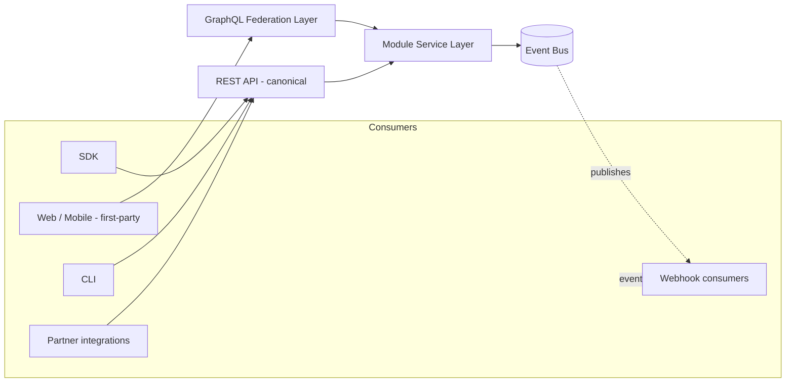

# Integration & API Gateway Strategy

> Status: v0.1 · Owner: Architecture · Last updated: 2026-06-30 · Formalized in [ADR-0003](../adr/0003-api-paradigm.md)

## 1. The Apparent Conflict in the Brief

The brief asks every module to expose REST, GraphQL, Webhooks, SDK, and CLI. Read literally as "fully build and maintain five independent API surfaces per module," this multiplies engineering cost roughly fivefold for no proportional value. The sane reading — and the one this corpus adopts — is that these are five **consumption modes** over one underlying service layer, not five independently authored APIs.

## 2. Alternatives Considered

**Option A — REST + BFF (Backend-for-Frontend) per client.**
- *Advantages*: well-understood; native HTTP caching; simplest tooling; what third-party integrators, CLI consumers, and webhook consumers actually expect by default.
- *Disadvantages*: over-/under-fetching without a tailored BFF; N+1-style problems for cross-module composed views (e.g., a Contact detail screen needing Identity + Reputation + CRM stage + recent Meetings in one view).

**Option B — GraphQL Federation across module subgraphs.**
- *Advantages*: clients fetch exactly the cross-module shape they need in one round trip; each module owns its subgraph, mapping cleanly onto the modular-monolith-with-event-bus boundary (§System Architecture); strong typed contract.
- *Disadvantages*: the federation gateway is an added moving part and failure domain; weaker native caching than REST; many integration/webhook consumers don't want GraphQL at all.

**Option C — Hybrid: REST is canonical, GraphQL is an aggregation layer — recommended.** REST is the system-of-record API for every module (serves SDK, CLI, webhooks, and partner integrations — satisfying the brief's literal per-module REST requirement), generated from the same underlying module service layer / OpenAPI schema that also drives a GraphQL federation layer used specifically by first-party web/mobile clients for composed, cross-module views.
- *Advantages*: resolves the apparent conflict cleanly; integrators get the simple, cacheable, universally-supported surface; first-party clients get the composed-query ergonomics where they actually pay off (cross-module dashboard/detail views); both surfaces are generated from one source of truth rather than hand-maintained twice.
- *Disadvantages*: still two paradigms to operate, mitigated by code generation rather than hand-authored duplication.

## 3. Recommendation

**Option C.** REST is canonical and versioned (`/v1/...`, additive-only within a major version, deprecation policy published per endpoint); GraphQL is additive sugar for first-party composed views, not a second source of truth.

## 4. Webhooks, SDK, CLI

- **Webhooks**: subscriptions to event-bus topics (the same bus used internally — see [`00-system-architecture.md`](00-system-architecture.md)), delivered with signed payloads, retry-with-backoff, and a delivery log visible to the subscribing tenant.
- **SDK**: generated from the REST OpenAPI schema for major languages (TypeScript, Python first; others as demand justifies) — not hand-maintained, to avoid drift.
- **CLI**: a thin wrapper over the SDK, primarily for enterprise admin scripting (provisioning, bulk export, automation management) and developer workflows.

## 5. Versioning Policy

- REST: URL-versioned major versions (`/v1`), additive non-breaking changes within a version, deprecation window published per breaking change (minimum 6 months for enterprise tenants).
- GraphQL: schema evolves additively; federation composition checks in CI prevent a module's subgraph change from silently breaking the composed schema.
- Webhook event payloads: versioned per event type; consumers can pin to a payload version.

## 6. Extension Points

- New consumption modes (e.g., a future protocol) are added as new generators over the same module service layer, not new hand-written integrations.
- New modules (marketplace/third-party) register their service layer the same way core modules do, automatically gaining REST + GraphQL + webhook support.

## 7. Security & Performance Notes

- All external surfaces (REST, GraphQL, webhooks) enforce the same tenant/permission model as internal calls — there is no "integration-only" privilege escape hatch.
- Rate limiting and quota policy are enforced at the gateway layer, tiered by tenant plan, with burst allowances for legitimate bulk operations (CLI-driven imports) distinguished from abuse patterns by request shape, not just volume.
