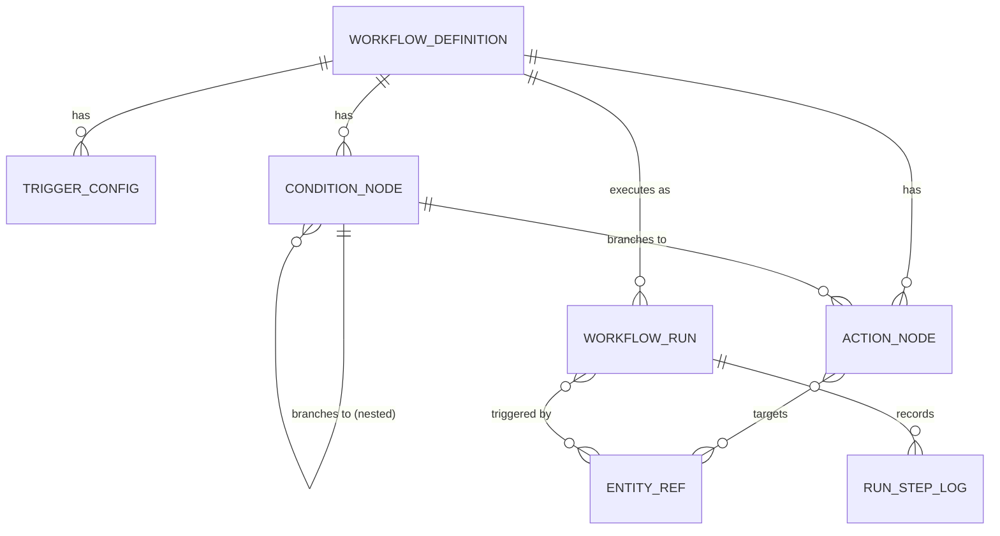
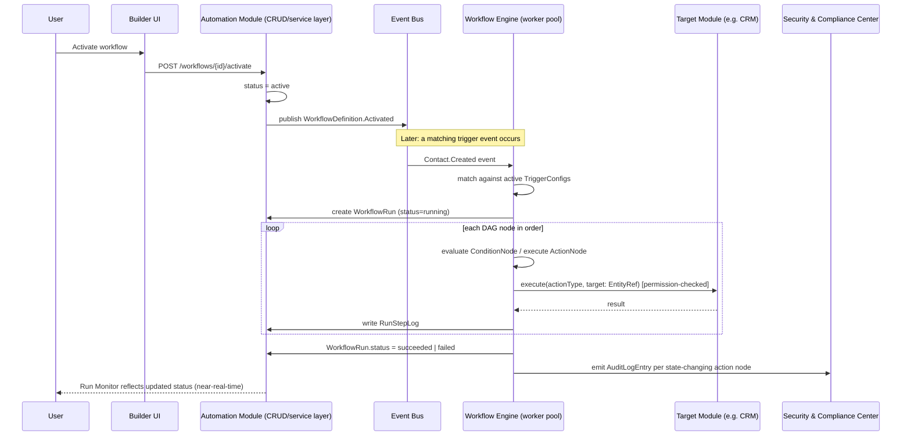

# Automation & Workflow Engine (Module)

> Depth tier: full (18-section) · Status: v0.1 · Owner: Product/Engineering · Last updated: 2026-06-30
> Engine internals (execution model, DAG semantics, Temporal-vs-custom-executor decision) are documented in [`../../01-architecture/03-automation-workflow-engine.md`](../../01-architecture/03-automation-workflow-engine.md). This document is the **product/UX surface**: the workflow builder UI, the template library, run monitoring, and this module's own CRUD API for workflow definitions.

## 1. Business Goal

Let any user — individual, sales rep, or agency team — eliminate the busywork between "something happened" and "I did the routine next step," without writing code or filing a ticket with engineering. This is the platform's concrete expression of the product-philosophy tenet "automate the busywork, not the relationship" ([`00-vision/00-product-philosophy.md`](../../00-vision/00-product-philosophy.md) §4): the engine drafts, reminds, and routes, but a human-configured trust boundary always governs anything that acts on another person's behalf. Commercially, this module is a primary differentiator called out directly in the philosophy doc's differentiation summary — "native trigger→condition→action engine, generic across modules" versus incumbents that have none or bolt on a third-party workflow tool.

## 2. User Story

- **Devon (quota-carrying seller)**: "When a contact enters my pipeline from a conference scan, I want it to automatically get assigned to the right pipeline stage and trigger a personalized follow-up draft, so I spend my time selling, not logging activity." (See [`00-vision/01-personas-and-jtbd.md`](../../00-vision/01-personas-and-jtbd.md) §2.)
- **Lena (agency/team lead)**: "When anyone on my team meets a client, I want a consistent automation — CRM entry, Slack notification to the account owner, and a 48-hour follow-up reminder — applied agency-wide, not reinvented by each employee, so the agency's process is an asset of the business, not tribal knowledge in five people's heads." (§5.)
- **Priya (enterprise admin)**: "When my org enables automation, I want to see and govern every automation that can run against company data — what triggers it, what it touches, who can create one — so a well-meaning employee's automation doesn't become a compliance incident." (§3.)

## 3. Functional Requirements

- Visual, no-code builder to compose a `WorkflowDefinition` as a trigger → condition(s) → action(s) DAG (engine semantics: [`03-automation-workflow-engine.md`](../../01-architecture/03-automation-workflow-engine.md) §1).
- A **template library** of pre-built workflows (e.g., "Auto-assign enterprise-domain contacts," "48-hour follow-up reminder," "Re-engagement nudge after 90 days silent") that can be cloned and customized rather than built from scratch.
- Trigger configuration covering all trigger types the engine supports: event-driven, scheduled/cron, webhook-received, manual/user-initiated, AI-detected.
- Condition nodes evaluating fields on the triggering entity or related entities (via `EntityRef` resolution), with AND/OR branching support matching the DAG's branch semantics.
- Action nodes that target any module's entity generically via `EntityRef` — assign a CRM `Deal` stage, create a `RunStepLog`-visible note, send a notification, trigger an AI task (e.g., draft a follow-up via the [AI Abstraction Layer](../../01-architecture/02-ai-abstraction-layer.md)), or call a registered action type contributed by another module.
- A **run monitor**: list of `WorkflowRun`s (running, succeeded, failed, partially failed) with drill-down to per-node `RunStepLog` detail for debugging.
- Enable/disable/archive a `WorkflowDefinition` without deleting its run history.
- Org-level automation library (Lena's agency case): workflows owned at the Organization scope, visible/runnable by all Members, edit permission gated by role.
- Admin governance surface (Priya's case): an allow-list of which trigger types and action types are permitted org-wide, and visibility into every active automation touching org data (cross-links to [Security & Compliance Center](../security-compliance-center/security-compliance-center.md) for the underlying policy enforcement).
- Manual "run now" / "test run" mode against a single target entity before activating a workflow broadly.
- Versioning: editing an active `WorkflowDefinition` creates a new version; in-flight `WorkflowRun`s continue against the version they started on.

## 4. Non-Functional Requirements

- Builder UI must remain usable (sub-200ms interaction latency) for workflows up to roughly 50 nodes; the DAG canvas is the dominant perceived-performance surface for this module.
- Run monitor list/search must return results in under 1s at 100K+ `WorkflowRun` rows per tenant (requires indexed, paginated queries — see §7).
- Workflow CRUD API: p99 under 300ms (read-heavy: definitions are read far more often than written).
- Execution latency is owned by the engine ([`03-automation-workflow-engine.md`](../../01-architecture/03-automation-workflow-engine.md) §3), not this module; this module's NFR is that run-status updates surface in the monitor UI within 2s of a `RunStepLog` write (near-real-time, not necessarily hard real-time — see §9).
- Template library must scale to hundreds of templates without becoming an unsearchable wall — requires categorization/tagging and search, not just a flat list.
- Tenant isolation: a `WorkflowDefinition` and its `WorkflowRun`s are strictly tenant-scoped; no cross-tenant visibility under any circumstance, consistent with [`01-data-architecture.md`](../../01-architecture/01-data-architecture.md) §1.

## 5. UX Flow

1. User clicks **"New Automation"** from the Automation home (or **"Use a Template"** to start from the template library instead of a blank canvas).
2. Builder opens to an empty DAG canvas with a single **Trigger** node placeholder. User selects a trigger type (e.g., "Contact Created") and configures its scope (e.g., "any contact" vs. "contacts tagged Enterprise").
3. User clicks the `+` connector below the trigger to add a **Condition** node; configures a field comparison (e.g., `contact.domainType == "enterprise"`) and sees the canvas auto-split into "yes" and "no" branches.
4. On the "yes" branch, user adds an **Action** node, picks an action type from a categorized picker (CRM, Notification, AI Task, Communication, etc.), and configures its target — the picker resolves to an `EntityRef`-compatible target (e.g., "the triggering Contact's associated Deal").
5. User adds a second action in parallel on the same branch (fan-out, per the DAG model) — e.g., "notify owner" alongside "assign pipeline stage."
6. User clicks **"Test Run"**, picks a sample existing entity (e.g., a real Contact record) to dry-run against, and reviews a step-by-step preview of what each node would do without committing side effects (where the action type supports a dry-run preview; not all do — see §13).
7. User names the workflow, sets its scope (personal vs. org-wide, for Lena's case), and clicks **"Activate."**
8. Workflow now appears in the **Automation List** view with status "Active," next-trigger-eligible indicator, and a run counter.
9. When the trigger condition fires in production, a new `WorkflowRun` appears in the **Run Monitor**, initially "Running," transitioning to "Succeeded" / "Failed" / "Partially Failed" as `RunStepLog` entries land.
10. User (or Priya, with admin visibility) clicks into a `WorkflowRun` to see the step-by-step log: each node, its input snapshot, output/result, duration, and any error.
11. User can pause, disable, edit (creating a new version), or archive the workflow from the Automation List at any time.
12. Priya, from the **Security & Compliance Center**, can view all org-wide active automations and revoke a specific action-type permission, immediately preventing new runs from executing that action type (existing in-flight runs fail gracefully with a clear `RunStepLog` reason — see [`security-compliance-center.md`](../security-compliance-center/security-compliance-center.md) §5).

## 6. Wireframe Description

**DAG Builder Canvas (primary screen)**

- **Center canvas**: infinite-scroll/zoomable node-graph editor. Nodes are rounded rectangles color-coded by type (Trigger = blue, Condition = amber/diamond, Action = green). Edges are directional connectors; branch points (Condition nodes) visually fork into labeled "Yes"/"No" (or multi-branch) paths rendered as separate downstream columns, mirroring the architecture doc's DAG model.
- **Left rail**: a collapsible node palette — tabs for Triggers, Conditions, Actions — each a searchable, categorized list (Actions grouped by owning module: CRM, Networking, AI, Communication, etc.) that the user drags onto the canvas or adds via the `+` connector affordance.
- **Right inspector panel**: contextual configuration form for the currently-selected node — e.g., selecting an Action node shows a target picker (entity-type dropdown + scope/filter fields resolving to an `EntityRef`), parameter fields specific to that action type, and (where applicable) an AI-assist "describe what you want" text box that pre-fills the form (see §12).
- **Top bar**: workflow name (inline-editable), scope toggle (Personal / Organization — Organization only enabled for users with the relevant role), Save Draft, Test Run, Activate/Deactivate toggle, version history dropdown.
- **Bottom drawer (collapsed by default)**: validation panel — surfaces DAG-level errors before activation (unreachable nodes, a Condition with no "no" branch handling, an Action targeting an entity type the user lacks permission to act on).
- **Test Run overlay**: when invoked, dims the canvas and animates execution left-to-right through the DAG, highlighting each node as it would execute and showing a side panel with simulated input/output per node.

**Template Library (secondary screen)**

- Grid of template cards (icon, name, one-line description, "uses: Trigger X → N actions" summary, category tag, usage-count social proof). Filter sidebar by category (Sales, Agency Ops, Re-engagement, Compliance-safe) and search bar. Clicking a card opens a preview of the DAG (read-only) before "Use This Template" clones it into the builder.

**Run Monitor (secondary screen)**

- Table/list view: workflow name, trigger summary, status badge, started-at, duration, triggering entity (resolved `EntityRef` display name/link). Filterable by workflow, status, date range, and (for Priya) by owning user/org.
- Row expansion or detail-page drill-down shows the `RunStepLog` timeline: vertical stepper, one entry per node, with status icon, duration, and an expandable raw input/output payload viewer for debugging.

## 7. Database Design

This module owns `WorkflowDefinition`, `TriggerConfig`, `ConditionNode`, `ActionNode`, `WorkflowRun`, `RunStepLog`, per the ownership map in [`03-data-model/er-overview.md`](../../03-data-model/er-overview.md) §2.

- **WorkflowDefinition**: `id`, `tenantId`, `ownerScope` (`personal` | `organization`), `ownerId` (Person or Organization), `name`, `description`, `status` (`draft` | `active` | `disabled` | `archived`), `version`, `templateSourceId` (nullable, if cloned from a template), `createdBy`, `createdAt`, `updatedAt`.
- **TriggerConfig**: `id`, `workflowDefinitionId`, `triggerType` (`event` | `cron` | `webhook` | `manual` | `ai_detected`), `eventTopic` (nullable), `cronExpression` (nullable), `webhookSlug` (nullable), `filterExpression` (scope filter, e.g. entity-field predicate).
- **ConditionNode**: `id`, `workflowDefinitionId`, `parentNodeId`, `expression` (field comparison or compound AND/OR tree), `branchLabel`.
- **ActionNode**: `id`, `workflowDefinitionId`, `parentNodeId`, `actionType` (registered action-type identifier, e.g. `crm.assign_stage`, `ai.draft_followup`), `target: EntityRef` (see [`01-data-architecture.md`](../../01-architecture/01-data-architecture.md) §3), `parameters` (JSON, action-type-specific), `idempotencyKeyTemplate`.
- **WorkflowRun**: `id`, `workflowDefinitionId`, `workflowDefinitionVersion`, `triggeringEntity: EntityRef`, `status` (`running` | `succeeded` | `failed` | `partially_failed`), `startedAt`, `completedAt`.
- **RunStepLog**: `id`, `workflowRunId`, `nodeId`, `nodeType`, `status`, `inputSnapshot` (JSON), `outputSnapshot` (JSON), `errorDetail` (nullable), `durationMs`, `executedAt`.

`ActionNode.target` and `WorkflowRun.triggeringEntity` are both `EntityRef` values, resolved at read time through the Entity Resolution Service ([`01-data-architecture.md`](../../01-architecture/01-data-architecture.md) §3) rather than stored as denormalized cross-module foreign keys — this is what lets the Run Monitor display "Contact: Jane Doe" without this module's schema knowing anything about the Networking module's `Contact` table.

## 8. API Design

REST is canonical, per [`04-integration-api-gateway.md`](../../01-architecture/04-integration-api-gateway.md); GraphQL exposes a composed view (e.g., a `WorkflowRun` with its resolved `triggeringEntity` display projection inlined in one query) for first-party web/mobile clients, generated from the same service layer rather than hand-maintained.

| Method & Path | Purpose | Request / Response sketch |
|---|---|---|
| `POST /v1/automation/workflows` | Create a `WorkflowDefinition` (draft) | Req: `{name, ownerScope, triggerConfig, nodes[]}` → Res: `{id, status: "draft", version: 1}` |
| `GET /v1/automation/workflows` | List workflows for the caller's scope | Query: `status`, `ownerScope`, `page` → Res: `{items: [...], nextCursor}` |
| `GET /v1/automation/workflows/{id}` | Fetch full DAG definition | Res: full `WorkflowDefinition` + nested `TriggerConfig`/`ConditionNode`/`ActionNode` tree |
| `PUT /v1/automation/workflows/{id}` | Update definition (creates new version if active) | Req: full DAG payload → Res: `{id, version: n+1}` |
| `POST /v1/automation/workflows/{id}/activate` | Transition draft → active | Res: `{status: "active"}` |
| `POST /v1/automation/workflows/{id}/test-run` | Dry-run against a sample target entity | Req: `{targetEntityRef}` → Res: simulated `RunStepLog[]`, no committed side effects where supported |
| `POST /v1/automation/workflows/{id}/run` | Manual trigger (for `manual` trigger type) | Req: `{targetEntityRef}` → Res: `{workflowRunId}` |
| `GET /v1/automation/runs` | List/search `WorkflowRun`s | Query: `workflowId`, `status`, `dateFrom/To`, `ownerId` (admin) → Res: paginated list |
| `GET /v1/automation/runs/{id}` | Fetch a run with its `RunStepLog` timeline | Res: `WorkflowRun` + ordered `RunStepLog[]` |
| `GET /v1/automation/templates` | Browse the template library | Query: `category`, `search` → Res: paginated `WorkflowDefinition` templates |
| `POST /v1/automation/templates/{id}/clone` | Clone a template into a new draft | Res: `{id, status: "draft"}` |
| `GET /v1/automation/action-types` | List registered action types available to caller's tenant | Res: `[{actionType, owningModule, parameterSchema}]`, filtered by Priya's org-level allow-list |

Webhook trigger registration (`webhookSlug`) reuses the platform's general webhook-receiving infrastructure described in [`04-integration-api-gateway.md`](../../01-architecture/04-integration-api-gateway.md) §4 rather than this module inventing its own inbound-webhook handling.

## 9. Backend Architecture

This module is one internal package within the Modular Monolith ([`00-system-architecture.md`](../../01-architecture/00-system-architecture.md) §1), but its **execution** is handled by the Automation & Workflow Engine, which is deployed as an independently-scaled worker pool from day one (queue-driven, per §3 of the system architecture doc) — this module's service layer is the CRUD/authoring surface in front of that engine, not the engine itself. The module publishes `WorkflowDefinition` change events to the event bus; the engine's executor consumes `TriggerConfig`-matching events from the same bus to schedule runs. No direct synchronous call path exists from "user clicks Activate" to "engine starts executing" — activation just flips a `status` flag and the engine's trigger-matching logic picks it up on the next relevant event, keeping authoring and execution loosely coupled.

**Module-specific architectural decision: how the visual builder's DAG maps to the stored `WorkflowDefinition` format.**

**Option A — JSON-Schema-validated tree.** The builder canvas state serializes to a strict, versioned JSON Schema (nodes as a tree with explicit `parentNodeId` links, no cycles by construction, each node type's `parameters` validated against a per-action-type schema at save time).
- *Advantages*: strong validation at the authoring boundary catches malformed workflows before they ever reach the engine; schema versioning gives a clean migration path when new node types are added; easy to render predictably in the canvas (tree structure maps directly to the branch-column UI in §6); easy for AI-authored workflows (§12) to target, since "produce valid JSON against this schema" is a well-bounded generation task.
- *Disadvantages*: a strict tree is less expressive than a general graph — it cannot natively represent a node with multiple parents (e.g., two different conditions both feeding the same downstream action without duplicating that action node), which some advanced agency-wide workflows (Lena's case) plausibly want.

**Option B — General graph format (arbitrary nodes + edges, DAG validity enforced by a runtime check rather than the storage shape).**
- *Advantages*: strictly more expressive — supports shared downstream nodes, more complex fan-in patterns; closer to how generic workflow tools (n8n-style) model state.
- *Disadvantages*: validation moves from "structurally impossible to construct an invalid shape" to "must be checked," which is a weaker guarantee and a larger surface for subtle bugs (e.g., an accidental cycle slipping past a check); harder for the canvas UI to render predictably (arbitrary graphs need real graph-layout logic, not a simple branch-column layout); materially harder target for AI-authored workflow generation, since the model must reason about a more open-ended structure.

**Recommendation: Option A (JSON-Schema-validated tree) for v1.** The large majority of real automation needs (Devon's pipeline assignment, Lena's agency-wide follow-up cadence) are tree-shaped; the expressiveness gap is real but narrow, and the validation/AI-authorability/UI-predictability advantages dominate at this stage. The schema explicitly reserves a `sharedNodeRef` extension field (unused in v1) as the seam for a future fan-in capability without a storage migration — node-sharing can be added by allowing a node to be referenced by `id` from multiple parents instead of requiring a full migration to Option B. If real usage data shows fan-in/shared-node patterns are common and users are working around the tree constraint by duplicating nodes, that is the concrete trigger to revisit.

**Estimated complexity**: medium — the builder/CRUD surface itself is conventional; the complexity concentrates in keeping the stored DAG format, the canvas rendering model, and the engine's execution contract in lockstep as node types grow. **Technical debt risk**: action-type parameter schemas drifting from what the inspector panel (§6) actually renders, if action-type registration (an extension point per [`03-automation-workflow-engine.md`](../../01-architecture/03-automation-workflow-engine.md) §5) isn't enforced as a single source of truth shared by the builder UI and the validation layer.

## 10. Frontend Architecture

The DAG builder is a stateful client-rendered canvas (not server-rendered, given its interactive drag/zoom/inline-edit requirements) backed by a normalized client-side graph store (nodes/edges keyed by ID) that serializes to the `WorkflowDefinition` JSON-Schema-tree shape (§9) on save — the client's in-memory representation and the persisted representation are intentionally the same shape to avoid a lossy translation layer. The node palette, inspector panel, and validation drawer are decoupled from canvas rendering so the canvas component itself stays focused on layout/interaction and can be reused (e.g., the read-only template-preview canvas in §6 is the same component in a non-editable mode). The Run Monitor and Template Library screens are conventional server-paginated list views, consistent with the rest of the platform's frontend patterns, fetched via the GraphQL aggregation layer where a composed view (run + resolved triggering-entity display projection) saves a round trip.

## 11. Mobile Considerations

The full DAG builder is **not** a mobile-first surface — composing a multi-branch automation graph on a small screen is a poor interaction pattern, consistent with treating the canvas as inherently desktop/tablet-oriented. Mobile apps support: browsing the template library and activating a template as-is (no editing), viewing the Run Monitor and `RunStepLog` detail (read-only, useful for Devon checking on the go whether his follow-up automation fired), and receiving push notifications when a `WorkflowRun` fails (actionable: tap through to the run detail). Editing an existing workflow's simple parameters (e.g., changing a condition's threshold value) without touching the graph topology is a plausible mobile-friendly middle ground, deferred to a future enhancement (§16) rather than v1 scope.

## 12. AI Opportunities

- **AI-suggested automations from observed repetitive behavior.** If the platform detects a user manually performing the same sequence of actions across multiple similar entities (e.g., Devon manually moves every contact tagged "enterprise" to the same pipeline stage and sends a similar note three times in two weeks), an AI task — routed through the [AI Abstraction Layer](../../01-architecture/02-ai-abstraction-layer.md) — proposes a pre-filled `WorkflowDefinition` draft ("It looks like you do this often — want to automate it?") rather than the user having to notice the pattern themselves and build it from scratch. This is the `ai_detected` trigger type's authoring-side counterpart: the same AI-detection capability that can trigger a workflow can also suggest creating one.
- **Natural-language-to-workflow authoring.** A text box ("describe what you want to happen") in the builder (or via an AI Assistant conversation, per the Ai Assistant Layer's `AITaskInvocation` model in [`03-data-model/er-overview.md`](../../03-data-model/er-overview.md)) that compiles a plain-language description into a valid `WorkflowDefinition` draft, which the user then reviews/edits in the canvas before activating — never auto-activated without human review, consistent with the trust-boundary principle in §13. This is explicitly the mechanism called out in [`03-automation-workflow-engine.md`](../../01-architecture/03-automation-workflow-engine.md) §4: AI agents author the same `WorkflowDefinition` format a human author would.
- **AI-assisted condition tuning**: suggesting threshold/filter refinements based on a workflow's run history (e.g., "this condition has matched 0% of runs in 30 days — did you mean `>` instead of `>=`?").

## 13. Security

Module-specific deltas beyond [`05-security-privacy-compliance.md`](../../01-architecture/05-security-privacy-compliance.md) (the canonical RBAC/audit framework):

- **The critical invariant: an automation must never be able to do something its configuring user couldn't do manually.** This is enforced at **action-execution time**, not workflow-creation time — a workflow can be authored (and even activated) referencing an action the creator currently has permission for, but if that permission is later revoked (e.g., Priya disables a role, or the user leaves the org and an org-owned workflow they authored persists per Lena's "leaving-employee data continuity" requirement), the next execution attempt re-checks permission against the *current* effective actor (the workflow's owner/last-activator) at the moment the `ActionNode` runs, not against a cached permission snapshot from creation time. A permission failure at execution time produces a `RunStepLog` entry with status `failed` and a clear reason, not a silent skip.
- Org-level action-type allow-listing (§3, §6) is enforced server-side at both validation time (the builder refuses to let a user add a disallowed action type) and execution time (defense in depth — the engine re-checks the allow-list even if a definition somehow contains a now-disallowed action, e.g., the allow-list changed after activation).
- `EntityRef` targets are resolved through the Entity Resolution Service with the *executing* actor's permission context, not the engine's own elevated service-account context — the engine must never act as a permission-bypass proxy.
- Webhook-triggered workflows authenticate inbound payloads (signature verification) per the gateway's general webhook security posture ([`04-integration-api-gateway.md`](../../01-architecture/04-integration-api-gateway.md) §4) before any trigger-matching occurs.
- Test Run / dry-run mode (§5) must guarantee no committed side effects for side-effecting action types — implemented by requiring each registered action type to declare a `dryRunSupported` capability and a no-op simulation path; action types that cannot safely simulate are clearly labeled "will execute for real" in the Test Run UI rather than silently real-executing.

## 14. Analytics

- Workflow-level: activation rate (drafts that become active), run success/failure/partial-failure rate, average run duration, most-used action types, template-to-active-workflow conversion rate (template library effectiveness).
- Adoption: automations-per-active-tenant, org-wide vs. personal workflow split (signal for Lena's agency use case maturity), time-from-signup-to-first-automation (onboarding funnel health).
- Reliability: per-action-type failure rate (surfaces flaky or poorly-designed action integrations), permission-denial rate at execution time (signal for §13's invariant being exercised, and a leading indicator of role/policy misconfiguration worth surfacing to Priya).
- Feeds the platform's general `MetricSnapshot`/`Dashboard`/`InsightSuggestion` analytics surface ([`03-data-model/er-overview.md`](../../03-data-model/er-overview.md) §3 condensed sketch) rather than maintaining a bespoke analytics store.

## 15. Testing Strategy

- **Builder UI**: component tests for node add/remove/connect interactions; snapshot tests for DAG-to-JSON serialization round-trips (canvas state → `WorkflowDefinition` → canvas state must be lossless).
- **Validation layer**: property-based tests generating random node trees to confirm the JSON-Schema validator rejects all structurally-invalid shapes (cycles, orphaned nodes, missing required parameters) and accepts all valid ones — this is the highest-leverage test surface given §9's reliance on schema validity as a correctness guarantee.
- **Execution integration tests**: full trigger→condition→action runs against a test tenant, asserting `RunStepLog` correctness, idempotency-key behavior on simulated worker-crash-and-retry (per the engine's idempotency guarantee, [`03-automation-workflow-engine.md`](../../01-architecture/03-automation-workflow-engine.md) §3), and permission-revocation-mid-flight behavior (§13's invariant) as an explicit test case, not an afterthought.
- **Cross-module action-type contract tests**: each module contributing an action type (e.g., CRM's `assign_stage`) must pass a conformance suite (declares its parameter schema, dry-run behavior, and idempotency behavior correctly) before being eligible for the action-type registry — prevents a malformed third-party-style integration from corrupting a `WorkflowRun`.
- **Load tests**: Run Monitor list/search query performance at the 100K+ rows/tenant NFR target (§4); builder canvas interaction-latency budget at 50-node DAGs.

## 16. Future Enhancements

- **Recommended Future Feature: Fan-in / shared-node support (Option B-lite extension).** *Why*: real agency-scale usage (Lena) will likely surface workflows where multiple condition branches should converge on one shared downstream action rather than duplicating it. *Business value*: reduces authoring duplication and the maintenance burden of keeping duplicated action nodes in sync, directly serving the agency persona's "consistent process" JTBD. *Technical design sketch*: extend the JSON-Schema tree (§9) with an opt-in `sharedNodeRef` field allowing an `ActionNode` to be referenced by `id` from more than one parent, with the canvas rendering a visual "merge" connector; the validator's cycle-detection logic generalizes from tree-traversal to graph-traversal only for nodes using this field, keeping the common case (no sharing) on the cheaper tree-validation path. *Possible implementation approach*: feature-flagged per tenant, ship to agency-tier tenants first as a controlled rollout. *Dependencies*: usage-data confirmation of real demand (§9's stated trigger condition); canvas graph-layout work beyond the current branch-column model.
- **Recommended Future Feature: Mobile-friendly parameter editing for existing workflows.** *Why*: Devon and Lena both plausibly want to tweak a threshold or notification recipient from a phone without opening the full desktop builder. *Business value*: increases automation iteration velocity (a workflow that's slightly mistuned gets fixed same-day instead of "next time I'm at my laptop"), improving the activation-rate and reliability metrics in §14. *Technical design sketch*: a constrained mobile form view that exposes only leaf-level `parameters` fields of existing nodes (no topology editing, no node add/remove), generated from the same per-action-type parameter schema used by the desktop inspector panel (§6, §9) so no second schema is maintained. *Possible implementation approach*: a dedicated lightweight mobile screen, not a responsive collapse of the full canvas (per §11's reasoning that the canvas itself is not mobile-appropriate). *Dependencies*: stable action-type parameter schema registry (already required by §9); mobile app navigation surface for the Automation module (currently read-mostly per §11).
- **Recommended Future Feature: Workflow simulation against historical data ("backtest").** *Why*: before activating a new automation, users want confidence it would have behaved correctly against real past data, beyond the single-entity Test Run (§5) which only previews one target at a time. *Business value*: reduces activation hesitancy and post-activation surprise failures, directly improving the activation-rate and failure-rate metrics in §14; particularly valuable for Priya evaluating whether a proposed org-wide automation is safe to approve. *Technical design sketch*: run the `WorkflowDefinition`'s trigger-matching and condition logic (without executing side-effecting actions — reusing the dry-run capability from §13) against a bounded historical window (e.g., "the last 500 Contact.Created events") and present aggregate results ("would have fired 47 times, 3 would have failed the permission check"). *Possible implementation approach*: a batch job against the event-bus's retained event log (subject to its retention window) rather than a live execution path; results cached and shown as a one-time report, not a live-updating view. *Dependencies*: event-bus event retention long enough to be useful (an infra/retention-policy decision outside this module's scope); dry-run capability coverage across action types (§13) being broad enough for backtest results to be meaningful.

## 17. Risks

- **Engine durability risk inherited from the architecture decision** ([`03-automation-workflow-engine.md`](../../01-architecture/03-automation-workflow-engine.md) §2.1, §6): if the custom DAG executor is under-resourced relative to real durability needs, this module's "it just works" promise to Devon/Lena erodes — surfaced here because the product surface (Run Monitor, failure notifications) is where users actually experience that risk, even though the fix lives in the engine.
- **Permission-model complexity risk**: §13's execution-time-recheck invariant is conceptually simple but easy to implement incorrectly (e.g., accidentally checking the engine's service-account permissions instead of the configuring/executing user's) — a security-critical correctness requirement riding on application code discipline, not just a database constraint.
- **Template-library quality/trust risk**: a low-quality or misconfigured system template cloned widely could propagate a bad pattern (e.g., an over-broad notification action) across many tenants simultaneously; mitigated by treating template publication as a reviewed, versioned process, not unrestricted self-service for system templates (tenant-authored templates, if added later, would need their own moderation story).
- **DAG-format expressiveness risk**: §9's tree-vs-graph tradeoff is a real bet; if fan-in needs turn out to be common sooner than expected, the JSON-Schema migration, while designed to be additive, still carries non-trivial canvas-rendering rework.

## 18. Open Questions

- Should personal (Mara/Devon-individual-tier) automation quotas differ from org-tier (Lena/Priya) quotas, and if so, is that a plan-tier gate enforced in this module or a billing-layer concern surfaced here?
- What is the right default retention window for `WorkflowRun`/`RunStepLog` history before archival/summarization — full fidelity forever is not viable at scale, but the right cutoff (and whether it's tenant-configurable, relevant for compliance-conscious tenants like Priya's) is undecided.
- Should AI-suggested automations (§12) ever be allowed to auto-activate for high-confidence, low-risk patterns, or is human review-before-activation an absolute floor for all AI-authored workflows regardless of confidence — current default in this doc assumes the latter, but it's worth revisiting once real suggestion-acceptance data exists.
- How does cross-tenant template sharing (e.g., a consultant who builds a great automation wanting to share it publicly, beyond their own org) fit the tenancy model — out of scope for v1 but plausible given the platform's marketplace ambitions ([`00-system-architecture.md`](../../01-architecture/00-system-architecture.md) §4 extension points).
