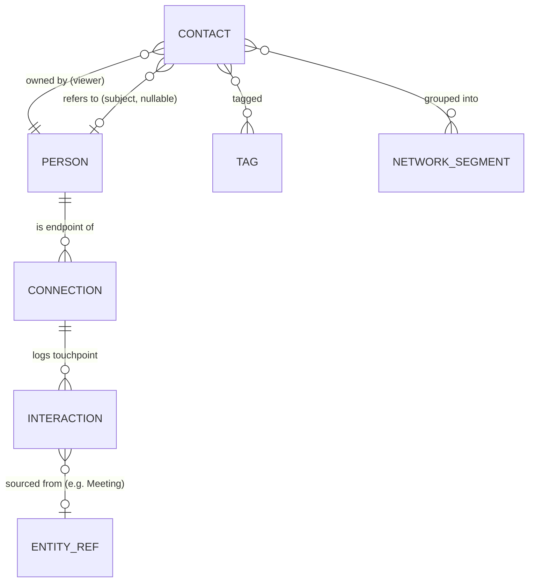
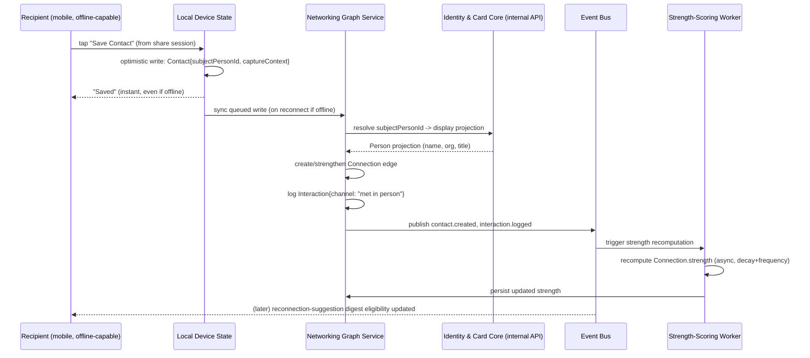

# Module: Contacts / Networking Graph

> Status: v0.1 · Owner: Networking Platform · Last updated: 2026-06-30
> Pillar: Networking (see [`00-vision/00-product-philosophy.md`](../../00-vision/00-product-philosophy.md) §3). Depends on Identity & Card Core's Person entity (see [`identity-card-core.md`](../identity-card-core/identity-card-core.md)); referenced by CRM (deal relationship context) and the AI Assistant Layer (enrichment context), per [`03-data-model/er-overview.md`](../../03-data-model/er-overview.md) §2.

## 1. Business Goal

Turn a captured contact into a living relationship graph instead of a pile of business cards nobody looks at again — the exact failure mode Mara's JTBD names explicitly in [`00-vision/01-personas-and-jtbd.md`](../../00-vision/01-personas-and-jtbd.md) §1. This module is the platform's clearest expression of "the unit of value is not a card was shared, it is a relationship was created, maintained, and made more valuable over time" ([`00-vision/00-product-philosophy.md`](../../00-vision/00-product-philosophy.md) §1): it owns the record of *how* a Person relates to other Persons, *how often* they interact, and *what's changing* in that relationship over time, surfacing intelligence (reconnection prompts, mutual-connection discovery) that a static contacts list never could. It is also the data substrate CRM builds pipeline on top of and the AI layer enriches — every downstream relationship-aware feature in the platform reads from this graph rather than maintaining its own.

## 2. User Story

- **Mara**: "When I meet someone worth remembering, I want them captured into my network automatically — tagged, with the context of where we met — and I want the platform to tell me when I've gone quiet on a relationship I said mattered, so I don't lose six months of conference contacts to silence."
- **Devon**: "When I'm at an event, I want every new contact to flow straight into my pipeline with context (how we met, what we discussed), so I spend my time selling, not logging activity — and I want to see who else at my company already knows this person before I reach out cold."
- **Yusuf**: "When I source a candidate, I want their relationship history with me tracked across multiple roles and years, so I can see I last placed them two years ago and re-engage intelligently instead of cold-restarting."
- **Lena**: "When my team meets people on behalf of the agency, I want shared visibility into the relationship graph — who on my team knows whom, and how strongly — so the agency's network is an asset of the business, not trapped in one employee's head, and it survives that employee leaving."
- **Priya**: "When an employee leaves, I want the org to be able to retain governed visibility into relationships formed on company time, without the platform silently reassigning ownership of someone's personal network."

## 3. Functional Requirements

- Capture a **Contact**: Person A's relationship-scoped view of Person B — distinct from B's own Identity & Card Core Person record (see [Section 7](#7-database-design) for the critical Contact-vs-Person distinction). A Contact is created from a card share, a manual add, an imported list, or a business-card photo scan.
- Maintain a **Connection**: a bidirectional graph edge between two Persons (both of whom may or may not be platform users) with `strength` (a computed/decaying score) and `context` metadata (how they're connected — e.g., "met at SaaStr 2026," "colleagues at Org X").
- Log **Interaction** records: a touchpoint (meeting, call, email, message, manual note) tied to a Connection, with timestamp, channel, and optional summary — the substrate for "you haven't talked to X in 6 months" and AI-drafted follow-ups.
- Support **Tag**s: free-form or org-defined labels applied to Contacts (many-to-many) for ad hoc organization.
- Support **NetworkSegment**s: saved, potentially dynamic groupings of Contacts (e.g., "warm leads," "SaaStr 2026 attendees," "Org X employees") usable as a unit for bulk action or CRM hand-off.
- Surface **relationship intelligence**: reconnection suggestions (decaying-interaction-recency signal), mutual-connection discovery ("Y and Z both know each other" — graph traversal across Connections), and relationship-strength scoring.
- Support contact capture from multiple entry points: card share save (§ identity-card-core flow), manual entry, CSV/vCard import, business-card photo scan (AI-assisted, [Section 12](#12-ai-opportunities)), and CRM-triggered capture (Devon logging a deal contact).
- Org-level relationship visibility and continuity: when an employee with org-owned Memberships leaves, Connections/Interactions formed in an org context can be retained at the org level per policy (Lena/Priya's JTBD), not silently deleted or silently reassigned.
- Expose the graph for cross-module consumption: CRM reads Connection context for Deal relationship intelligence; AI Assistant Layer reads Interaction history as RAG context for drafting follow-ups.

## 4. Non-Functional Requirements

- Contact capture must work fully offline on mobile (the dominant capture context — events, venues with poor signal) and sync per [ADR-0010](../../adr/0010-offline-first-sync-protocol.md); this is this module's defining mobile constraint the way NFC sharing is identity-card-core's.
- Graph traversal queries (mutual-connection discovery, network-segment evaluation) must stay within interactive latency bounds (target: p95 < 500ms for a single-hop mutual-connection query at T2 scale) even as a tenant's Connection count grows into the tens of thousands.
- Relationship-strength scoring recomputation is a background/batch process, not a synchronous request-path cost — staleness of a few hours is acceptable; blocking a page load on it is not.
- Multi-tenancy follows the same tiered hybrid as the rest of the platform ([`01-architecture/01-data-architecture.md`](../../01-architecture/01-data-architecture.md) §1); org-retained Connections/Interactions must be placement-consistent with the owning Organization's tenancy tier, not the individual employee's.
- Contact/Interaction data is Sensitive PII or Internal classification per [`01-architecture/05-security-privacy-compliance.md`](../../01-architecture/05-security-privacy-compliance.md) §2 — see [Section 13](#13-security) for module-specific handling.

## 5. UX Flow

**Contact capture from a card share (the dominant entry point):**
1. User (recipient of a shared DigitalCard) taps "Save Contact" in the Recipient View (see [`identity-card-core.md`](../identity-card-core/identity-card-core.md) §5).
2. A Contact record is created referencing the sharer's Person ID, pre-filled from the scoped card fields the recipient was shown — not a copy of the sharer's full Identity & Card Core record.
3. App prompts a lightweight context capture: "Where did you meet?" (free text or recent-event suggestion) and optional Tag/NetworkSegment assignment — kept to one screen, low friction, skippable.
4. A Connection edge is created (or strengthened, if one already existed) between the two Persons; an Interaction record ("met in person") is logged with the capture timestamp.
5. If offline, steps 2-4 happen against local state and queue for sync per [ADR-0010](../../adr/0010-offline-first-sync-protocol.md); user sees an optimistic "Saved" confirmation immediately.

**Logging an interaction (ongoing relationship maintenance):**
1. User opens a Contact's detail view, taps "Log Interaction."
2. Selects channel (call/meeting/email/message/note), enters optional summary (or accepts an AI-drafted summary if the interaction originated from a Meetings-module-logged call — cross-module via `EntityRef`).
3. Interaction saved; Connection's `strength` score and `lastInteractionAt` recompute (async).

**Reconnection-suggestion surfacing (Mara's "you've gone quiet" JTBD):**
1. Background job evaluates Connections whose `lastInteractionAt` exceeds a decay threshold relative to historical interaction cadence for that relationship.
2. Surfaced as a daily/weekly digest card: "You haven't talked to [Contact] in 6 months — last interaction was [context]."
3. User taps through to Contact detail, can log a new interaction, dismiss, or trigger an AI-drafted reconnection message (hands off to Communication/AI Assistant modules).

**Mutual-connection discovery (Devon's warm-intro JTBD):**
1. Devon views a new Contact's detail page.
2. "Mutual Connections" panel performs a graph traversal: which Persons in Devon's own Connections also have a Connection to this Contact's underlying Person.
3. Each mutual connection shown with relationship-strength indicator, enabling Devon to ask a warm-intro favor instead of cold outreach.

## 6. Wireframe Description

**Network/Contact List screen**: searchable, filterable list (filter by Tag, NetworkSegment, relationship-strength tier, last-interaction recency). Each row: photo, name, current org/title (live-resolved from the underlying Person via Identity & Card Core, not stored redundantly), a relationship-strength indicator (small visual meter, not a raw number), and a "last interaction" relative timestamp. Top bar has a NetworkSegment selector and a prominent "Add Contact" action exposing capture entry points (scan card, manual, import).

**Contact Detail screen**: header mirrors the underlying Person's card-derived display info, with a clear visual distinction (e.g., a label or border treatment) signaling "this is your relationship view, not their live card" — important given the Contact-vs-Person distinction in §7. Below: a chronological Interaction timeline (most recent first), a "Log Interaction" floating action button, a Tags row (add/remove inline), Connection metadata (context, strength, mutual-connections count with expandable panel), and a "View Card" link to the live shared card if still accessible.

**Reconnection Digest** (home/dashboard surface, not full-screen): a horizontally scrollable set of cards, each one Contact with a one-line reason ("6 months since SaaStr 2026") and quick actions (Log Interaction, Dismiss, Draft Message).

**NetworkSegment Manager**: list of saved segments with member count, a toggle for "dynamic" (rule-based, auto-updating membership) vs. "static" (manually curated) segments, and a rule builder for dynamic segments (e.g., "Tag = warm-lead AND lastInteraction < 90 days").

**Org Network View** (Lena/Priya, enterprise): an aggregate view across team members' Contacts where org-policy grants visibility — a table/graph hybrid showing which team members know which external contacts, surfaced specifically to answer "does anyone on my team already know this person."

## 7. Database Design

Contacts / Networking Graph owns Contact, Connection, Interaction, Tag, NetworkSegment, per [`03-data-model/er-overview.md`](../../03-data-model/er-overview.md) §2. The single most important modeling decision in this module: **a Contact is not a duplicate of the other Person's profile.** A Contact is owned by the *viewing* Person and stores that Person's relationship-scoped view (capture context, tags, notes) plus a reference to the other Person's `EntityRef`/ID — it never copies name/title/org fields, which are always live-resolved from Identity & Card Core at read time (or from a point-in-time card snapshot if the other party isn't a platform Person at all — see `unmatchedProfile` below). This is what keeps "one graph, many views" true: two different Persons who both know the same third Person each have their own Contact record, but there is exactly one underlying Person.

Key fields (design-level, not full DDL):

- **Contact**: `id`, `ownerPersonId` (FK, the viewer), `subjectPersonId` (FK, nullable — null if the other party isn't yet a platform Person, e.g., captured from a paper card scan with no platform match), `unmatchedProfile` (JSON snapshot of name/org/contact fields, used only when `subjectPersonId` is null), `captureSource` (`card_share`/`manual`/`import`/`scan`/`crm`), `captureContext` (free text, e.g., "Met at SaaStr 2026"), `ownerOrganizationId` (nullable, set when org-retained per §13), `createdAt`.
- **Connection**: `id`, `personAId`, `personBId` (both FK to Person, the graph edge — symmetric, stored once per pair not twice), `strength` (computed float, decays over time without interaction), `context` (free text/structured, how they're connected), `lastInteractionAt`, `createdAt`.
- **Interaction**: `id`, `connectionId` (FK), `loggedByPersonId` (FK, who logged it — may differ from either endpoint if logged by an org-level user), `channel` (`meeting`/`call`/`email`/`message`/`note`), `summary` (text, optionally AI-drafted), `occurredAt`, `sourceRef` (nullable `EntityRef`, e.g., points to a Meetings-module Meeting if the interaction originated there).
- **Tag**: `id`, `label`, `scope` (`personal`/`organization`), `ownerPersonId` or `ownerOrganizationId`, `colorHint`.
- **ContactTag** (join): `contactId`, `tagId`.
- **NetworkSegment**: `id`, `ownerPersonId` or `ownerOrganizationId`, `name`, `kind` (`static`/`dynamic`), `ruleDefinition` (JSON, only for `dynamic`), `createdAt`.
- **NetworkSegmentMember** (join, only populated for `static` segments; `dynamic` segments evaluate `ruleDefinition` at query time): `segmentId`, `contactId`.

This matches the shared fragment in [`03-data-model/er-overview.md`](../../03-data-model/er-overview.md) §1; the `unmatchedProfile` snapshot and the `subjectPersonId` nullability are module-local detail not promoted to the cross-module diagram, since no other module needs to know about unmatched-contact handling.

## 8. API Design

REST is canonical; GraphQL is the first-party aggregation layer, per [`01-architecture/04-integration-api-gateway.md`](../../01-architecture/04-integration-api-gateway.md). Representative `/v1` endpoints:

| Method & Path | Purpose | Request / Response sketch |
|---|---|---|
| `POST /v1/contacts` | Create a Contact (any capture source) | req: `{subjectPersonId?, unmatchedProfile?, captureSource, captureContext}` → res: `{id, connectionId}` |
| `GET /v1/contacts/{id}` | Fetch Contact detail (live-resolves subject Person) | res: `{id, subject: {resolved Person projection}, tags, connectionStrength, lastInteractionAt}` |
| `GET /v1/contacts?segment={id}&tag={id}` | List/filter Contacts | res: paginated Contact list |
| `POST /v1/connections/{id}/interactions` | Log an Interaction | req: `{channel, summary?, occurredAt, sourceRef?}` → res: Interaction |
| `GET /v1/persons/{id}/connections/{otherId}/mutual` | Mutual-connection discovery | res: `{mutualConnections: [{person, strength}]}` |
| `GET /v1/persons/{id}/reconnection-suggestions` | Reconnection digest | res: array of `{contact, reason, daysSinceInteraction}` |
| `POST /v1/network-segments` | Create a NetworkSegment | req: `{name, kind, ruleDefinition?}` → res: segment |
| `POST /v1/contacts/{id}/tags` | Apply a Tag | req: `{tagId}` → res: updated tag list |
| `POST /v1/contacts/import` | Bulk CSV/vCard import | req: file upload → res: `{jobId}` (async, status polled or webhook-notified) |

GraphQL angle: a Contact Detail screen typically needs the Contact's relationship metadata *plus* the live-resolved Person/DigitalCard projection from Identity & Card Core *plus* recent Interactions *plus*, for a Devon-shaped user, the related CRM Deal — a four-module composed read that is exactly the case [`04-integration-api-gateway.md`](../../01-architecture/04-integration-api-gateway.md) §2 reserves the GraphQL federation layer for; REST stays canonical for CLI-driven bulk import/export, partner integrations, and webhook payloads (e.g., `contact.created`, `interaction.logged` events).

## 9. Backend Architecture

Contacts / Networking Graph is a module in the modular monolith with its own schema, communicating with Identity & Card Core through the synchronous internal Entity Resolution API (resolving `subjectPersonId` to a display projection on every Contact read) and with CRM/Automation/AI Assistant Layer through the event bus (per [`01-architecture/00-system-architecture.md`](../../01-architecture/00-system-architecture.md) §1) — publishing `contact.created`, `connection.strengthened`, `interaction.logged` events that CRM (pipeline context), Automation (reconnection-trigger workflows), and the AI layer (RAG context invalidation) all consume independently.

**Module-specific architectural decision: how is relationship-strength scoring computed?**

- **Option A — Synchronous, on-read computation.** Every time a Connection's strength is requested, compute it live from the Interaction history (recency-weighted frequency, channel-weighted, with decay).
  - *Advantages*: always perfectly fresh; no batch infrastructure; simplest to reason about and to change the scoring formula (no migration of stored values).
  - *Disadvantages*: cost scales with Interaction history length per request; a Contact List screen rendering strength indicators for hundreds of Contacts at once would mean hundreds of on-the-fly aggregations, which does not meet this module's own latency targets (§4) as a tenant's graph grows.
- **Option B — Asynchronous batch/background recomputation, stored score.** A background job (queue-driven, same worker-pool pattern as the AI/Automation extraction in [`01-architecture/00-system-architecture.md`](../../01-architecture/00-system-architecture.md) §3) recomputes `Connection.strength` on a schedule and on-event (new Interaction logged), storing the result for fast reads.
  - *Advantages*: reads are a single indexed lookup; computation cost is amortized and decoupled from request latency; matches the platform's existing pattern of queue-driven workers for non-request-path work.
  - *Disadvantages*: strength can be momentarily stale (acceptable per §4's explicit tolerance); requires recomputation-trigger logic (event-driven recompute on new Interaction, scheduled decay-only recompute otherwise) which is one more moving part.
- **Recommendation**: **Option B.** This module's own non-functional requirement (§4) explicitly accepts hours of staleness for scoring while requiring sub-second graph-traversal reads — that asymmetry is the textbook case for write-time/background computation over read-time computation, and it reuses worker-pool infrastructure the platform already operates for AI/Automation rather than introducing a new execution model.

Graph traversal (mutual-connection discovery) runs as relational self-joins on the Connection table within Postgres for v1 — explicitly *not* a dedicated graph database, consistent with the platform's broader bias against introducing a new datastore before a measured trigger justifies it (mirrors the vector-DB migration posture in [`01-architecture/01-data-architecture.md`](../../01-architecture/01-data-architecture.md) §5). Trigger for revisiting: multi-hop traversal queries (2+ hops, e.g., "second-degree connections") becoming a core product surface with a latency SLO relational self-joins can't meet at the tenant's graph size — at that point a dedicated graph engine (e.g., Neo4j) or a precomputed/cached adjacency-list approach becomes the next evaluation, not before.

**Estimated complexity**: medium. The schema is straightforward; the complexity is concentrated in keeping Contact reads cheap despite always needing a live cross-module Person resolution, and in getting the strength-decay/reconnection-suggestion heuristics tuned well enough to be useful rather than noisy.

**Technical debt risk**: the Contact-vs-Person distinction (§7) is easy to violate under deadline pressure (a future feature quietly caching subject-Person fields on Contact "for performance," recreating the duplicated-profile problem the platform exists to avoid) — mitigated by treating any `unmatchedProfile`-shaped field added to a *matched* Contact (non-null `subjectPersonId`) as a code-review red flag, not just convention.

The contact-capture-to-graph-update flow, from a card-share save through Connection/Interaction creation and async strength recomputation:

## 10. Frontend Architecture

Contact List and Contact Detail are shared components between web and mobile; the capture entry points (scan, NFC-share-triggered save) are mobile-heavy and partly native per [ADR-0009](../../adr/0009-mobile-client-architecture.md). Contact and Interaction state is optimistic-local-first (single-owner data per [ADR-0010](../../adr/0010-offline-first-sync-protocol.md) — a Contact is owned by exactly one viewing Person, so last-write-wins with versioning is sufficient; no CRDT needed). NetworkSegment rule evaluation for `dynamic` segments happens server-side (the rule definition is portable JSON, but evaluation against the live graph isn't meaningfully client-cacheable at scale), with the client treating segment membership as a server-resolved read.

## 11. Mobile Considerations

Offline contact capture is this module's defining mobile requirement, the way NFC sharing is identity-card-core's — per [ADR-0010](../../adr/0010-offline-first-sync-protocol.md), captured Contacts are single-owner data, so the offline path is comparatively simple:

- A Contact created offline (card-share save, manual entry, or photo scan queued for AI extraction) is written to local device state immediately with an optimistic UI confirmation, then queued in the offline-sync outbox.
- On reconnect, queued Contact/Interaction writes sync using last-write-wins with monotonic versioning; because a Contact is single-owner (only the capturing Person ever writes to their own Contact record), genuine conflicts are rare — the realistic conflict case is the *subject* Person's underlying profile having changed since capture, which is resolved by re-resolving the live Person projection on next read rather than a Contact-level merge conflict.
- Business-card photo scanning queues the captured image locally and defers AI extraction (which requires connectivity to reach `ModelRouter`) until reconnect; the user sees a placeholder Contact with `unmatchedProfile` pending extraction, not a blocked UI.
- Reconnection-suggestion digests and mutual-connection discovery are server-computed and require connectivity — these degrade gracefully to "last known" cached results when offline rather than attempting local computation, since the full graph isn't device-resident.
- NetworkSegment dynamic-rule evaluation is unavailable offline (server-side per §10); `static` segments remain browsable from cached membership.

## 12. AI Opportunities

All AI tasks route through `ModelRouter`/`ModelProvider`/`CapabilitySet` per [`01-architecture/02-ai-abstraction-layer.md`](../../01-architecture/02-ai-abstraction-layer.md). Module-specific tasks:

- **AI-assisted Contact extraction from a scanned business-card photo**: a `vision`+`jsonMode` task identical in shape to identity-card-core's own-card extraction (§12 of that doc) but populating `Contact.unmatchedProfile` instead of a DigitalCard — the same AI task type reused by a different calling module, per the extension-point pattern in [`02-ai-abstraction-layer.md`](../../01-architecture/02-ai-abstraction-layer.md) §7. Includes a fuzzy-match step against existing platform Persons (by name/email/org) to offer "this might be [existing Person] — link instead of creating unmatched?" before finalizing.
- **AI-detected reconnection suggestions**: beyond the simple recency-decay heuristic in §5, an LLM-assisted ranking task can incorporate Interaction summaries and Connection context to prioritize *which* stale relationships are worth resurfacing first (e.g., a high-strength relationship that's gone quiet outranks a low-strength one), using `KnowledgeContextRef`-cited Interaction history as RAG context per [`02-ai-abstraction-layer.md`](../../01-architecture/02-ai-abstraction-layer.md) §4.
- **Relationship-strength scoring refinement**: the deterministic decay/frequency formula in §9 is the v1 baseline; an ML-assisted scoring model (potentially a lightweight classifier rather than a full LLM task) could incorporate interaction *quality* signals (sentiment of logged notes, meeting outcomes from the Meetings module) — flagged here as the natural evolution path for the scoring function defined architecturally in §9, not a v1 commitment.
- **AI-drafted reconnection/follow-up messages**: grounded in real Interaction history (not generic), declared as a standard completion task with RAG context assembled from the Connection's Interaction timeline — the draft is always presented for user review/edit before send, consistent with the platform's explicit non-negotiable that automation never sends on a human's behalf without a configured trust boundary ([`00-vision/00-product-philosophy.md`](../../00-vision/00-product-philosophy.md) §4).
- **Mutual-connection-aware warm-intro drafting**: when Devon's mutual-connection panel (§5) surfaces a shared contact, an AI task can draft an intro-request message to the mutual connection, using both parties' relationship context as grounding.

## 13. Security

Module-specific deltas only; platform-wide RBAC, `PolicyBinding`, and audit logging are defined once in [`01-architecture/05-security-privacy-compliance.md`](../../01-architecture/05-security-privacy-compliance.md) and not restated here.

- **Contact and Interaction data is Sensitive PII** by default (§2 of the security doc: "Contact personal details, meeting notes") — `captureContext`, `unmatchedProfile`, and Interaction `summary` fields are the highest-sensitivity content in this module (private notes about a relationship) and are subject to redaction-before-third-party-AI-call by default, not opt-in.
- **Org-retained relationship data** (Lena/Priya's departed-employee continuity requirement, §3) is a `PolicyBinding` scoped via `EntityRef{module: "networking", entityType: "Connection"/"Contact", entityId}` — an org policy can grant the organization read access to relationship data formed by an employee in an org context, but this must be an explicit, disclosed policy configured before or at the time of capture (e.g., surfaced to the employee at org-join time), never a silent retroactive claim, per the "governed by policy, never silently" language in [`00-vision/01-personas-and-jtbd.md`](../../00-vision/01-personas-and-jtbd.md) §"Cross-Persona Tension."
- **The Contact-vs-Person distinction is itself a privacy boundary**: Person A's Contact record (their private notes, tags, capture context about Person B) must never be readable by Person B or surfaced through Person B's own account — it is a one-directional relationship-view record, not a shared document. This is stricter than typical RLS tenant-isolation because it must also hold *within* a tenant when Persons A and B are both members of the same organization tenant.
- **Mutual-connection discovery** is a graph-traversal feature that inherently reveals relationship existence between two other parties to a third party (Devon sees that Y knows Z) — this requires its own visibility rule distinct from standard RBAC: a Connection's existence is discoverable in mutual-connection results only if neither endpoint Person has restricted their Connection visibility, a setting this module must expose explicitly rather than assuming default-visible.
- **Right-to-erasure fan-out**: when a `DataSubjectRequest` originates from Identity & Card Core (per that doc's §13), this module must delete or anonymize Contact/Connection/Interaction records referencing the erased Person — including `unmatchedProfile` snapshots and other parties' Contact records that reference the erased Person as `subjectPersonId` (those Contacts degrade to an `unmatchedProfile`-only state rather than being deleted outright, preserving the *viewer's* relationship history while honoring the *subject's* erasure right).

## 14. Analytics

- Contact capture volume by source (`card_share`/`manual`/`import`/`scan`/`crm`) — signal for which entry points actually drive network growth.
- Capture-to-first-interaction-logged conversion rate (a captured-but-never-engaged Contact is the "pile of business cards" failure mode this module exists to prevent).
- Reconnection-suggestion engagement rate (surfaced → acted-on) — the core metric for whether relationship intelligence is delivering value, not noise.
- Average Connection strength trend over time per tenant (network health indicator).
- Mutual-connection panel usage and warm-intro-message send rate (Devon's JTBD value signal).
- NetworkSegment creation and dynamic-segment rule complexity distribution (signal for whether the segmentation feature is being used as designed or needs simpler defaults).
- Org-retained-relationship policy adoption rate among enterprise tenants (Priya/Lena's feature).

## 15. Testing Strategy

- **Unit**: relationship-strength decay/scoring formula (§9) across a matrix of interaction-recency/frequency/channel combinations; Contact-vs-Person resolution logic (matched vs. `unmatchedProfile` paths).
- **Integration**: Contact capture flow end-to-end against a real schema-per-module test database, including the Identity & Card Core internal-API dependency (mocked and real-integration variants).
- **Isolation/security**: explicit tests asserting Person B can never read Person A's Contact record about them (§13's directional-privacy boundary is the highest-value isolation test in this module, distinct from standard tenant-RLS tests); RLS-policy coverage tests for every new table per the platform-wide release gate.
- **Graph-correctness**: mutual-connection traversal tests against known graph fixtures (verify correctness and that visibility-restricted Connections are correctly excluded per §13).
- **Offline/sync**: contact-capture-while-offline-then-reconnect scenarios, verifying last-write-wins versioning behaves correctly and no duplicate Contacts are created on retry/resync.
- **Load**: graph-traversal query load-tested against the p95 < 500ms target (§4) at representative tenant graph sizes (synthetic graphs at 1K, 10K, 100K Connections per tenant) to validate the relational-self-join approach (§9) before it needs revisiting.

## 16. Future Enhancements

- **Recommended Future Feature — Second-degree (multi-hop) network exploration.** Why: §9 explicitly scoped v1 graph traversal to single-hop mutual-connection queries via relational self-joins; Devon's and Yusuf's JTBDs both extend naturally to "who is two hops away from me that I should ask for an intro to" (classic professional-network value, currently absent). Business value: meaningfully increases the platform's differentiation against LinkedIn's public graph by doing it on a private, owned graph. Technical design sketch: either a precomputed/cached adjacency-list expansion (refreshed async, similar pattern to relationship-strength scoring in §9) for bounded 2-hop queries, or migration to a dedicated graph engine if traversal depth/volume outgrows relational self-joins — exactly the documented trigger condition in §9. Possible implementation approach: start with the cached-adjacency-list approach as a smaller increment before committing to a new datastore; instrument query patterns first to validate real demand depth (most users may only need 1-hop). Dependencies: depends on relationship-visibility settings (§13) being correctly enforced at each hop, since multi-hop traversal compounds the privacy-exposure surface of mutual-connection discovery.
- **Recommended Future Feature — Org-wide relationship heat map / account-based network coverage.** Why: Lena's and Devon's JTBDs both point at a richer version of the Org Network View (§6) — not just "does anyone know this person" but "which target accounts/companies does our org have zero relationship coverage on," a classic account-based-sales gap-analysis view. Business value: directly supports CRM/sales-motion value, a strong upsell surface for the CRM module's enterprise tier. Technical design sketch: aggregate Connection/Contact data by the *organization* of the subject Person (resolved via Identity & Card Core's Membership records) to produce a coverage matrix; computed as a scheduled aggregation job (same worker-pool pattern as §9's strength scoring), not a live query. Possible implementation approach: build as a CRM-module-facing read API first (this module exposes the aggregation, CRM module owns the UI/workflow), keeping the heat-map UI out of this module's own surface area. Dependencies: requires org-level `PolicyBinding` visibility (§13) to already be correctly scoped, and a reasonably complete Membership graph in Identity & Card Core for subject Persons' organizations to be resolvable.
- **Recommended Future Feature — Relationship-decay-aware automated nudges via the Automation Engine.** Why: today's reconnection digest (§5) is a passive surface the user must check; Mara's JTBD ("tell me when I've gone quiet") is better served by a proactive trigger, and the platform already has a generic Automation & Workflow Engine ([`01-architecture/03-automation-workflow-engine.md`](../../01-architecture/03-automation-workflow-engine.md)) this module should plug into rather than building bespoke notification logic. Business value: turns a passive insight into an active retention/engagement driver, and demonstrates the "automate the busywork, not the relationship" tenet concretely. Technical design sketch: `connection.strength_decayed_below_threshold` as a new event-bus topic this module publishes (already has the underlying scoring infrastructure from §9), consumed by a user-configured `WorkflowDefinition` with a `TriggerConfig` on that topic and an `ActionNode` targeting `EntityRef{module: "networking", entityType: "Contact", entityId}` (e.g., action: "draft a reconnection message" or "create a CRM task"). Possible implementation approach: pure integration work against the existing Automation Engine contract — no new execution infrastructure needed in this module, only the new event topic and threshold-crossing detection logic. Dependencies: depends on the Automation & Workflow Engine module's `ActionNode`/`EntityRef` targeting being implemented and stable.

## 17. Risks

- The Contact-vs-Person boundary (§7, §9, §13) is conceptually simple but easy to erode incrementally under feature pressure — it is this module's single most important invariant and the one most likely to be silently violated by a well-intentioned future optimization.
- Relationship-strength scoring and reconnection suggestions are heuristic by nature; a poorly-tuned formula risks becoming noise the user learns to ignore (undermining the entire relationship-intelligence value proposition), or worse, surfacing a stale/awkward reconnection prompt about a relationship that has intentionally lapsed (a sensitivity risk distinct from a pure data-quality risk).
- Mutual-connection discovery and org-wide network visibility features (§13, §16) carry real reputational risk if visibility controls are wrong — revealing that Person A knows Person B to an unauthorized third party is a trust breach with no clean technical undo.
- Org-retained relationship data on employee departure (§13) sits in genuine tension with individual data ownership (the "own your identity" tenet); getting the policy/consent model wrong risks both a compliance problem and a trust problem with the exact individual-professional segment (Mara-like users inside an org) the platform depends on.

## 18. Open Questions

- Should `Connection.strength` and visibility settings be symmetric (both parties see/control the same edge) or can each Person independently restrict visibility of a shared Connection without the other's knowledge — and if asymmetric, how is that reconciled in mutual-connection discovery (§13)?
- What is the default decay curve for relationship-strength scoring (§9), and should it be configurable per-tenant/per-user, or is a single platform-wide default sufficient for v1?
- For org-retained relationships (§13, §16), what is the precise default when an employee departs and no explicit policy was configured at capture time — fully personal (status quo individual ownership), fully org-retained, or blocked pending admin decision?
- Should `unmatchedProfile` Contacts (captured from a non-platform-user) ever be proactively matched/linked automatically when the subject later joins the platform, or should linking always require explicit user confirmation given the privacy sensitivity of silently connecting a paper-card scan to a real platform identity?
- How should NetworkSegment dynamic-rule evaluation be invalidated/recomputed at scale — on every write to a potentially matching Contact (expensive, always fresh) or on a schedule (cheaper, can show stale segment membership)?
