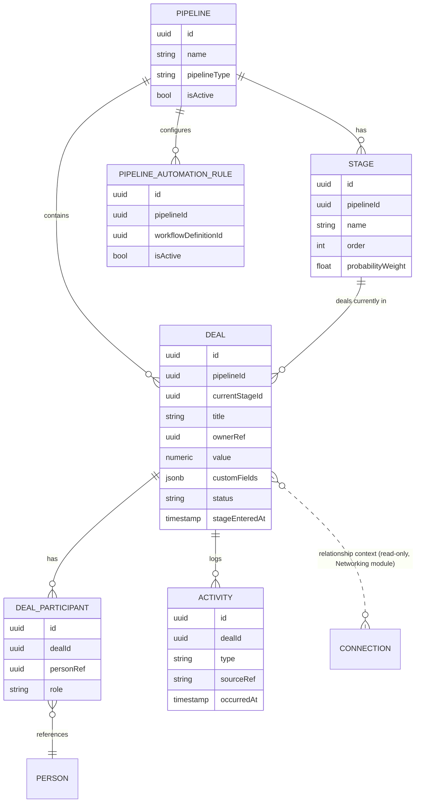
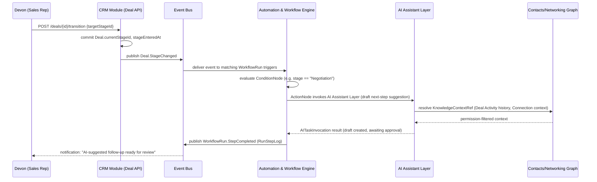

# Module: CRM / Relationship Pipeline

> Status: v0.1 · Owner: Product / Sales Tooling · Last updated: 2026-06-30
> Builds on: [`01-architecture/03-automation-workflow-engine.md`](../../01-architecture/03-automation-workflow-engine.md) (this module's `PipelineAutomationRule` consumes that engine — it does not implement its own), [`01-architecture/01-data-architecture.md`](../../01-architecture/01-data-architecture.md) (shared `Person`/`EntityRef` model), and the Contacts/Networking Graph module (`Connection`, referenced for in-deal relationship context, not re-derived here).

## 1. Business Goal

Give relationship-driven work — sales pipelines, recruiting pipelines, agency client pipelines — a native home on the same identity graph as everything else, instead of forcing a separate CRM tool that duplicates contact data and drifts out of sync. Per [`00-vision/00-product-philosophy.md`](../../00-vision/00-product-philosophy.md) §2, incumbent CRMs (Salesforce, HubSpot) are enterprise-weight and bolt contact acquisition on top of a separate data model; this module is deliberately the opposite — pipeline/stage/deal tracking as a *view and set of actions* over the shared `Person`/`Contact`/`Connection` graph, satisfying Pillar 10 ("CRM — pipeline and relationship-stage management built on the same contact graph, not a separate one," §3). Business value: it is the module most directly responsible for converting "a relationship exists" into "a relationship has commercial or organizational value being tracked," and it is the highest-revenue-relevance module for org-tenant monetization (Devon's and Yusuf's employers pay for seats here).

## 2. User Story

- **Devon** (Quota-Carrying Seller): "When I'm at an event or call, I want every new contact to flow straight into my pipeline with context, so that I spend my time selling, not logging activity." (verbatim JTBD, [`00-vision/01-personas-and-jtbd.md`](../../00-vision/01-personas-and-jtbd.md) §2). Devon needs a `Deal` to be creatable directly from an existing `Contact`/`Connection` with zero re-entry, automation handling follow-up cadence, and fast visibility into who at the account he already knows.
- **Yusuf** (Recruiter / Talent Partner): "When I source a candidate, I want to track their certifications, portfolio, and our relationship history over multiple roles and years, so that I can re-engage them intelligently instead of cold-restarting every search." (verbatim JTBD, §4 of the same doc). Yusuf uses this module with a **Pipeline configured for a recruiting motion** (stages like "Sourced → Screened → Submitted → Offer → Placed") rather than a sales motion — the same `Pipeline`/`Stage`/`Deal` entities, reconfigured, not a separate recruiting-specific schema. A candidate "Deal" persists across multiple roles/years because `DealParticipant` references the same `Person`, letting Yusuf see full history on re-engagement rather than starting cold.
- **Secondary** — **Lena** (Agency/Team Lead) needs shared pipeline visibility across her 5-20 person team and pipeline continuity when an employee leaves (the `Deal`'s `DealParticipant` and `Activity` records belong to the org tenant, not the individual employee's personal data, per the org-tenant model in [`01-architecture/01-data-architecture.md`](../../01-architecture/01-data-architecture.md) §1).

## 3. Functional Requirements

- Users/admins can create custom `Pipeline`s with custom `Stage` sequences (name, order, optional probability-to-close weight, optional stage-entry/exit automation hooks) — no hardcoded "sales" vs. "recruiting" pipeline type; the stage model is generic enough for both (and other relationship-pipeline use cases) without a schema fork.
- A `Deal` belongs to exactly one `Pipeline` and one `Stage` at a time; moving a `Deal` between stages is a first-class, audited action (drag-and-drop in the UI, or API-driven).
- A `Deal` has one or more `DealParticipant`s, each referencing an existing `Person` (never a duplicated name/email/phone field) with a `role` on the deal (e.g., "Economic Buyer," "Champion," "Candidate," "Hiring Manager").
- Users can log `Activity` records against a `Deal` (call, email, meeting, note) manually, or have them created automatically from integrated sources (e.g., a completed `Meeting` from the Meetings module, an `Interaction` from the Networking module) via the event bus.
- Users can view, inline on a `Deal`'s detail screen, existing `Connection` data from the Contacts/Networking Graph module showing relationship context — e.g., "you are connected to 2 people at this account who are not currently `DealParticipant`s" — without this module storing or re-deriving any connection-strength data itself.
- Users/admins can configure `PipelineAutomationRule`s (e.g., "when a Deal sits in Stage X for >14 days with no Activity, notify the owner and suggest a follow-up draft") that compile to a `WorkflowDefinition` on the platform Automation & Workflow Engine — this module never executes its own trigger/condition/action logic.
- Deals support custom fields (per-pipeline-configurable, e.g., "Deal Source," "Expected Close Date," "Candidate Salary Expectation") without a schema migration per tenant.
- Users can filter/sort/report on Deals by stage, owner, value, age-in-stage, and any custom field; a Kanban board view (by stage) and a list/table view are both first-class.
- Deal ownership is reassignable (e.g., territory handoff, employee departure per Lena's continuity need) without losing `Activity` history.

## 4. Non-Functional Requirements

- **Latency**: pipeline board view (Kanban) renders p99 < 200ms for boards up to ~500 active deals, consistent with the platform's card-render/identity-lookup latency target ([`06-scalability-strategy.md`](../../01-architecture/06-scalability-strategy.md) §5); larger boards degrade via pagination/virtualization, not query timeout.
- **Consistency**: stage transitions and the automation triggers they fire must be reliably ordered (a `Deal.StageChanged` event is published only after the transition is durably committed) to avoid automation acting on stale state.
- **Multi-tenancy**: Pipelines, Deals, and Activities are tenant-isolated per the default RLS tier ([`01-data-architecture.md`](../../01-architecture/01-data-architecture.md) §1); org-tenant Deals are visible per `PolicyBinding` scope (e.g., a rep sees only their own Deals unless granted team/org visibility), not a flat org-wide default.
- **Scalability**: Activity volume scales with usage intensity (a high-activity Devon may log dozens of Activities/day per active Deal) independent of Deal count — indexing and the Activity timeline query path must be designed for activity-volume growth, not just deal-count growth.
- **Data integrity**: deleting/archiving a `Person` (right-to-erasure flow, [`05-security-privacy-compliance.md`](../../01-architecture/05-security-privacy-compliance.md) §6) must cleanly handle `DealParticipant` references via the same `EntityRef`-addressed fan-out deletion mechanism, not a CRM-specific cascade script.
- **Cross-module read latency**: the in-deal `Connection` lookup (§3, §9) must not block the Deal detail page's primary render — it is fetched as a secondary, independently-loading panel.

## 5. UX Flow

Primary flow: Devon creates a Deal from a freshly captured contact and tracks it through stages.

1. Devon meets a prospect at an event; the contact is captured via the existing card-exchange flow into the Networking module as a `Contact` (out of scope for this doc — see the Networking module doc), enriched automatically per the platform's AI enrichment flow.
2. From the `Contact` detail screen, Devon clicks "Add to Pipeline," selects his team's "Enterprise Sales" `Pipeline`, and the new `Deal` is created in the first `Stage` ("Prospecting") with the `Contact`'s underlying `Person` auto-added as a `DealParticipant` with role "Primary Contact" — zero re-entry.
3. Devon's pipeline board (Kanban, grouped by Stage) shows the new Deal card; he opens it and sees a "Relationship Context" panel showing existing `Connection`s — "You are also connected to 2 people at Acme Corp (via 2024 conference)" — surfaced from the Networking module, prompting him to add a second `DealParticipant`.
4. Over the following weeks, Devon logs `Activity` entries (calls, emails) manually, and several are auto-logged when a `Meeting` is completed and linked to this Deal via `EntityRef`.
5. A `PipelineAutomationRule` Devon's manager configured ("notify owner if Deal idle >14 days in any stage past Prospecting") fires; Devon gets a notification with an AI-suggested next action (drafted via the AI Assistant Layer's CRM-scoped agent, §12) — he reviews and sends the suggested follow-up.
6. Devon drags the Deal card from "Negotiation" to "Closed Won"; the stage transition publishes `Deal.StageChanged`, which a separate `PipelineAutomationRule` consumes to trigger a "create onboarding task" action targeting another module via `EntityRef`.

Secondary flow: Yusuf re-engages a past candidate.

1. Yusuf searches Deals across all pipelines (including closed/inactive ones) for a candidate `Person` by name; finds a "Placed" Deal from 18 months ago in the "Recruiting — Engineering" pipeline.
2. He sees the full `Activity` history from that prior engagement plus the candidate's `Certifications`/`Portfolio` (linked modules, not duplicated), and creates a new `Deal` in the current open req's pipeline with the same `Person` as `DealParticipant` — relationship history carries forward because it was never tied to a single Deal lifecycle.

## 6. Wireframe Description

**Pipeline board (Kanban) view**:
- Top bar: Pipeline selector (dropdown — "Enterprise Sales," "Recruiting — Engineering," etc., scoped to what the user can access), view toggle (Board / List), filter bar (owner, date range, custom fields), "+ New Deal" button.
- Board: one column per `Stage`, ordered left-to-right per the Pipeline's configured stage order; column header shows Stage name, Deal count, and aggregate value (sum of a configurable numeric field, e.g., deal size); each Deal renders as a compact card (primary `DealParticipant` name/avatar pulled from `Person`/`DigitalCard`, Deal title, value, age-in-stage badge, owner avatar).
- Drag-and-drop between columns triggers stage transition; a brief confirmation toast surfaces any automation that fired as a result ("Automation: idle-deal reminder cancelled").

**Deal detail view**:
- Header: Deal title, Stage (editable dropdown, alternate to drag-and-drop), owner, value, custom fields inline-editable.
- Participants panel: list of `DealParticipant`s, each rendering the underlying `Person`'s card-style identity chip (photo, name, title/org from `Membership`) plus their deal-specific `role`; "+ Add Participant" searches existing `Person`/`Contact` records (never a free-text name field, enforcing reuse).
- **Relationship Context panel** (the cross-module integration point, §9): a distinct, clearly-labeled panel showing `Connection` data from the Networking module — "Your network at [Account]: 2 connections" with avatars and a link to view the full connection graph; this panel is visually separated from `DealParticipant`s to make clear it is contextual intelligence, not deal data the CRM module owns.
- Activity timeline: reverse-chronological feed of `Activity` records (manual + auto-logged), each tagged by type (call/email/meeting/note) and source (manual vs. linked `Meeting`/`Interaction`), with inline "Log Activity" quick-add.
- Automation panel (collapsed by default): shows which `PipelineAutomationRule`s are currently "armed" for this Deal's stage (e.g., "idle reminder in 6 days") — visibility into automation state, not just outcomes.

**Pipeline/Automation configuration screen** (admin/manager surface):
- Stage builder: ordered list of stages, drag-to-reorder, add/remove/rename, optional probability weight per stage.
- Automation rule builder: thin form over the platform Automation Engine's `WorkflowDefinition` builder (shared component, not CRM-bespoke — see [`03-automation-workflow-engine.md`](../../01-architecture/03-automation-workflow-engine.md) §4), pre-populated with CRM-relevant trigger types (`Deal.StageChanged`, `Deal.IdleDuration`, `Activity.Logged`) and CRM-relevant action targets (`EntityRef` to a Deal/Activity).

## 7. Database Design

Entities owned by this module (per [`03-data-model/er-overview.md`](../../03-data-model/er-overview.md) §2): `Pipeline`, `Stage`, `Deal`, `DealParticipant`, `Activity`, `PipelineAutomationRule`.

- **Pipeline**: `id`, `ownerRef` (Person or Organization), `name`, `pipelineType` (free-form label, e.g. "sales," "recruiting" — descriptive only, not a schema fork), `isActive`, `createdAt`.
- **Stage**: `id`, `pipelineId` (FK → Pipeline), `name`, `order` (int), `probabilityWeight` (nullable float), `isClosedWon` / `isClosedLost` (booleans marking terminal stages).
- **Deal**: `id`, `pipelineId`, `currentStageId` (FK → Stage), `title`, `ownerRef` (Person), `value` (nullable numeric), `customFields` (JSONB, schema validated per-Pipeline config), `status` (open/closed_won/closed_lost), `createdAt`, `stageEnteredAt` (drives age-in-stage and idle-duration automation triggers).
- **DealParticipant**: `id`, `dealId` (FK → Deal), `personRef` (FK → Identity & Card Core `Person`, never a duplicated contact field), `role` (string, e.g. "Champion," "Candidate," "Economic Buyer"), `addedAt`.
- **Activity**: `id`, `dealId` (FK → Deal), `type` (call/email/meeting/note), `body` (nullable text), `sourceRef` (nullable `EntityRef`, populated when auto-logged from a `Meeting` or `Interaction`), `loggedBy` (Person), `occurredAt`.
- **PipelineAutomationRule**: `id`, `pipelineId`, `name`, `workflowDefinitionId` (FK into the Automation & Workflow Engine's `WorkflowDefinition` — this module stores only the association, not trigger/condition/action logic; see §9), `isActive`.

This module does **not** own a `Connection` table — relationship context shown in the Deal detail view (§6) is a read-time lookup against the Contacts/Networking Graph module's `Connection`/`Interaction` entities via the Entity Resolution Service, never a foreign key or duplicated edge.

## 8. API Design

REST is canonical per [`01-architecture/04-integration-api-gateway.md`](../../01-architecture/04-integration-api-gateway.md); GraphQL composes Deal data with Networking (`Connection`), AI Assistant Layer (linked `Conversation`s), and Meetings for the cross-module Deal detail view in one query, avoiding the N+1 problem the architecture doc calls out for exactly this kind of composed view.

| Method | Path | Purpose | Request / Response sketch |
|---|---|---|---|
| `GET` | `/v1/pipelines` | List accessible pipelines | → `Pipeline[]` |
| `POST` | `/v1/pipelines` | Create a pipeline with stages | `{name, pipelineType, stages: [{name, order}]}` → `Pipeline` |
| `PATCH` | `/v1/pipelines/{id}/stages` | Reorder/edit stages | `{stages: [...]}` → `Stage[]` |
| `GET` | `/v1/pipelines/{id}/deals` | List deals in a pipeline (board/list data) | query params (stage, owner, filters) → `Deal[]` |
| `POST` | `/v1/deals` | Create a deal | `{pipelineId, stageId, title, participants: [{personRef, role}]}` → `Deal` |
| `PATCH` | `/v1/deals/{id}` | Update deal fields | partial `Deal` → `Deal` |
| `POST` | `/v1/deals/{id}/transition` | Move deal to a new stage | `{targetStageId}` → `Deal` (publishes `Deal.StageChanged`) |
| `POST` | `/v1/deals/{id}/participants` | Add a participant | `{personRef, role}` → `DealParticipant` |
| `GET` | `/v1/deals/{id}/relationship-context` | Fetch in-deal Connection summary | → `{connectionCount, connections: ConnectionSummary[]}` (proxied from Networking module) |
| `POST` | `/v1/deals/{id}/activities` | Log an activity | `{type, body, occurredAt}` → `Activity` |
| `GET` | `/v1/deals/{id}/activities` | Activity timeline | → `Activity[]` (paginated) |
| `POST` | `/v1/pipelines/{id}/automation-rules` | Create a CRM automation rule (delegates to Automation Engine) | `{name, trigger, conditions, actions}` → `PipelineAutomationRule` (internally creates a `WorkflowDefinition`) |
| `GET` | `/v1/pipelines/{id}/automation-rules` | List rules for a pipeline | → `PipelineAutomationRule[]` |

The `relationship-context` endpoint is the explicit, callable manifestation of the Connection-reuse integration described in §9 — it is a proxy/aggregation read, not a CRM-owned data source.

## 9. Backend Architecture

This module is a Core-deployment-unit member of the modular monolith ([`00-system-architecture.md`](../../01-architecture/00-system-architecture.md) §2) — transactionally co-located with Identity, Networking, and Security in the default tenancy tier, since Deal creation, participant addition, and stage transitions benefit from cheap single-DB transactions with Identity/Networking lookups (the architecture doc's stated advantage of Option A/C for exactly this kind of tightly-coupled cross-module read/write). It is explicitly named in [`06-scalability-strategy.md`](../../01-architecture/06-scalability-strategy.md) §2 (T3 row) as among the **least likely** modules to need independent extraction given this transactional coupling.

**Consuming the Automation Engine, not building one (the module-specific architectural decision).** `PipelineAutomationRule` is a thin, CRM-domain-flavored configuration wrapper over the platform's `WorkflowDefinition`/`TriggerConfig`/`ConditionNode`/`ActionNode` model ([`03-automation-workflow-engine.md`](../../01-architecture/03-automation-workflow-engine.md) §1, §3) — this module never implements its own trigger evaluation, condition matching, or action execution. Two designs were considered:

- **Option A — CRM-specific automation subsystem.** A purpose-built rules engine scoped to Deal/Stage/Activity events only, optimized for CRM-shaped triggers (stage-idle duration, activity-count thresholds).
  - *Advantages*: tighter, simpler domain-specific UX for common CRM cadences (e.g., a built-in "stage SLA" primitive) without translating through a generic DAG model; potentially lower per-evaluation latency for the narrow case.
  - *Disadvantages*: directly violates the platform's explicit anti-pattern of bespoke per-module automation logic ([`03-automation-workflow-engine.md`](../../01-architecture/03-automation-workflow-engine.md) §1, §4); duplicates durability/retry/idempotency engineering the platform engine already solves; CRM automations could never compose with cross-module workflows (e.g., "when a Deal closes won AND a linked Document is signed, do X") since they'd live in a separate execution model; a second audit trail to reconcile with the platform-wide one.
  - This option is included here specifically because it is the realistic temptation for this module given how CRM-flavored some triggers feel — explicitly rejected rather than silently assumed away.
- **Option B — Pipeline-domain rules compile to platform `WorkflowDefinition`s (recommended, and what's reflected in §7's schema).** `PipelineAutomationRule` is a CRM-scoped UI/API convenience layer (§6 admin screen, §8 endpoint) that authors a real `WorkflowDefinition` using CRM-relevant trigger types (`Deal.StageChanged`, a derived `Deal.IdleDuration` scheduled-trigger pattern, `Activity.Logged`) and `EntityRef`-targeted actions, executed entirely by the shared engine.
  - *Advantages*: one execution engine, one audit trail (`WorkflowRun`/`RunStepLog`), one durability/idempotency model platform-wide; CRM automations compose naturally with cross-module workflows since they're the same primitive; AI-authored automation (an agent emitting a `WorkflowDefinition` per [`03-automation-workflow-engine.md`](../../01-architecture/03-automation-workflow-engine.md) §4) works identically for CRM rules with no special-casing.
  - *Disadvantages*: CRM-specific UX conveniences (like a built-in stage-SLA primitive) must be built as a thin compilation layer translating "idle for N days" into the engine's scheduled-trigger primitives, rather than a native concept — slightly more indirection in the admin UI's rule builder than a purpose-built CRM rules engine would need.

**Recommendation**: Option B, with the recognition that the "thin compilation layer" is itself the main CRM-specific engineering investment in this area — worth the indirection cost to avoid the composability and audit-trail fragmentation costs of Option A.

**Relationship-context integration** (the second module-specific architectural point, called out explicitly per the task brief): the Deal detail view's "Relationship Context" panel (§6) and `/relationship-context` endpoint (§8) call the Contacts/Networking Graph module's read API through the same internal Entity Resolution Service pattern used for `EntityRef` resolution platform-wide ([`01-data-architecture.md`](../../01-architecture/01-data-architecture.md) §3) — this module never stores, caches durably, or re-derives `Connection`/connection-strength data. This is a deliberate boundary: connection-strength computation (whatever scoring/recency logic the Networking module uses) can evolve independently without this module's schema or logic changing, and there is exactly one source of truth for "who is connected to whom," consistent with the platform's "one graph, many views" tenet ([`00-vision/00-product-philosophy.md`](../../00-vision/00-product-philosophy.md) §4). A short-TTL read-through cache (seconds, not minutes) is acceptable for this specific panel since relationship-context staleness has low real-world cost, but the cache is explicitly not a second source of truth — a cache miss always falls through to the Networking module's live API, never to a CRM-local approximation.

## 10. Frontend Architecture

- The Kanban board uses virtualized column rendering (only mount visible card subset) to hold the p99 < 200ms render target (§4) as board size grows; drag-and-drop state is optimistic (card moves immediately) with rollback on a failed `transition` API call.
- The Relationship Context panel is an independently-loading, lazily-fetched component (§4's cross-module read-latency requirement) so a slow Networking-module response never blocks the primary Deal detail render — implemented as a Suspense-boundary-style async slot, not a blocking data dependency of the page shell.
- The Pipeline/Stage/Automation-rule builder screens reuse the platform's shared `WorkflowDefinition` builder UI component (from the Automation & Workflow Engine module's frontend) configured with a CRM-specific trigger/action palette, rather than this module shipping its own rule-builder UI — same reuse discipline as the backend's Option B decision in §9.
- Custom-field rendering on the Deal detail view is schema-driven off the Pipeline's configured custom-field definitions (JSONB schema, §7), so new custom fields a tenant adds require no frontend code change.

## 11. Mobile Considerations

- Per [ADR-0009](../../adr/0009-mobile-client-architecture.md) (React Native), the mobile Deal list/board view prioritizes the list view over a full drag-and-drop Kanban board on small screens — stage transition on mobile is a tap-to-select-stage action rather than drag-and-drop, a deliberate UX simplification rather than a feature gap.
- Quick `Activity` logging (especially "log a call" right after it happens, walking out of a meeting) is a priority mobile flow — a persistent quick-add affordance, voice-to-text note capture where the platform supports it.
- Offline (per [ADR-0010](../../adr/0010-offline-first-sync-protocol.md)): Activity creation and Deal stage transitions queue locally and sync on reconnect, since these are exactly the "field rep walks out of a meeting with no signal" scenarios the offline-first model is meant to cover; conflict resolution for a stage transition that raced with a teammate's concurrent transition follows the platform's general offline-sync conflict policy (last-write-wins with a surfaced conflict notice, not silent overwrite).

## 12. AI Opportunities

CRM is one of the highest-leverage modules for AI because Activity history is a rich, structured signal the AI Assistant Layer can ground on via `KnowledgeContextRef`.

- **AI deal-risk scoring**: an `AITaskInvocation` (periodic, system-triggered via the event bus on `Activity.Logged`/`Deal.IdleDuration` events) that scores a Deal's likelihood-to-close-on-time or risk-of-stalling based on Activity recency/frequency, participant engagement breadth (multiple `DealParticipant`s engaging vs. one champion gone quiet), and stage velocity compared to the Pipeline's historical norms — surfaced as a non-blocking risk badge on the Deal card, never as an automated action without review, consistent with the platform's human-approval-by-default trust posture ([`00-vision/00-product-philosophy.md`](../../00-vision/00-product-philosophy.md) §4).
- **AI-suggested next actions**: grounded in `Activity` history and `Connection` context (the sequence diagram in §9 shows this exact flow), a CRM-scoped `AIAgent` persona ("Deal Follow-up Drafter," configured per [`ai-assistant-layer.md`](../ai-assistant-layer/ai-assistant-layer.md) §3) suggests the next best action (follow-up email, intro request via an unleveraged `Connection`, a check-in call) — drafted, never sent, without explicit approval per that module's trust-boundary model.
- **AI-drafted outreach grounded in Activity history**: extends the same drafting capability described in the AI Assistant Layer doc's UX flow, but scoped specifically to a Deal's `KnowledgeContextRef` set (its Activities, its Participants' `Person` records, and relevant `Connection` paths) so drafts reference real prior conversation content rather than generic templates — this is the concrete cross-module payoff of keeping Activity/Connection data clean and well-modeled rather than CRM-siloed.
- **Pipeline health summarization**: a manager-facing digest ("3 deals in Negotiation have had no activity in 10+ days; 2 candidates Yusuf sourced 6 months ago match a newly opened req") — a natural extension of deal-risk scoring aggregated at the pipeline level, valuable for Lena's team-lead visibility need.

All of the above route through the AI Assistant Layer module ([`ai-assistant-layer.md`](../ai-assistant-layer/ai-assistant-layer.md)) rather than this module calling `ModelRouter` directly — CRM contributes `KnowledgeContextRef`-eligible data and `taskType` definitions, it does not duplicate AI infrastructure.

## 13. Security

Module-specific deltas only; platform-wide posture is in [`01-architecture/05-security-privacy-compliance.md`](../../01-architecture/05-security-privacy-compliance.md).

- **Deal visibility scoping**: `PolicyBinding` scope for Deals is commonly per-owner or per-team rather than org-wide-by-default (§4) — a rep should not see another rep's pipeline by default in most org configurations; this is configured, not hardcoded, since some orgs (small agencies like Lena's) want full team visibility while larger sales orgs want territory-scoped visibility.
- **Relationship-context panel as a potential information-disclosure surface**: showing "you are connected to 2 people at this account" inherently reveals something about the Networking module's data to whoever can view the Deal. This module must respect the *viewing user's own* permission to see those `Connection` records (not just the Deal's own visibility), so a Deal shared broadly within a team does not leak one teammate's personal network data to another teammate who lacks visibility into it — the same invoking-user-permission-intersection principle described in the AI Assistant Layer's §9/§13 for `KnowledgeContextRef`, applied here to a direct cross-module UI integration rather than an AI context assembly.
- **Automation action execution permission parity**: per [`03-automation-workflow-engine.md`](../../01-architecture/03-automation-workflow-engine.md) §6, a `PipelineAutomationRule`'s actions execute with the permission boundary of its **configuring user**, not the Deal owner or any other actor — a manager-configured "auto-reassign stale deals" rule cannot do something the configuring manager couldn't do manually.
- **Customer/candidate PII in custom fields**: Pipeline custom fields (§7, JSONB) are tenant-defined and can capture sensitive data (e.g., Yusuf's "Candidate Salary Expectation" field) — these are classified under the Sensitive PII handling tier by default when a custom field is flagged as such at creation time, extending the redaction-before-AI-send behavior to apply to custom-field content the same as core fields.

## 14. Analytics

- **Pipeline health**: deals by stage, average age-in-stage, stage-to-stage conversion rate, win rate by pipeline/owner/source — the standard CRM reporting baseline, computed from `Deal`/`Stage` transition history.
- **Activity coverage**: Activities-per-Deal-per-week as a leading indicator of deal health and rep engagement (low-activity deals are the population AI deal-risk scoring, §12, is most useful against).
- **Automation effectiveness**: `PipelineAutomationRule` trigger-fire rate and downstream outcome correlation (e.g., do deals that received an idle-reminder-triggered follow-up close at a higher rate than those that didn't) — feeds back into recommending better default automation templates.
- **Relationship-context engagement**: how often the Relationship Context panel (§6/§9) is viewed and acted on (e.g., a new `DealParticipant` added as a direct result) — the key metric proving the cross-module Connection-reuse integration is delivering real value, not just a nice-to-have panel nobody opens.
- **Recruiting-motion-specific** (Yusuf's use case): time-to-re-engage on a previously "Placed" or "Closed Lost" candidate Deal, since long-horizon re-engagement is the core recruiting JTBD this module structurally enables by not siloing Deal history per engagement.

## 15. Testing Strategy

- **Standard CRUD/integration coverage**: Pipeline/Stage/Deal/DealParticipant/Activity creation, update, and permission-scoped read paths; stage-transition state-machine correctness (no illegal transitions, `stageEnteredAt` always updates correctly for accurate age-in-stage reporting).
- **Cross-module contract tests**: the Relationship Context integration (§9) is tested against a contract/mock of the Networking module's read API independent of that module's actual implementation, so this module's test suite doesn't become coupled to Networking's internal data shape — consistent with the platform's module-boundary discipline ([`00-system-architecture.md`](../../01-architecture/00-system-architecture.md) §5).
- **Automation compilation tests**: since `PipelineAutomationRule` compiles to a `WorkflowDefinition` (§9 Option B), tests verify the compiled definition is structurally correct (right trigger type, right `EntityRef` targets) against the Automation Engine's schema — a regression here would silently break CRM automations without any CRM-domain test catching it if only end-to-end execution were tested.
- **Tenant-isolation/RLS tests** for Deal/Activity visibility scoping as a release gate, per the platform-wide posture ([`01-data-architecture.md`](../../01-architecture/01-data-architecture.md) §7) — particularly the per-owner/per-team visibility configurations (§13), since misconfigured visibility is the realistic CRM-specific instance of the platform's highest-severity risk class.
- **AI-output testing** for this module's AI-surfaced features (deal-risk scoring, suggested next actions) defers to the AI Assistant Layer module's eval-set/golden-output/human-review-sampling strategy ([`ai-assistant-layer.md`](../ai-assistant-layer/ai-assistant-layer.md) §15), with CRM-specific eval-set inputs (realistic Deal/Activity histories) contributed by this module's team rather than a separate testing methodology being invented here.
- **Load/scale tests**: Kanban board render performance at the documented p99 < 200ms target (§4) under realistic board sizes (500+ deals) and Activity-timeline pagination performance under high-Activity-volume Deals.

## 16. Future Enhancements

- **Recommended Future Feature: Multi-pipeline deal linking.** *Why*: Lena's agency and larger orgs sometimes need one relationship tracked across two pipelines simultaneously (e.g., a client account in both a "New Business" pipeline and a "Renewals" pipeline) — today a `Deal` belongs to exactly one Pipeline. *Business value*: avoids forcing teams to choose between duplicating a Deal (data drift risk) or awkwardly cramming two motions into one pipeline's stages. *Technical design sketch*: introduce a `DealLink{primaryDealId, linkedDealId, linkType}` join entity rather than changing `Deal`'s single-pipeline ownership model, preserving the simpler single-pipeline case as the default and unlinked deals as the common case. *Implementation approach*: ship read-only cross-linking first (view a linked deal from another pipeline's detail screen) before any shared-state behavior (e.g., shared Activity timeline), since shared mutable state across two Pipelines raises stage-transition-semantics questions that need product definition first. *Dependencies*: none blocking; purely additive to current schema.
- **Recommended Future Feature: Configurable stage-entry/exit requirements (validation gates).** *Why*: some sales/recruiting motions require enforcing data completeness before a Deal can advance (e.g., "cannot move to Negotiation without a value and a DealParticipant with role Economic Buyer"). *Business value*: improves pipeline data quality, which directly improves the accuracy of AI deal-risk scoring (§12) and pipeline analytics (§14) — a data-quality investment with compounding downstream AI/analytics value. *Technical design sketch*: extend `Stage` with an optional `entryRequirements` (JSON rule set: required fields, required participant roles) evaluated at `transition` time, rejecting the API call with a structured validation error rather than a generic failure. *Implementation approach*: start with a small fixed set of requirement types (required field present, required participant role present) before considering a fully generic rule DSL, given the Automation Engine's `ConditionNode` model already exists and could arguably be reused here instead of inventing a parallel validation-rule format — worth evaluating against Option B's reuse precedent from §9 before building. *Dependencies*: product decision on whether this reuses `ConditionNode` (consistency with §9's automation-reuse principle) or is a simpler purpose-built validation schema (faster to ship, smaller surface).
- **Recommended Future Feature: AI-assisted pipeline/stage configuration for new pipelines.** *Why*: Yusuf or Lena setting up a new pipeline type from scratch (no sales-pipeline template fits a recruiting or agency-client motion well) faces a blank-canvas problem. *Business value*: lowers time-to-value for non-sales pipeline use cases, directly serving the platform's stated goal of one generic Pipeline/Stage model serving multiple motions (§1) — if setup friction is high, that genericity doesn't pay off in practice. *Technical design sketch*: an `AIAgent` persona ("Pipeline Setup Assistant") that, given a short natural-language description of the motion being tracked, proposes a `Stage` sequence and a starter set of `PipelineAutomationRule`s, presented as an editable proposal (never auto-applied) the user confirms — reusing the AI Assistant Layer's existing draft-review pattern (§ai-assistant-layer.md §5) rather than inventing a new approval UX. *Implementation approach*: template-matching against a small curated library of known pipeline archetypes (sales, recruiting, agency-client, partnership) as a first pass before attempting fully generative stage design, since a curated-template-plus-AI-adjustment approach is lower-risk than free-form generation for a structural configuration action. *Dependencies*: AI Assistant Layer's agent infrastructure (existing); a curated archetype library (net-new content work, not engineering).

## 17. Risks

- **Custom-field sprawl**: unconstrained per-tenant custom fields (§7) risk becoming an ungoverned schema-on-write liability (inconsistent typing, no validation) if not paired with the validation-gate feature (§16) or at least basic type enforcement at creation time — flagged now so it isn't discovered only after tenants have already created hundreds of loosely-typed fields.
- **Relationship-context panel staleness vs. live-query cost tradeoff** (§9): the short-TTL cache is a real engineering tradeoff that could under- or over-cache depending on actual Networking-module read latency in production; needs to be measured against real traffic rather than assumed correct from design alone.
- **Automation-rule UX indirection** (§9's "thin compilation layer" cost): if the generic `WorkflowDefinition` builder UI proves too abstract for common CRM cadences (e.g., "stage SLA"), the temptation to special-case a CRM-only shortcut (Option A from §9) will resurface under user-experience pressure — worth pre-committing to solving this with better CRM-flavored UI templates over the generic builder rather than reopening the architecture decision.
- **Deal-risk scoring trust calibration**: an AI deal-risk score that is wrong often enough will be ignored (alert fatigue) or, worse, distrusted enough to undermine confidence in other AI Opportunities features in this module — this is a quality bar problem more than an engineering one, and should be held to the same eval/golden-output discipline as the AI Assistant Layer module before broad rollout.
- **Visibility-scoping misconfiguration** (§13) remains the single highest-severity realistic risk for this module specifically, given Deal data sensitivity (commercial terms, candidate compensation expectations) and the non-trivial admin configuration surface for per-owner/per-team visibility.

## 18. Open Questions

- Should `Deal` visibility default to owner-only or team-wide for newly created Pipelines, and should that default differ for "recruiting" vs. "sales" `pipelineType` labels, or is that over-fitting a free-form descriptive field with behavioral meaning it wasn't designed to carry?
- Per Devon's persona note in [`00-vision/01-personas-and-jtbd.md`](../../00-vision/01-personas-and-jtbd.md) §2 ("integration with existing CRM, not replacing it on day one") — what is the v1 posture on bidirectional sync with an external CRM (Salesforce/HubSpot) for orgs not ready to fully migrate, and does that sync target this module's `Deal`/`Activity` model directly or a dedicated integration adapter layer? This has architectural implications for whether `Deal.id` needs an external-system mapping table from day one.
- Should `PipelineAutomationRule`'s "thin compilation layer" (§9) expose the underlying `WorkflowDefinition` for advanced users to edit directly (power-user escape hatch into the full Automation Engine builder), or keep the CRM-scoped rule builder as the only authoring surface for this module's automations?
- How should multi-pipeline deal linking (§16) interact with deal-risk scoring and pipeline analytics (§14) once it ships — does a linked deal's risk score or activity count roll up into both pipelines' reporting, double-counting activity, or stay strictly per-pipeline?
- What is the right granularity for the validation-gate feature (§16) — should it reuse the Automation Engine's `ConditionNode` model (consistency, but adds DAG-evaluation overhead to a synchronous API call path) or a simpler purpose-built schema (faster, but a second rule-expression format in the codebase)?
