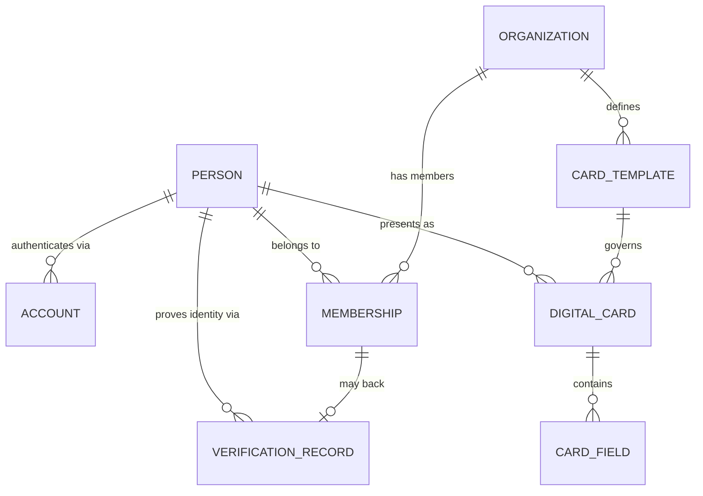
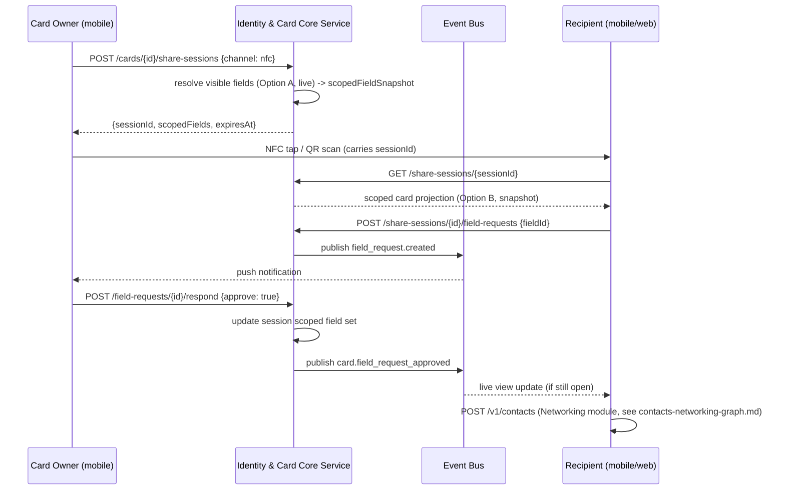

# Module: Identity & Card Core

> Status: v0.1 · Owner: Identity Platform · Last updated: 2026-06-30
> Pillar: Identity (see [`00-vision/00-product-philosophy.md`](../../00-vision/00-product-philosophy.md) §3). Foundational module — every other module references its entities by ID and owns none of them (see [`01-architecture/01-data-architecture.md`](../../01-architecture/01-data-architecture.md) §2 and [`03-data-model/er-overview.md`](../../03-data-model/er-overview.md) §2).

## 1. Business Goal

Give every professional — from a solo freelancer to a 50,000-person enterprise — one canonical, verifiable digital identity and one or more presentable "cards" derived from it, shareable in the time it takes to tap a phone together. This is the substrate the rest of the platform's twelve-pillar thesis depends on: nothing else (Networking, CRM, Reputation, Certifications) can exist as "one graph, many views" unless there is exactly one owning record of "who is this person," referenced everywhere else by ID rather than copied. Identity & Card Core is also the module that makes the individual-first/enterprise-ready tenet concrete: a Person exists and is useful with zero Organization, but the same Person/Membership shape scales to enterprise rollout without a schema migration.

The product wedge is frictionless card sharing (NFC/QR/link) because that is the moment of first value — but the architectural goal is broader: a durable, verifiable identity record that every other module can trust without re-asking the user who they are.

## 2. User Story

- **Mara** (independent professional): "I want to create a card in under two minutes with no org setup, share it by tapping my phone against someone else's at a conference, and trust that the person I just met sees an accurate, current version of my identity — not a stale paper card I handed out six months ago."
- **Devon** (quota-carrying seller): "I want a 'Sales' card distinct from my personal card, so a prospect sees my title, company, and calendar link, while my personal cell number stays hidden unless I explicitly choose to reveal it."
- **Priya** (enterprise admin): "I want to provision identity for 2,000 employees via SSO/SCIM, enforce a consistent verified-organization badge and approved field set on every employee card, and revoke a departed employee's card instantly without losing the underlying relationship data other modules built on top of it."
- **Yusuf** (recruiter): "I want to verify that a candidate's claimed certification or current title is real before I invest relationship-building time, without manually emailing a previous employer."
- **Lena** (agency lead): "I want every team member's card to carry the agency's brand and a consistent field set, governed centrally, even though each team member also has their own personal identity underneath it."

## 3. Functional Requirements

- Create and maintain a **Person** record (canonical human identity, distinct from login credentials) with a default profile (name, headline, photo, primary contact fields).
- Support multiple **Account** records per Person (email/password, OAuth, SSO, future passkey) — many-to-one, so a person can change or add login methods without losing identity continuity.
- Create one or more **DigitalCard**s per Person, each an independently configurable presentable surface (e.g., "Sales card," "Personal card," "Speaker card") with its own field set, visibility rules, theme/branding, and share targets.
- Each DigitalCard is composed of ordered **CardField** records (typed: text, phone, email, URL, social handle, custom) with per-field visibility (`public`, `link-only`, `request-required`, `hidden`) and per-field display order.
- Field-level visibility control: a card owner can mark any field as visible only after the recipient explicitly requests it (e.g., personal cell number) — this is a hard requirement, not a card-level all-or-nothing toggle.
- Share a card via NFC tap, QR code render, or shareable link, each producing a scoped, revocable share session.
- Maintain **Organization** records (company/team) and **Membership** join records (Person↔Organization, with role, title, start/end date) — this is what makes an enterprise rollout and a brand-consistent card possible.
- Support **VerificationRecord**s: a claim (employment, title, credential, identity document) plus its verification status (`unverified`, `pending`, `verified`, `revoked`), verification method, and verifying authority — surfaced as a trust badge on the card.
- Support card revocation/deactivation independent of Person deletion (an employee leaves; their org-branded card is revoked, their underlying Person and personal data persist per the personal→org upgrade path in [`00-vision/01-personas-and-jtbd.md`](../../00-vision/01-personas-and-jtbd.md)).
- Card view/scan analytics visible to the card owner (who viewed, when, via which channel) subject to the viewer's own privacy settings.
- Org admins can define a card template (locked fields, required branding) that member cards inherit from, per [Section 13](#13-security).

## 4. Non-Functional Requirements

- Card render (the most latency-sensitive path in the platform, since it happens in front of another human in real time) must meet p99 < 200ms at T2+ scale, per [`01-architecture/06-scalability-strategy.md`](../../01-architecture/06-scalability-strategy.md) §5.
- Card sharing must work fully offline on mobile (NFC/QR rendering requires no network round-trip for the share itself; see [Section 11](#11-mobile-considerations)).
- Identity lookups are the hottest read path in the platform (nearly every other module's request touches Person/DigitalCard) — this module is explicitly never extracted as an independent service in v1 (see [`01-architecture/00-system-architecture.md`](../../01-architecture/00-system-architecture.md) §2) precisely because its load is the platform's baseline load, not a divergent profile.
- VerificationRecord handling meets the Regulated/Credential data class controls in [`01-architecture/05-security-privacy-compliance.md`](../../01-architecture/05-security-privacy-compliance.md) §2 (immutable audit trail, retention aligned to credentialing-body requirements).
- Availability target matches platform-wide SLO; a Person/DigitalCard read-path outage degrades every module simultaneously, so this module's error budget is the tightest in the platform.
- Multi-tenancy follows the tiered hybrid in [`01-architecture/01-data-architecture.md`](../../01-architecture/01-data-architecture.md) §1 — individual Persons default to RLS shared-schema tenancy; enterprise Organizations may opt into database-per-tenant placement without a data-model change.

## 5. UX Flow

**Card creation (Mara, first use):**
1. User signs up (Account created, Person created in the same transaction).
2. Onboarding wizard pre-fills a default DigitalCard from Account signal (name, email) and asks 3-4 quick questions (role, what you do, primary contact channel).
3. User lands on card editor with a usable default card already populated — zero blank-page problem.
4. User taps "Add Card" to create a second persona (e.g., "Personal") if desired; each card is independently editable.
5. For each field, user sets visibility (`public` / `link-only` / `request-required` / `hidden`) via an inline toggle next to the field.
6. User taps "Share" — sees NFC/QR/Link options.

**Card sharing (in-person, Mara and a prospect):**
1. User taps "Share" on a chosen card, phone enters NFC broadcast mode or renders a QR code.
2. Recipient taps phones together (NFC) or scans the QR with their camera.
3. Recipient's device opens a share-session view rendering only the fields visible to an unauthenticated/first-time viewer.
4. Recipient taps "Save Contact" — this triggers Contacts/Networking Graph's Contact-creation flow (see [`contacts-networking-graph.md`](../contacts-networking-graph/contacts-networking-graph.md) §11 sequence diagram), not a CardField copy — Identity & Card Core never hands over a duplicated record, only a reference plus a point-in-time snapshot for offline resilience.
5. If recipient requests a `request-required` field (e.g., personal cell), card owner gets a push notification and approves/denies in one tap; approval updates the share session's visible field set live if the recipient's view is still open.

**Verification (Yusuf verifying a candidate's claimed title):**
1. Candidate's card shows an "Unverified" badge next to their claimed title at Org X.
2. Candidate initiates verification (e.g., SSO confirmation through their employer's identity provider, or a manual document upload reviewed by a verification partner).
3. VerificationRecord transitions `pending` → `verified`; card badge updates without the candidate re-sharing.
4. Yusuf, viewing the previously shared card link, sees the badge update live (or on next view) — verification is a property of the underlying card, not a one-time snapshot.

## 6. Wireframe Description

**Card Editor screen**: top app bar with card-name selector (switch between a Person's multiple cards) and a "+" to add a new card. Below it, a live card preview (matches what a recipient will see) rendered at top of screen, scrollable field list below in edit mode. Each field row: icon (type), value, drag handle (reorder), and a visibility chip (`Public` / `Link only` / `On request` / `Hidden`) that opens a 4-option picker on tap. Bottom-pinned "Share" button, persistent across scroll.

**Share Sheet** (modal, triggered by "Share"): three large tap targets — "Tap to Share" (NFC, with an animated phone-tap icon when in broadcast mode), "Show QR," "Copy Link" — plus a secondary row for "Save to Apple/Google Wallet." A small live counter shows "Active share session" status when NFC/QR is actively broadcasting.

**Recipient View** (what someone sees after a tap/scan): single-screen card render — photo, name, headline, organization (with verified badge if applicable), visible fields with tap-to-call/email/copy affordances, a prominent "Save Contact" button, and a subtler "Request more info" link that surfaces `request-required` fields with a one-tap request action.

**Org Admin Card Template screen** (Priya): a form mirroring the Card Editor but with a per-field lock toggle ("required," "locked value," "editable by member") and a brand panel (logo, color, font) applied to every member card inheriting the template.

**Verification panel**: list of claims (title, employer, credential) each with a status pill and an action button appropriate to status (`Start Verification`, `Pending — Resend`, `Verified` with verifying-authority and date shown on tap).

## 7. Database Design

Identity & Card Core owns Person, Account, Organization, Membership, DigitalCard, CardField, VerificationRecord — the shared core entities defined in [`01-architecture/01-data-architecture.md`](../../01-architecture/01-data-architecture.md) §2. No other module may duplicate these fields; cross-module references use `EntityRef{module: "identity", entityType, entityId}` per the same doc §3.

Key fields (design-level, not full DDL):

- **Person**: `id`, `displayName`, `primaryPhotoUrl`, `headline`, `defaultCardId`, `tenantId`, `createdAt`, `status` (`active`/`deactivated`).
- **Account**: `id`, `personId` (FK), `authMethod` (`password`/`oauth:google`/`sso:saml`/`passkey`), `externalId`, `lastUsedAt`.
- **Organization**: `id`, `name`, `domain`, `tenantId`, `brandConfig` (logo, color, font — JSON), `verificationStatus`.
- **Membership**: `id`, `personId` (FK), `organizationId` (FK), `role`, `title`, `startDate`, `endDate` (nullable = current), `cardTemplateId` (nullable FK).
- **DigitalCard**: `id`, `personId` (FK), `label` (e.g., "Sales"), `theme` (JSON), `cardTemplateId` (nullable FK, set when org-governed), `isDefault`, `status` (`active`/`revoked`), `createdAt`, `updatedAt`.
- **CardField**: `id`, `cardId` (FK), `fieldType` (`text`/`phone`/`email`/`url`/`social`/`custom`), `label`, `value`, `visibility` (`public`/`link_only`/`request_required`/`hidden`), `displayOrder`, `lockedByTemplate` (bool).
- **VerificationRecord**: `id`, `personId` (FK), `claimType` (`employment`/`title`/`credential`/`identity_document`), `claimRef` (e.g., Membership ID or free text), `status` (`unverified`/`pending`/`verified`/`revoked`), `verificationMethod` (`sso_confirmation`/`document_review`/`third_party_attestation`), `verifyingAuthority`, `verifiedAt`, `expiresAt` (nullable, relevant for time-bound credentials).

A `ShareSession` (ephemeral, not in the canonical ER diagram since it is ~operational/cache-tier state, TTL-bound) tracks an active NFC/QR/link share: `cardId`, `channel`, `scopedFieldSnapshot`, `createdAt`, `expiresAt`, `viewerAccountId` (nullable, for request-required field approval routing).

This diagram is the module-scoped expansion of the shared-core fragment in [`01-architecture/01-data-architecture.md`](../../01-architecture/01-data-architecture.md) §2; `CardTemplate` is local detail not promoted to the cross-module diagram in [`03-data-model/er-overview.md`](../../03-data-model/er-overview.md) since no other module references it directly.

## 8. API Design

REST is canonical; GraphQL is a first-party aggregation layer over the same service layer, per [`01-architecture/04-integration-api-gateway.md`](../../01-architecture/04-integration-api-gateway.md). Representative `/v1` endpoints:

| Method & Path | Purpose | Request / Response sketch |
|---|---|---|
| `POST /v1/persons` | Create Person (signup) | req: `{displayName, account: {...}}` → res: `{id, displayName, defaultCardId}` |
| `GET /v1/persons/{id}` | Fetch canonical Person record | res: `{id, displayName, headline, photoUrl, memberships: [...]}` |
| `POST /v1/persons/{id}/cards` | Create a new DigitalCard | req: `{label, theme}` → res: `{id, label, fields: []}` |
| `PATCH /v1/cards/{id}/fields/{fieldId}` | Update a CardField's value or visibility | req: `{visibility: "request_required"}` → res: updated field |
| `POST /v1/cards/{id}/share-sessions` | Begin a share (NFC/QR/link) | req: `{channel: "nfc"}` → res: `{sessionId, scopedFields, expiresAt}` |
| `GET /v1/share-sessions/{id}` | Recipient resolves a share (unauthenticated-safe) | res: scoped card projection only |
| `POST /v1/share-sessions/{id}/field-requests` | Recipient requests a `request_required` field | req: `{fieldId}` → res: `{status: "pending"}` |
| `POST /v1/field-requests/{id}/respond` | Owner approves/denies a field request | req: `{approve: true}` → res: updated session field set |
| `POST /v1/organizations/{id}/card-templates` | Org admin defines a governed template | req: `{lockedFields, brandConfig}` → res: template |
| `POST /v1/persons/{id}/verification-records` | Initiate a verification claim | req: `{claimType, claimRef}` → res: `{id, status: "pending"}` |
| `GET /v1/persons/{id}/verification-records` | List verification status | res: array of VerificationRecord |

GraphQL angle: a first-party mobile "card detail" view typically needs Person + active DigitalCard + VerificationRecords + (cross-module) recent Interactions from Networking in one round trip — this is exactly the composed-view case [`04-integration-api-gateway.md`](../../01-architecture/04-integration-api-gateway.md) §2 calls out for the GraphQL aggregation layer; REST stays the per-resource canonical surface for SDK/CLI/webhook/partner consumers (e.g., a partner CRM pulling verified-card data via REST + webhook on `card.updated`).

## 9. Backend Architecture

Identity & Card Core is a module within the modular monolith (per [`01-architecture/00-system-architecture.md`](../../01-architecture/00-system-architecture.md) §1) with its own schema; it is the one module every other module has a synchronous internal-API dependency on (read-heavy lookups: "resolve this Person," "resolve this DigitalCard's public projection"), since requiring every module to go through the event bus for a hot, read-only, latency-critical lookup would be the wrong tool for that access pattern. State *changes* (card updated, verification status changed, membership ended) still publish to the event bus via the transactional outbox, so Networking, CRM, Automation, and Security can react asynchronously (e.g., CRM updating a Deal's contact display name when a Person updates theirs) without polling.

**Module-specific architectural decision: where does field-level visibility enforcement live?**

- **Option A — Enforce at read time in the service layer.** Every card-read query filters CardFields by the viewer's resolved access level (public/owner/approved-requester) in application code before returning a projection.
  - *Advantages*: single enforcement point, easy to audit and test in isolation; visibility rules can change without a data migration (no stored "view" per recipient).
  - *Disadvantages*: every new read path (REST, GraphQL, internal API, webhook payload builder) must remember to apply it — a missed call site is a privacy leak, not just a bug.
- **Option B — Materialize scoped projections at share time.** When a ShareSession is created, pre-compute and store the exact field set the recipient is allowed to see (this is effectively what the `scopedFieldSnapshot` in §7 already does for the ephemeral share-session case).
  - *Advantages*: recipient view is a simple, fast lookup with no per-request visibility logic; works offline (see [Section 11](#11-mobile-considerations)) since the snapshot travels with the share.
  - *Disadvantages*: a snapshot can drift from the live card (owner changes a field's visibility after sharing) — must be paired with a "live" mode that re-resolves on each view when connectivity allows, or accept a TTL-bound staleness window.
- **Recommendation**: both, scoped to different paths. Use Option B (snapshot) for the ephemeral share-session/offline path, since that is the path that must work without a server round-trip. Use Option A (read-time enforcement) for every authenticated, connected read path (REST, GraphQL, internal API), since those can afford live enforcement and benefit from a single source of truth. This mirrors the platform's broader pattern of choosing the cheaper-but-staler mechanism only where offline/latency genuinely forces it (same reasoning as ADR-0010's CRDT-only-where-needed stance).

The end-to-end card-sharing handshake spans both enforcement paths described above (snapshot at session creation, live approval for `request_required` fields):

**Estimated complexity**: medium-high. The data model itself is simple; the complexity is concentrated in visibility enforcement correctness, share-session lifecycle (TTL, revocation, request-approval routing), and being the platform's hottest read path under load.

**Technical debt risk**: visibility-rule enforcement is the most likely site of a privacy bug as new read paths are added (new module, new API surface); mitigated by centralizing Option A enforcement in one repository-layer function every card-read path is required to call, with a lint rule flagging direct CardField table access outside that function — the same DB-permission-enforced boundary discipline as the platform-wide pattern in [`01-architecture/00-system-architecture.md`](../../01-architecture/00-system-architecture.md) §5.

## 10. Frontend Architecture

Card Editor and Recipient View are built as shared components between web and mobile where the rendering logic is identical (card layout, field display) — only the share-initiation surface (NFC trigger, native QR camera) is platform-specific, consistent with React Native's shared-codebase-plus-native-modules approach in [ADR-0009](../../adr/0009-mobile-client-architecture.md). The live card preview in the editor is driven by the same rendering component the Recipient View uses, so "what I'm editing" and "what gets shared" can never visually drift apart.

State management: card-edit state is local/optimistic (instant field edits, debounced save) since a card edit is single-owner, low-contention data — no CRDT needed per [ADR-0010](../../adr/0010-offline-first-sync-protocol.md). Verification status and org-template-locked fields are server-driven and read-only in the client until a status-change event arrives over the event-bus-backed notification channel.

## 11. Mobile Considerations

This module is the primary reason [ADR-0009](../../adr/0009-mobile-client-architecture.md) chose React Native with native modules rather than a PWA-only approach: NFC broadcast/read and native Wallet integration (Apple Wallet / Google Wallet pass generation) are not deliverable through a web-only shell, and they are core, not secondary, flows here.

- **NFC sharing** must work with the device's NFC stack directly (native module), broadcasting a payload that resolves to a ShareSession URL — the tap itself requires no network call; only resolving the session (fetching `scopedFields`) needs connectivity, and that fetch is what the offline path below addresses.
- **Offline card sharing**: per [ADR-0010](../../adr/0010-offline-first-sync-protocol.md), a DigitalCard's current `scopedFieldSnapshot` for each visibility tier is cached on-device and refreshed on each app foreground/edit — so a share initiated with no connectivity still renders a recipient view from a recent (not live) snapshot, with a "last updated" timestamp shown if the snapshot is older than a threshold. This is the offline-sync rationale called out generically in ADR-0010 §Context made concrete for this module.
- **QR rendering** is fully offline-capable (the QR encodes a URL; rendering the code itself needs no network), but resolving that URL on the recipient's device still depends on their connectivity unless the issuer device embedded a signed offline payload — out of scope for v1, flagged in [Section 16](#16-future-enhancements).
- **Wallet pass generation** (Apple Wallet / Google Wallet) is a background, queued operation (not in the critical share path) that produces a pass file synced to the device's native wallet app; pass updates (e.g., a verified badge appearing) use each platform's native push-update mechanism for wallet passes.
- **Camera-based business-card scanning** (capturing someone else's paper card) is a mobile-only entry point feeding Networking's Contact-creation flow, not this module's data — see [`contacts-networking-graph.md`](../contacts-networking-graph/contacts-networking-graph.md) §12 for the AI extraction angle, since the photo doesn't become a DigitalCard, it becomes a Contact owned by the scanning Person.

## 12. AI Opportunities

All AI tasks route through `ModelRouter`/`ModelProvider`/`CapabilitySet`, never a direct provider SDK call — see [`01-architecture/02-ai-abstraction-layer.md`](../../01-architecture/02-ai-abstraction-layer.md). Module-specific tasks:

- **AI-assisted card-field extraction from a scanned business-card photo**: declares a `CapabilitySet{vision: true, jsonMode: true}` task; extracts name/title/org/phone/email from an image into structured CardField-shaped output for user confirmation before save. (Note: when the *user's own* paper card is being digitized into their own DigitalCard, this lives here; when scanning *someone else's* card to create a Contact, the same capability is invoked from Networking — same AI task type, different calling module, per the "new AI task type, no provider code change" extension point in [`02-ai-abstraction-layer.md`](../../01-architecture/02-ai-abstraction-layer.md) §7.)
- **AI-assisted verification-document review**: a `vision`+`jsonMode` task pre-screens an uploaded credential/ID document for completeness and obvious mismatch (name on document vs. Person record) before routing to human or third-party verification — reduces reviewer load without replacing the verification authority of record.
- **Smart field-visibility defaults**: a lightweight classification task suggests a visibility tier for a newly added field based on field type and historical owner behavior (e.g., personal cell numbers are `request_required` for 90%+ of users) — proposed as a default, never auto-applied without user confirmation, consistent with the platform's "automate the busywork, not the relationship" tenet ([`00-vision/00-product-philosophy.md`](../../00-vision/00-product-philosophy.md) §4).
- **Card-content quality suggestions**: an LLM completion task (no special capability beyond standard text generation) reviews a card's headline/field set and suggests improvements (e.g., a sparse or stale card) — surfaced as an optional nudge, not an automated edit.

All four route per-tenant through the same `RoutingPolicy`, so an enterprise tenant can restrict verification-document review to a self-hosted/approved-provider only, while an individual tenant gets the cheapest capable provider — same code path, per [`02-ai-abstraction-layer.md`](../../01-architecture/02-ai-abstraction-layer.md) §3.

## 13. Security

Module-specific deltas only; platform-wide RBAC, `PolicyBinding`, and audit logging are defined once in [`01-architecture/05-security-privacy-compliance.md`](../../01-architecture/05-security-privacy-compliance.md) and not restated here.

- **VerificationRecord** is the platform's clearest instance of the Regulated/Credential data class (§2 of the security doc): immutable audit trail per status transition, retention aligned to the verifying authority's requirements, and a `PolicyBinding` scope of `EntityRef{module: "identity", entityType: "VerificationRecord", entityId}` for any enterprise tenant restricting who can initiate or approve verification.
- **Field-level visibility** (§9 above) is itself an authorization concern distinct from RBAC roles — it is owner-set, per-field, per-viewer-context policy, not a role grant; it is enforced in the service layer rather than the platform RBAC engine because its scope (a single CardField, for a single ephemeral viewer) is finer-grained than `PolicyBinding`'s typical scope (tenant/org/resource), though it uses the same `EntityRef` addressing internally for audit logging of field-request approvals.
- **Org card templates with locked fields** are an enterprise control surface: an org admin's `PolicyBinding` over `EntityRef{module: "identity", entityType: "CardTemplate", entityId}` determines who can edit a template; member cards inheriting a template cannot override locked fields regardless of the member's own card-edit permission.
- **Share-session tokens** are short-TTL, single-card-scoped, and never carry broader account access — a compromised or leaked share link exposes only that card's already-public-or-explicitly-shared field set, never an authentication credential.
- **Right-to-erasure** (GDPR Art. 17): Person deletion is the fan-out trigger origin described in [`01-architecture/01-data-architecture.md`](../../01-architecture/01-data-architecture.md) §7 — Identity & Card Core is the module that *initiates* the `DataSubjectRequest` event, since it owns the Person record every other module's deletion cascades from.

## 14. Analytics

- Card creation/activation rate (signup → first usable card), time-to-first-share (a key activation metric for Mara's JTBD).
- Share-channel mix (NFC vs. QR vs. link) and conversion-to-saved-contact rate per channel.
- Field-request approval latency and approval rate (signal for whether `request_required` is friction or appropriate gating).
- Verification funnel: initiated → pending → verified conversion rate and time-to-verify, segmented by claim type and verification method.
- Org template adoption rate (for enterprise tenants) and locked-field override-request frequency (signal that a template is too restrictive).
- Card view counts and viewer-return-rate (a card viewed multiple times by the same viewer may signal relationship-building interest worth surfacing to Networking/CRM).

## 15. Testing Strategy

- **Unit**: CardField visibility-resolution logic (every visibility tier × every viewer-context combination) is the single highest-value unit-test surface in this module given §9's risk analysis.
- **Integration**: Person/Account/Membership lifecycle transactions (signup, org join/leave, card-template inheritance) against a real schema-per-module test database.
- **Contract**: REST OpenAPI schema conformance tests (since GraphQL and SDK/CLI are generated from it, a contract break here breaks every consumption mode at once).
- **Isolation/security**: RLS-policy coverage tests for every new table, per the platform-wide release-gate requirement in [`01-architecture/01-data-architecture.md`](../../01-architecture/01-data-architecture.md) §7; explicit tests asserting a `request_required` field is never present in an unapproved share-session payload.
- **End-to-end**: NFC/QR share-and-save flow on real device hardware (simulators do not exercise real NFC stacks) as a release gate for mobile builds.
- **Load**: card-render path load-tested against the p99 < 200ms target in §4, since this is the platform's hottest read path and a regression here degrades every module simultaneously.

## 16. Future Enhancements

- **Recommended Future Feature — Offline-signed share payloads.** Why: §11 flags that QR/NFC sharing still depends on the *recipient's* connectivity to resolve a ShareSession; a fully offline handshake (both devices with no connectivity, e.g., a remote conference venue) is currently unsupported. Business value: removes the last connectivity dependency from the platform's signature interaction. Technical design sketch: issuer device embeds a signed, self-contained scoped-field payload directly in the NFC/QR data (not just a URL) using a short-lived asymmetric signing key tied to the DigitalCard, verifiable offline by the recipient client without a server call; a background sync later reconciles the interaction into the canonical ShareSession log once either device regains connectivity. Possible implementation approach: extend the native NFC/QR module (ADR-0009) with a local signing/verification library; reuse the offline-first sync protocol's (ADR-0010) conflict model for reconciling the deferred ShareSession write. Dependencies: native module work on both platforms, a key-management story for per-card signing keys, and product decision on payload size limits (NFC/QR have practical data-size ceilings that constrain how many fields can be embedded offline).
- **Recommended Future Feature — Time-bound / single-use share links.** Why: today's `request_required` and TTL-bound ShareSession model handles in-person sharing well but doesn't address the case of sharing a card in a public, durable context (an email signature link) where the owner may want to later expire or rotate access without changing their card content. Business value: gives privacy-conscious users (and enterprise compliance-driven tenants) fine-grained control over durable share surfaces, closing a gap between ephemeral in-person sharing and a permanent public link. Technical design sketch: a `ShareLink` entity (distinct from the ephemeral `ShareSession`) with explicit `expiresAt`/`maxUses`/`revokedAt` fields, generating its own scoped snapshot independent of the live card so revocation is immediate and auditable. Possible implementation approach: extend the existing share-session service rather than building a parallel system; reuse `EntityRef`-based audit logging for link creation/revocation events. Dependencies: none blocking — buildable on current schema with one new table.
- **Recommended Future Feature — Cross-organization verified-badge federation.** Why: Yusuf's JTBD and enterprise rollout both benefit from a Person's verification being portable and checkable across tenants without re-verifying from scratch every time (e.g., a verified former employee's title-at-Org-X claim shouldn't need re-verification when Org Y wants to confirm it, if Org X is a trusted verifying authority). Business value: reduces verification friction platform-wide and increases the value of the verification system itself as more organizations participate (network effect). Technical design sketch: a `VerifyingAuthority` registry of organizations/third parties opted into being queryable verification sources, with a signed-attestation exchange protocol (verification claims signed by the issuing org's key, checkable by any relying party without contacting the issuer synchronously). Possible implementation approach: model as an extension of `VerificationRecord.verificationMethod` plus a new attestation-exchange service; could be built as a marketplace/extension module per the extension points in [`01-architecture/00-system-architecture.md`](../../01-architecture/00-system-architecture.md) §4 rather than core platform code. Dependencies: legal/trust framework work (who can become a `VerifyingAuthority`) is a bigger blocker than the technical design; should not be started before that policy question has a clear owner.

## 17. Risks

- This module's hot-path status means any latency or correctness regression has platform-wide blast radius — the highest-stakes module to deploy changes to, which argues for stricter release gating here than in lower-traffic modules.
- Field-level visibility is a fine-grained privacy control with real reputational and trust cost if it leaks (§9, §13) — it is also the hardest visibility model to get exactly right in testing because of the combinatorial viewer-context space.
- VerificationRecord trust depends partly on third-party verification partners/authorities outside platform control — a compromised or low-integrity verifying authority degrades the credibility of the entire verification badge system, similar in shape to the third-party AI provider risk disclosed in [`01-architecture/05-security-privacy-compliance.md`](../../01-architecture/05-security-privacy-compliance.md) §9.
- Org card templates create a tension between brand governance (Lena, Priya) and individual card ownership (the "own your identity" tenet) — over-restrictive default template behavior risks undermining user trust that their identity is genuinely theirs.

## 18. Open Questions

- What is the default visibility tier assignment for newly created custom field types, and should it differ between individual and org-governed cards?
- Should VerificationRecord support self-attestation (no third party, just a timestamped claim) as a lower trust tier, or should "unverified" always mean "no badge" with a binary verified/unverified model?
- How long should an offline share-session snapshot remain presentable before the client requires a reconnect-and-refresh (§11) — a fixed TTL, or staleness-indicator-only with no hard cutoff?
- Does cross-organization verified-badge federation (§16) require a paid/contractual relationship between organizations, or can any two organizations on the platform opt into mutual trust unilaterally?
- Where exactly does ownership of a departed employee's card content sit after Membership ends — fully reverts to the individual, fully reverts to the org (revoked), or a negotiated middle state — and is this a platform default or a per-org policy choice?
