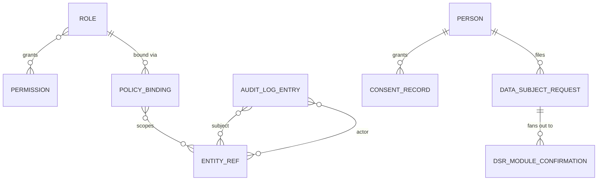
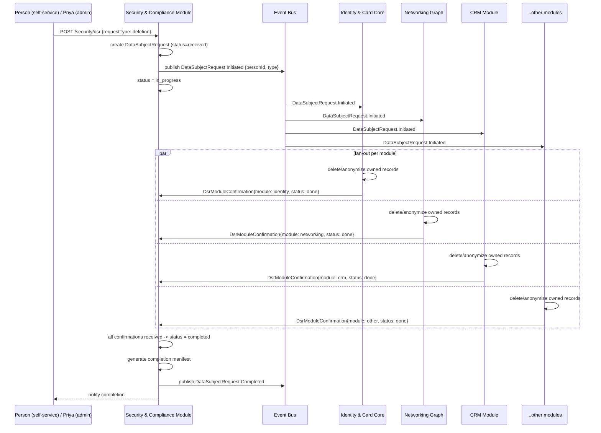

# Security & Compliance Center (Module)

> Depth tier: full (18-section) · Status: v0.1 · Owner: Product/Security · Last updated: 2026-06-30
> The underlying framework (RBAC model, audit-log mechanics, consent/erasure design, auth strategy) is documented in [`../../01-architecture/05-security-privacy-compliance.md`](../../01-architecture/05-security-privacy-compliance.md). This document is the **admin- and user-facing product surface** built on that framework: the screens Priya uses to manage roles, review audit logs, and handle data-subject requests, plus the self-service consent/export surface Mara uses.

## 1. Business Goal

Make the platform's compliance and access-governance posture something an enterprise admin can *see and operate*, not just trust exists in a backend doc. This module is what converts the architecture's RBAC/audit/consent framework into evaluable, screenshot-able product surface area during enterprise sales and security review — directly serving the product philosophy's "enterprise-ready" tenet ([`00-vision/00-product-philosophy.md`](../../00-vision/00-product-philosophy.md) §4): the same data model that gives Mara a free, zero-setup individual experience scales to a 2,000-person org with roles, audit trails, and compliance guarantees, without a data-model migration. It is also where the platform fulfills its "own your identity" commitment for individuals — self-service consent and data export live here too, not in a separate "privacy settings" silo.

## 2. User Story

- **Priya (enterprise admin)**: "When I roll this out company-wide, I want centralized role-based access, a searchable/exportable audit trail, and a clear compliance posture, so that I'm not creating a shadow-IT or data-leak liability my security team would block." (See [`00-vision/01-personas-and-jtbd.md`](../../00-vision/01-personas-and-jtbd.md) §3.)
- **Priya (incident response)**: "When something looks wrong — an unexpected bulk export, a role change I didn't make — I want to find out who did what, when, and to what, within minutes, not file a support ticket and wait."
- **Mara (independent professional)**: "When I want to know what data this platform holds about me, or I want it gone, I want a self-service way to export or delete my data without needing to email support and hope someone responds." (§1.)
- **Lena (agency lead, secondary)**: "When an employee leaves, I want their access revoked immediately and a clear record of what they could see, so a departure doesn't become a data-access incident." (§5, cross-referencing the leaving-employee continuity concern in [`01-personas-and-jtbd.md`](../../00-vision/01-personas-and-jtbd.md) §5.)

## 3. Functional Requirements

- **Role management**: create/edit/archive `Role`s, assign `Permission`s to a `Role` (N:N), assign `Role`s to Persons/Memberships within an Organization.
- **Policy binding management**: bind a `Role` to a scope — tenant-wide, a specific `Organization`, or a specific resource via `EntityRef` (e.g., "Editor role, scoped to this one CRM Pipeline") — surfacing the `PolicyBinding` model defined in [`05-security-privacy-compliance.md`](../../01-architecture/05-security-privacy-compliance.md) §4 as an editable screen rather than a backend-only construct.
- **Audit log**: searchable, filterable (actor, action type, subject entity/module, date range), paginated view of `AuditLogEntry` records; CSV/JSON export for compliance review or external SIEM ingestion.
- **Consent management**: view and manage `ConsentRecord`s — both an admin-facing org-wide consent posture view (Priya: "what categories of processing has my org's data been consented to") and a self-service per-Person consent screen (Mara: "what have I agreed to, and can I withdraw it").
- **Data Subject Request (DSR) workflow**: intake (self-service request creation, or admin-initiated on behalf of a Person), fulfillment tracking (status: received → in-progress → fanned-out → completed/rejected), and a fan-out deletion/export confirmation view showing per-module completion status.
- **Self-service data export**: a Person can request a full export of their own data (driving toward the same `DataSubjectRequest` machinery used for GDPR Art. 15/20 access/portability requests).
- Role/permission change history is itself audit-logged (this module's own admin actions are not exempt from the audit trail — see §13).
- Bulk role assignment via CSV/SCIM-driven provisioning (cross-referencing the auth-strategy ADR's SSO/SCIM commitment, [`05-security-privacy-compliance.md`](../../01-architecture/05-security-privacy-compliance.md) §3) for Priya onboarding a large org.

## 4. Non-Functional Requirements

- Audit log search must return results in under 2s at tens of millions of `AuditLogEntry` rows per large enterprise tenant — this is the module's dominant scale challenge (see §9).
- Audit log export of large date ranges must not block the UI thread or time out — implemented as an async export job with a download-ready notification, not a synchronous request.
- `AuditLogEntry` records are immutable and tamper-evident (hash-chained, per [`05-security-privacy-compliance.md`](../../01-architecture/05-security-privacy-compliance.md) §5) — this module's write path must never expose an update/delete affordance for audit entries, full stop.
- DSR fulfillment must meet regulatory SLAs (GDPR: 30 days, extendable once by 60; CCPA: 45 days, extendable once by 45) — the fulfillment tracker must surface time-remaining-against-SLA prominently, not just a status string.
- Role/permission changes must take effect for in-flight sessions within a bounded window (near-immediate revocation matters for security incident response — a revoked admin should not retain effective access for an arbitrary cache TTL).
- This module's own data (audit logs, role assignments) is itself maximally sensitive — see §13 for the access-control deltas this implies.

## 5. UX Flow

**Audit Log review (Priya):**

1. Admin opens **Audit Log** from the Security & Compliance Center home.
2. Default view shows the most recent `AuditLogEntry` records across the org, reverse-chronological.
3. Admin filters by actor (a specific Person, or "system/automation" to isolate non-human actors), action type (e.g., `role.updated`, `contact.exported`), subject module (e.g., only CRM-related entries), and a date range.
4. Admin clicks a single entry to expand full context: actor, action, resolved subject (`EntityRef` display projection — e.g., "Deal: Acme Renewal"), timestamp, and any structured context payload (e.g., "previous value → new value" for a field change).
5. Admin clicks **"Export"**, selects format (CSV/JSON) and the currently-applied filter scope, and receives a download-ready notification once the async export job completes.

**Role & policy management (Priya):**

6. Admin opens **Roles**, sees a list of `Role`s with member counts and a summary of granted `Permission`s.
7. Admin clicks **"New Role"**, names it, and selects `Permission`s from a categorized checklist (grouped by module — CRM, Automation, Documents, etc.).
8. Admin opens **Policy Bindings** for that role, clicks **"Add Binding,"** and selects a scope: Tenant-wide, a specific Organization, or "Specific resource" (which opens an `EntityRef`-driven picker — e.g., search for and select one CRM Pipeline).
9. Admin assigns the role to one or more Persons/Memberships via a member picker (or bulk-assigns via CSV/SCIM import, §3).
10. Saved changes are immediately audit-logged and take effect per the §4 revocation-latency requirement.

**Data Subject Request handling (Priya, admin-initiated):**

11. Admin opens **Data Subject Requests**, clicks **"New Request,"** selects the requesting Person and request type (Access / Export / Deletion / Correction), and submits.
12. Request enters the fulfillment tracker at status "Received," with an SLA countdown visible.
13. Admin (or an automated fan-out process, §9) advances the request to "In Progress," triggering the fan-out deletion/export flow across modules (§9's sequence diagram).
14. The fan-out confirmation view shows a per-module checklist (Identity & Card Core, Networking, CRM, Documents, etc.) with each module's completion status, so the admin can see at a glance whether any module has not yet confirmed.
15. Once all modules confirm, status moves to "Completed," and a completion record (including a manifest of what was deleted/exported) is generated and retained for compliance evidence.

**Self-service consent & export (Mara):**

16. Individual user opens **Privacy & Data** from account settings (same underlying module, scoped to their own Person record only).
17. User sees a list of `ConsentRecord`s (e.g., "AI processing of my data," "Marketing communications") with toggles to withdraw consent.
18. User clicks **"Export my data"** or **"Delete my account,"** which creates a self-service `DataSubjectRequest`, entering the same fulfillment tracker (§13-19) but scoped to their own record, with status visible to them.

## 6. Wireframe Description

**Audit Log screen**

- **Top filter bar**: actor picker (typeahead over Persons + a special "System/Automation" filter), action-type multi-select, module multi-select, date-range picker, free-text search over the context payload, and an "Export" button (disabled until results are loaded, to avoid exporting an unbounded unset-filter query by accident).
- **Main table**: columns for timestamp, actor (avatar + name, or a distinct icon for automation/system actors), action (human-readable verb, e.g., "Updated Role"), resolved subject (clickable, links through to the subject entity where the viewer has permission to see it), and a chevron to expand inline detail.
- **Right-side detail drawer** (on row click, instead of navigating away): full structured payload, hash-chain verification indicator (a small "tamper-evident: verified" badge reflecting the chain-integrity check), and a "view related entries" shortcut (same actor, same subject, or same `WorkflowRun` if the action was automation-initiated).

**Roles & Policy Bindings screen**

- **Left list panel**: roles, with member-count badges and a "system role" lock icon for non-editable built-in roles (e.g., a base "Org Owner" role that cannot be deleted).
- **Main panel (role detail)**: tabs for **Permissions** (categorized checklist grouped by module, matching the action-type categorization pattern used in the Automation module's builder), **Policy Bindings** (a table of scope bindings — Tenant / Organization / Resource — each row showing the resolved `EntityRef` display name for resource-scoped bindings), and **Members** (assigned Persons, with bulk add/remove and a CSV/SCIM import affordance).
- Inline warning banner when a proposed permission change would affect currently-active sessions or in-flight Automation workflows that depend on the changed role (cross-reference: the Automation module's action-execution-time permission recheck, [`automation-workflow-engine.md`](../automation-workflow-engine/automation-workflow-engine.md) §13).

**Data Subject Request tracker**

- **List view**: requests as rows — requestor, type (Access/Export/Deletion/Correction), status badge, SLA countdown (color-shifts amber/red as deadline approaches), initiated-by (self-service vs. admin-initiated).
- **Detail view**: a horizontal stepper (Received → In Progress → Fanned Out → Completed/Rejected) above a **per-module fan-out checklist** — one row per module (Identity & Card Core, Networking, CRM, Documents, Meetings, etc.), each with a status icon and timestamp of that module's confirmation, so a stalled module is immediately visually obvious rather than buried in a log.
- **Completion manifest** (once Completed): a generated, downloadable record listing exactly what was deleted or exported, retained as compliance evidence — itself an immutable artifact, not a live-editable document.

**Self-service Privacy & Data screen (Mara-facing, simplified subset of the above)**

- Single-column layout: "Your Consents" section (toggle list), "Your Data" section ("Export my data" / "Delete my account" buttons, each opening a confirmation modal explaining what will happen and the expected timeframe), and "Your Requests" history (a simplified version of the DSR tracker scoped to the user's own requests).

## 7. Database Design

This module owns `Role`, `Permission`, `PolicyBinding`, `AuditLogEntry`, `ConsentRecord`, `DataSubjectRequest`, per [`03-data-model/er-overview.md`](../../03-data-model/er-overview.md) §2.

- **Role**: `id`, `tenantId`, `name`, `description`, `isSystemRole` (boolean, non-deletable built-ins), `createdAt`.
- **Permission**: `id`, `key` (e.g., `crm.deal.edit`, `automation.workflow.activate`), `module` (owning module identifier), `description`.
- **RolePermission** (join): `roleId`, `permissionId`.
- **PolicyBinding**: `id`, `roleId`, `subjectRef` (the Person or Membership the binding applies to), `scope: EntityRef | "tenant" | "organization:{id}"` (see [`01-data-architecture.md`](../../01-architecture/01-data-architecture.md) §3), `createdAt`, `createdBy`.
- **AuditLogEntry**: `id`, `tenantId`, `actor: EntityRef` (a Person, or a special `automation`/`system` actor type), `action`, `subject: EntityRef`, `context` (JSON, structured before/after or invocation detail), `timestamp`, `hashChainPrev`/`hashChainSelf` (tamper-evidence), append-only.
- **ConsentRecord**: `id`, `personId`, `category` (e.g., `ai_processing`, `marketing`, `data_processing`), `granted` (boolean), `grantedAt`, `withdrawnAt` (nullable), `source` (e.g., "onboarding flow," "explicit settings change").
- **DataSubjectRequest**: `id`, `personId`, `requestType` (`access` | `export` | `deletion` | `correction`), `status` (`received` | `in_progress` | `fanned_out` | `completed` | `rejected`), `initiatedBy` (self-service or admin `EntityRef`), `slaDeadline`, `completionManifest` (JSON, populated on completion), `createdAt`, `completedAt`.
- **DataSubjectRequestModuleConfirmation** (fan-out tracking, supporting child entity): `id`, `dataSubjectRequestId`, `module`, `status`, `confirmedAt`.

`PolicyBinding.scope` and `AuditLogEntry.subject`/`actor` are `EntityRef` values resolved through the Entity Resolution Service ([`01-data-architecture.md`](../../01-architecture/01-data-architecture.md) §3) — this module never holds a direct foreign key into another module's schema, consistent with the modular-monolith boundary discipline ([`00-system-architecture.md`](../../01-architecture/00-system-architecture.md) §5).

## 8. API Design

REST is canonical ([`04-integration-api-gateway.md`](../../01-architecture/04-integration-api-gateway.md)); GraphQL composes views like "audit log entry with resolved actor and subject display projections inlined" for the first-party admin console.

| Method & Path | Purpose | Request / Response sketch |
|---|---|---|
| `POST /v1/security/roles` | Create a `Role` | Req: `{name, permissionKeys[]}` → Res: `{id, name}` |
| `GET /v1/security/roles` | List roles for tenant | Res: `[{id, name, memberCount, isSystemRole}]` |
| `PUT /v1/security/roles/{id}/permissions` | Update granted permissions | Req: `{permissionKeys[]}` → Res: `{id, permissionKeys[]}` |
| `POST /v1/security/policy-bindings` | Bind a role to a scope | Req: `{roleId, subjectRef, scope}` → Res: `{id}` |
| `DELETE /v1/security/policy-bindings/{id}` | Revoke a binding | Res: `204`, audit-logged |
| `GET /v1/security/audit-log` | Search audit entries | Query: `actor`, `action`, `module`, `dateFrom/To`, `cursor` → Res: paginated `AuditLogEntry[]` |
| `POST /v1/security/audit-log/export` | Async export job | Req: `{filters, format}` → Res: `{exportJobId, status: "queued"}` |
| `GET /v1/security/audit-log/export/{jobId}` | Poll export status | Res: `{status, downloadUrl?}` |
| `GET /v1/security/consents` | List a Person's consent records (self or admin-on-behalf, permission-gated) | Res: `[{category, granted, grantedAt}]` |
| `PUT /v1/security/consents/{category}` | Grant/withdraw a consent category | Req: `{granted: boolean}` → Res: `{category, granted}` |
| `POST /v1/security/dsr` | File a `DataSubjectRequest` | Req: `{personId, requestType}` → Res: `{id, status: "received", slaDeadline}` |
| `GET /v1/security/dsr/{id}` | Fetch DSR detail with fan-out status | Res: `DataSubjectRequest` + `DsrModuleConfirmation[]` |
| `GET /v1/security/dsr` | List/search DSRs (admin) | Query: `status`, `requestType`, `dateFrom/To` → Res: paginated list |

Bulk SCIM-driven role assignment (§3) is served by the platform's general SCIM provisioning endpoint (part of the auth-strategy surface, [`05-security-privacy-compliance.md`](../../01-architecture/05-security-privacy-compliance.md) §3) rather than this module inventing a parallel bulk-import format.

## 9. Backend Architecture

This module sits in the Modular Monolith ([`00-system-architecture.md`](../../01-architecture/00-system-architecture.md) §1) as the platform's enforcement and audit layer — per the entity ownership map ([`03-data-model/er-overview.md`](../../03-data-model/er-overview.md) §2), it is referenced by every other module, not the reverse. Audit logging is a first-class consumer of the event bus ([`05-security-privacy-compliance.md`](../../01-architecture/05-security-privacy-compliance.md) §5): every state-changing action across every module emits to the bus, and this module's audit-ingestion path consumes those events rather than other modules calling an "audit API" synchronously inline with their own request path — this keeps audit logging from adding latency to the action being audited, and keeps it reliable even if this module is temporarily degraded (events queue rather than being dropped).

**Module-specific architectural decision: real-time audit log streaming vs. near-real-time batch indexing for the searchable log UI (§5, §6).**

**Option A — Real-time streaming indexing.** Each `AuditLogEntry` event is indexed into the search store (full-text/filtered search backing the Audit Log screen) synchronously as part of event-bus consumption, so a new entry is searchable within (low single-digit) seconds of occurring.
- *Advantages*: best experience for Priya's incident-response use case (§2) — "find out who did what within minutes" genuinely means minutes, not "minutes plus an indexing lag nobody mentioned"; no perceived gap between "audit entry exists" and "audit entry is searchable."
- *Disadvantages*: couples search-index write throughput directly to platform-wide write volume (every state change, across every module, is a write into this module's index) — at high tenant/action volume this is a meaningfully larger sustained indexing load than most modules' own search needs (cf. Postgres full-text search as the platform default per [`01-data-architecture.md`](../../01-architecture/01-data-architecture.md) §6); a noisy indexing pipeline failure mode risks becoming a platform-wide bottleneck given how central audit logging is.

**Option B — Near-real-time batch indexing (e.g., micro-batch every 30-60s).** Audit events land in the immutable append-only store synchronously (for compliance/tamper-evidence correctness, which is non-negotiable), but the search-optimized index is refreshed on a short batch cadence rather than per-event.
- *Advantages*: decouples indexing load from the write-hot-path, smoothing it into predictable batches; simpler operationally (a scheduled job, not a stream processor with its own failure modes to operate); the immutable log itself is still always current — only *searchability* lags slightly, and the underlying entry is never lost or delayed in being recorded, only in being indexed.
- *Disadvantages*: a genuine, if small, gap between "an action happened" and "an admin can find it by searching" — unacceptable if interpreted literally against an SLA promise of "real-time," acceptable if the product is honest that audit log search is near-real-time (most enterprise SIEM-adjacent tooling already sets this expectation, so it is not an unusual posture).

**Recommendation: Option B (near-real-time batch indexing) for v1**, with the immutable hash-chained store (the actual compliance-critical artifact) always written synchronously and never batched — only the *search index* on top of it is batched. This matches the actual NFR stated in §4 ("under 2s... at tens of millions of rows," a *query* latency target, not a *freshness* target) and avoids coupling this module's indexing pipeline to platform-wide write throughput before there's evidence the gap matters to real incident-response workflows. The documented trigger to revisit toward Option A: if a real security incident is meaningfully slowed by indexing lag (a measured, not hypothetical, cost), or if a target enterprise customer's procurement requirements explicitly demand sub-second audit search freshness as a contractual term.

**Estimated complexity**: medium — the RBAC/policy-binding CRUD surface is conventional; the complexity concentrates in (a) the audit search index at enterprise scale and (b) DSR fan-out orchestration correctness (§ below). **Technical debt risk**: DSR fan-out completion tracking silently drifting if a new module is added but doesn't wire into the fan-out confirmation contract — mitigated by making fan-out module registration a required step in onboarding any new module (the same `EntityRef`-addressed mechanism used for automation and audit, per [`05-security-privacy-compliance.md`](../../01-architecture/05-security-privacy-compliance.md) §6, so it is generic platform infrastructure rather than a hand-maintained module list that can go stale).

## 10. Frontend Architecture

The Audit Log, Roles, and DSR Tracker screens are conventional server-paginated/filtered list-and-detail views (no canvas-style stateful editor like the Automation module's builder), fetched primarily through the GraphQL aggregation layer for composed displays (e.g., an audit entry with resolved actor/subject projections inlined in one query) to avoid the admin console issuing N+1 calls per row. The export flows (audit log CSV/JSON, DSR completion manifest) are async-job-backed on the client: the UI submits a job, polls or subscribes for completion, and surfaces a download link — never a synchronous request blocking the UI thread for a potentially large export. Permission-sensitive UI elements (e.g., the "Roles" nav item, the cross-org audit view) are gated client-side for UX responsiveness but **always** re-enforced server-side — the client-side gate is a convenience, never the security boundary (see §13).

## 11. Mobile Considerations

Priya's core workflows (role management, policy binding, bulk SCIM import) are desktop-oriented admin tasks, similar in spirit to the Automation builder's desktop-first posture — not because mobile is unsupported, but because the information density (permission checklists, scope pickers) doesn't compress well to a small screen. Mobile support targets: a read-only Audit Log browse/search (useful for Priya doing a quick incident-response check away from her desk), DSR status checking (both admin and self-service), and the full self-service Privacy & Data screen for Mara (consent toggles, request export/deletion) — this surface is simple enough to be fully mobile-native, and arguably *more* likely to be used from mobile given it's an individual-user-facing settings screen rather than an admin console.

## 12. AI Opportunities

- **AI-assisted anomaly detection in audit logs.** An AI task (routed through the [AI Abstraction Layer](../../01-architecture/02-ai-abstraction-layer.md)) scores audit log activity for deviation from an actor's or org's normal pattern — e.g., a bulk export at 3am from a new IP, a sudden spike in `role.permissions.updated` events, an admin granting themselves a new resource-scoped `PolicyBinding` shortly before a large data export. Flagged anomalies surface as a prioritized review queue in the Audit Log screen (§6) rather than requiring Priya to manually scan for them. This must run as a detection/scoring task only — it never auto-remediates (e.g., never auto-revokes access) without human confirmation, consistent with the trust-boundary principle applied to automation generally ([`automation-workflow-engine.md`](../automation-workflow-engine/automation-workflow-engine.md) §13).
- **AI-assisted DSR triage.** For ambiguous or free-text DSR intake (e.g., a request submitted via a support channel rather than the structured self-service flow), an AI task classifies the request type (access/export/deletion/correction), extracts the relevant Person identity, and pre-fills the structured `DataSubjectRequest` form for admin confirmation — reducing manual intake effort while keeping a human in the loop for the legally consequential confirmation step.
- **AI-assisted policy review**: periodically surfacing roles with unusually broad permission grants relative to peer roles, or `PolicyBinding`s that look stale (scoped to a resource that no longer exists, or a Person who left the org) — a compliance-hygiene assistant rather than an autonomous policy-changing agent.

## 13. Security

This section addresses module-specific deltas beyond the canonical framework in [`05-security-privacy-compliance.md`](../../01-architecture/05-security-privacy-compliance.md); the central concern is that **this module's own data is itself maximally sensitive** — arguably the single highest-value target in the platform for an attacker or malicious insider, since it describes who can do what to everyone else's data.

- **Meta-access control**: viewing `AuditLogEntry` records *about other admins* (e.g., Priya reviewing another admin's role changes) requires a distinct, narrowly-granted permission (`security.audit.view_admin_actions`) separate from general audit-log access — a regular admin should not, by default, be able to audit-log-stalk a more senior admin or a security team member without that being itself a visible, audited action. This is the platform's answer to "who watches the watchers": the audit log's own access is logged, including who searched for what.
- **No self-elevation**: a Role-management action that would grant the acting admin *themselves* additional permissions beyond what they currently hold is blocked outright (not just logged) — this prevents a compromised admin session from being used to escalate privilege through this module.
- **Immutability is enforced at the data layer, not just the API layer**: `AuditLogEntry` rows have no application-level update/delete path, and the hash-chaining (§7) gives a verifiable tamper-evidence guarantee independent of trusting the application code — a defense-in-depth posture appropriate for the module whose entire purpose is being trustworthy evidence.
- **DSR fan-out completion is itself a security-sensitive workflow**: a module that falsely reports `DsrModuleConfirmation{status: done}` without actually deleting data is a compliance and security failure mode; mitigated by periodic reconciliation audits (a scheduled job that spot-checks completed DSRs against actual data state across modules) rather than trusting fan-out confirmations unconditionally forever.
- **Consent records are evidence, not just configuration**: `ConsentRecord` history (including withdrawn/superseded consents) is retained, not overwritten in place, so the platform can prove what a Person had consented to at any point in time — relevant if a regulator or the Person themselves later disputes what was agreed to.
- This module is the natural enforcement point referenced by the Automation module's execution-time permission recheck ([`automation-workflow-engine.md`](../automation-workflow-engine/automation-workflow-engine.md) §13) — `PolicyBinding` resolution is a synchronous internal API call other modules depend on for authorization decisions, making this module's availability and correctness a platform-wide dependency, not just an admin convenience feature.

## 14. Analytics

- Admin-facing: role/permission change frequency, policy-binding count and scope distribution (tenant vs. org vs. resource-scoped — a signal for whether an org is using fine-grained governance or coarse defaults), audit log search/export usage (a proxy for active security operations maturity among enterprise tenants).
- DSR operational metrics: requests by type, average time-to-completion against SLA, SLA-breach rate (a hard compliance-risk KPI Priya and the platform's own compliance function both care about), fan-out module completion latency (identifies consistently-slow modules in the deletion pipeline).
- Self-service adoption: consent withdrawal rates by category (a signal of trust/UX issues if a category sees unusually high withdrawal), self-service export/deletion request volume (Mara-side privacy-control engagement).
- Anomaly-detection effectiveness (§12): flagged-anomaly review rate, false-positive rate as reported by admin feedback on flagged items — necessary to keep the AI detection feature trustworthy rather than noisy.
- Feeds the platform's general `MetricSnapshot`/`Dashboard` analytics surface ([`03-data-model/er-overview.md`](../../03-data-model/er-overview.md) §3), with access to this module's own analytics gated by the same meta-access-control principle as §13 (analytics about admin behavior are still sensitive).

## 15. Testing Strategy

- **RBAC correctness**: exhaustive permission-matrix tests (every `Role`/`Permission`/`PolicyBinding` scope combination against representative actions) as a release gate, not just spot-checked — given §1 of [`05-security-privacy-compliance.md`](../../01-architecture/05-security-privacy-compliance.md) names RLS/access-control gaps as the platform's single highest-severity risk class.
- **Audit log immutability tests**: confirm no code path (including admin tooling, including this module's own internal APIs) can update or delete an existing `AuditLogEntry`; hash-chain verification tests that deliberately corrupt a test entry and confirm detection.
- **DSR fan-out integration tests**: full end-to-end deletion/export flow across a representative set of modules in a test tenant, including a deliberately-injected slow/failing module to confirm the fan-out tracker correctly reflects partial completion rather than falsely reporting success.
- **SLA-timer tests**: confirm `slaDeadline` calculation correctness across request types and jurisdictions (GDPR vs. CCPA timelines, §4), and that the countdown UI accurately reflects extension scenarios.
- **Self-elevation prevention tests** (§13): explicit negative test cases confirming an admin cannot grant themselves new permissions through any code path, including indirect ones (e.g., creating a new role with broad permissions and assigning it to themselves).
- **Meta-access-control tests**: confirm a standard admin cannot view audit entries about another admin's actions without the dedicated permission, and that the attempt itself is logged.

## 16. Future Enhancements

- **Recommended Future Feature: ABAC policy layer on top of RBAC.** *Why*: the architecture doc explicitly reserves this as an extension point ([`05-security-privacy-compliance.md`](../../01-architecture/05-security-privacy-compliance.md) §4) for enterprises with complex conditional-access needs (e.g., "Editor access to Deals, but only during business hours and only from a managed device") that pure role/scope binding cannot express. *Business value*: unblocks larger, more security-mature enterprise customers (Priya's segment) whose existing IT policy requires conditional access beyond RBAC, a common enterprise-sales blocker. *Technical design sketch*: an `AttributeCondition` construct attached to a `PolicyBinding` (e.g., `{attribute: "request.time", operator: "between", value: ["09:00","18:00"]}`), evaluated at the same authorization-check call sites already used for RBAC, so it composes with rather than replaces existing bindings. *Possible implementation approach*: start with a small, fixed set of supported attributes (time-of-day, IP/network-range, device-trust signal) rather than a fully general policy language, to bound initial complexity. *Dependencies*: device-trust/network-context signals being available to the auth layer (an `AuthProvider` abstraction capability, [`05-security-privacy-compliance.md`](../../01-architecture/05-security-privacy-compliance.md) §3) — likely gated on the chosen CIAM vendor's feature support.
- **Recommended Future Feature: Real-time SIEM streaming integration.** *Why*: large enterprise security teams (Priya's most security-mature segment) typically centralize all audit signal into an existing SIEM (Splunk, Datadog, etc.) rather than reviewing audit logs in a vendor's native UI exclusively. *Business value*: removes a recurring enterprise-sales objection ("does this integrate with our existing security tooling") and increases stickiness once integrated (switching cost). *Technical design sketch*: a streaming export channel (webhook-based, reusing the platform's existing webhook infrastructure per [`04-integration-api-gateway.md`](../../01-architecture/04-integration-api-gateway.md) §4) that pushes `AuditLogEntry` events to a configured SIEM endpoint as they're written to the immutable store — independent of, and faster than, the near-real-time search-index batch cadence chosen in §9, since this is a push integration rather than a query-serving index. *Possible implementation approach*: ship as a per-tenant opt-in integration (enterprise-tier feature), reusing webhook delivery/retry/signing infrastructure rather than building bespoke SIEM connectors. *Dependencies*: webhook delivery-log infrastructure maturity; per-tenant configuration UI for destination/format selection (likely a common pattern with other future external-integration features, not unique to this module).
- **Recommended Future Feature: Automated DSR reconciliation auditor.** *Why*: §13 names a real risk — a module falsely or incompletely confirming DSR fan-out completion — that is currently only mitigated by "periodic reconciliation audits" described informally. *Business value*: converts a manual/ad-hoc mitigation into a verifiable, demonstrable control, materially strengthening the platform's SOC 2/GDPR audit evidence story (a concrete artifact auditors can be shown, not just a process description). *Technical design sketch*: a scheduled job that, for a sample of completed `DataSubjectRequest`s, re-queries each confirming module's actual current data state (via the same Entity Resolution Service used elsewhere) to verify the claimed deletion/export actually holds, flagging discrepancies as a high-severity internal incident. *Possible implementation approach*: start with deletion requests only (verifying absence is more tractable than verifying export completeness) and a modest sampling rate, scaling up if discrepancies are found. *Dependencies*: each module exposing a verifiable "does this Person still have data here" check, which is a stronger contract than the current confirmation-only fan-out interface — likely requires a small extension to the module-onboarding contract referenced in §9.

## 17. Risks

- **Audit-log scale risk**: §9's batch-indexing approach is a considered bet, but if a large enterprise tenant's action volume outpaces the chosen batch cadence's practical limits, search usability (the dominant NFR in §4) degrades — the documented trigger condition (§9) exists precisely so this is caught and re-evaluated with data, not discovered in a customer escalation.
- **DSR fan-out correctness risk**: the single highest compliance-exposure risk in this module — an incomplete deletion that the platform believes is complete is a GDPR Art. 17 violation with real regulatory exposure, not just a product bug; this is why §16 prioritizes the reconciliation-auditor enhancement.
- **Meta-access-control bypass risk**: §13's "who watches the watchers" controls are conceptually important but easy to under-implement (e.g., a new admin-facing API added later that forgets to apply the `view_admin_actions` permission check) — requires this control to be part of the module's onboarding/review checklist for any new audit-log-adjacent endpoint, not a one-time implementation.
- **Self-service/admin scope-confusion risk**: because this module serves both Priya's admin console and Mara's self-service settings from the same underlying entities (§1), a permission-scoping bug could leak admin-only views to individual users or vice versa — the two UX surfaces (§6) must be backed by genuinely distinct, narrowly-scoped API permission checks, not just different frontend routes over the same broad API.

## 18. Open Questions

- Should `AuditLogEntry` retention be indefinite by default, or should there be a default retention/archival policy with tenant-configurable extension — indefinite retention is the safer default for compliance evidence but has real long-term storage-cost and query-performance implications at the scale described in §4.
- Where exactly does HIPAA-adjacent handling (explicitly out of scope for v1 per [`05-security-privacy-compliance.md`](../../01-architecture/05-security-privacy-compliance.md) §7) intersect with this module if a future recruiting/healthcare-adjacent tenant is onboarded — does it require new `DataSubjectRequest` types and a new compliance-posture tier, or a more fundamental data-handling review beyond what this module currently models?
- Should the self-service DSR flow (Mara) support partial/granular export (e.g., "export only my CRM-visible data") rather than all-or-nothing, and if so, how does that interact with the fan-out confirmation model's current per-module-not-per-field granularity?
- What is the right model for DSRs filed against a Person who is a Member of an org-owned tenant where some of "their" data (e.g., relationships formed on the org's behalf, per the personal-to-org upgrade path in [`01-personas-and-jtbd.md`](../../00-vision/01-personas-and-jtbd.md) §Cross-Persona Tension) is jointly governed — whose consent and whose deletion request controls in a dispute, and is that resolved by policy or does it require product-level disclosure/negotiation UI?
