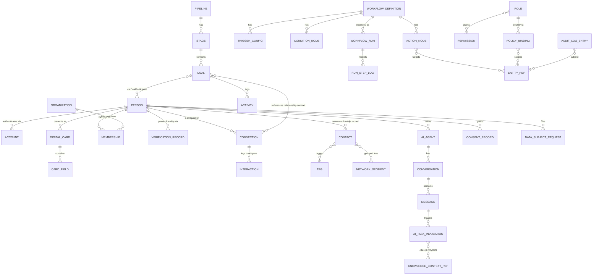

# Cross-Module Entity-Relationship Overview

> Status: v0.1 · Owner: Architecture · Last updated: 2026-06-30
> Scope: design-level ER diagram (key entities and relationships, not full DDL/column lists). Per-module docs reference this diagram rather than redefining shared entities.

## 1. Consolidated Diagram

## 2. Entity Ownership Map

| Entity | Owning Module | Referenced By |
|---|---|---|
| Person, Account, Organization, Membership, DigitalCard, CardField, VerificationRecord | Identity & Card Core | Every other module (by ID, never duplicated) |
| Contact, Connection, Interaction, Tag, NetworkSegment | Contacts / Networking Graph | CRM (deal relationship context), AI Assistant Layer (enrichment context) |
| AIAgent, Conversation, Message, AITaskInvocation, KnowledgeContextRef | AI Assistant Layer | All modules (as a context consumer via `KnowledgeContextRef`/`EntityRef`) |
| Pipeline, Stage, Deal, DealParticipant, Activity, PipelineAutomationRule | CRM / Relationship Pipeline | Automation (action targets), Networking (relationship context) |
| WorkflowDefinition, TriggerConfig, ConditionNode, ActionNode, WorkflowRun, RunStepLog | Automation & Workflow Engine | All modules (as event consumers/producers) |
| Role, Permission, PolicyBinding, AuditLogEntry, ConsentRecord, DataSubjectRequest | Security & Compliance Center | All modules (as the enforcement/audit layer) |
| `EntityRef{module, entityType, entityId}` | Defined in [`01-architecture/01-data-architecture.md`](../01-architecture/01-data-architecture.md) §3 | Automation (`ActionNode.target`), Security (`AuditLogEntry.subject`, `PolicyBinding.scope`), AI (`KnowledgeContextRef` extends it) |

## 3. Condensed-Module Entity Sketch (Lightweight — Full Schemas Deferred to v0.2)

| Module | Core Entities (sketch) |
|---|---|
| Reputation | Endorsement, TrustSignal, ReputationScore (computed, not stored as source of truth) |
| Portfolio | PortfolioItem, MediaAsset, CaseStudy |
| Certifications | Credential, CredentialVerification, ContinuingEducationRecord |
| Documents | Document, DocumentVersion, DocumentShareGrant |
| Meetings | Meeting, MeetingParticipant, MeetingNote, ActionItem |
| Knowledge | KnowledgeArticle, KnowledgeSpace, ArticleRevision |
| Collaboration | Workspace, WorkspaceMember, SharedView |
| Communication | MessageThread, NotificationPreference, DeliveryLog |
| Analytics & Insights | MetricSnapshot, Dashboard, InsightSuggestion (AI-generated) |
| Marketplace & Extensions | ExtensionListing, ExtensionInstallation, ExtensionPermissionGrant |

All condensed-module entities that need to reference core or other-module data do so via `EntityRef`, never via direct foreign keys across module schemas — consistent with the boundary enforced in [`01-architecture/00-system-architecture.md`](../01-architecture/00-system-architecture.md).

## 4. Design Coherence Note

The recurring pattern across this diagram is: **exactly one** owning module per entity, **zero** duplicated profile/contact fields outside Identity & Card Core, and **one** polymorphic cross-module reference shape (`EntityRef`) reused by Automation, Security, and AI rather than each module inventing its own. This is the concrete data-modeling discipline that keeps "one identity graph, many views" (see [`00-vision/00-product-philosophy.md`](../00-vision/00-product-philosophy.md)) true as the module count grows.
