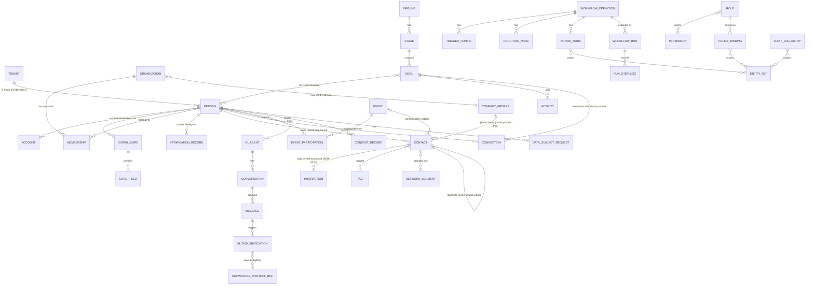

# Cross-Module Entity-Relationship Overview

> Status: v0.3 · Owner: Architecture · Last updated: 2026-09-29
> Scope: design-level ER diagram (key entities and relationships, not full DDL/column lists). Per-module docs reference this diagram rather than redefining shared entities.

## 1. Consolidated Diagram

```mermaid
erDiagram
    PERSON ||--o{ ACCOUNT : "authenticates via"
    TENANT ||--o{ PERSON : "is home of (ADR-0001)"
    PERSON ||--o{ DIGITAL_CARD : "presents as"
    DIGITAL_CARD ||--o{ CARD_FIELD : contains
    PERSON ||--o{ MEMBERSHIP : "belongs to"
    ORGANIZATION ||--o{ MEMBERSHIP : "has members"
    PERSON ||--o{ VERIFICATION_RECORD : "proves identity via"

    PERSON ||--o{ CONTACT : "owns relationship record"
    PERSON ||--o{ CONNECTION : "is endpoint of"
    CONTACT ||--o{ INTERACTION : "logs private touchpoint (ADR-0020)"
    CONTACT }o--o{ TAG : tagged
    CONTACT }o--o{ NETWORK_SEGMENT : "grouped into"
    CONTACT ||--o{ CONTACT : "reportsTo (owner-private edge)"

    COMPANY_PROFILE |o--o{ CONTACT : "placed under (owner-private tree)"
    ORGANIZATION }o--o| COMPANY_PROFILE : "may link by domain"

    EVENT ||--o{ EVENT_PARTICIPATION : "records presence"
    PERSON ||--o{ EVENT_PARTICIPATION : attends
    EVENT |o--o{ CONTACT : "contextualizes capture"

    PERSON ||--o{ AI_AGENT : owns
    AI_AGENT ||--o{ CONVERSATION : has
    CONVERSATION ||--o{ MESSAGE : contains
    MESSAGE ||--o{ AI_TASK_INVOCATION : triggers
    AI_TASK_INVOCATION }o--o{ KNOWLEDGE_CONTEXT_REF : "cites (EntityRef)"

    PIPELINE ||--o{ STAGE : has
    STAGE ||--o{ DEAL : contains
    DEAL }o--o{ PERSON : "via DealParticipant"
    DEAL ||--o{ ACTIVITY : logs
    DEAL }o--o{ CONNECTION : "references relationship context"

    WORKFLOW_DEFINITION ||--o{ TRIGGER_CONFIG : has
    WORKFLOW_DEFINITION ||--o{ CONDITION_NODE : has
    WORKFLOW_DEFINITION ||--o{ ACTION_NODE : has
    WORKFLOW_DEFINITION ||--o{ WORKFLOW_RUN : "executes as"
    WORKFLOW_RUN ||--o{ RUN_STEP_LOG : records
    ACTION_NODE }o--o{ ENTITY_REF : targets

    ROLE }o--o{ PERMISSION : grants
    ROLE ||--o{ POLICY_BINDING : "bound via"
    POLICY_BINDING }o--o{ ENTITY_REF : scopes
    AUDIT_LOG_ENTRY }o--o{ ENTITY_REF : subject
    PERSON ||--o{ CONSENT_RECORD : grants
    PERSON ||--o{ DATA_SUBJECT_REQUEST : files
```

> **v0.3 changes (2026-09-29).** `INTERACTION` now hangs off the author's `CONTACT`, not the shared `CONNECTION`: under the v0.2 edge, each person could read the other's private notes ([ADR-0020](../adr/0020-interactions-owned-by-contact.md)). `CONNECTION` is a data-free edge and is tenant-less, joining `COMPANY_PROFILE` as the second scoped exception to tenant scoping. `TENANT` is shown because every person now has a personal tenant, and every tenant-scoped row carries `tenant_id`. Not drawn: `OUTBOX_EVENT` (tenant-scoped, one row per committed write, ids only — [ADR-0007](../adr/0007-event-backbone-choice.md) amendment) and `SCHEMA_MIGRATIONS` ([ADR-0021](../adr/0021-schema-migrations.md)), which are infrastructure rather than domain entities.

## 2. Entity Ownership Map

| Entity | Owning Module | Referenced By |
|---|---|---|
| Person, Account, Organization, Membership, DigitalCard, CardField, VerificationRecord | Identity & Card Core | Every other module (by ID, never duplicated) |
| Contact, Connection, Interaction, Tag, NetworkSegment, Event, EventParticipation | Contacts / Networking Graph | CRM (deal relationship context), AI Assistant Layer (enrichment context, batch follow-up grouping by `Event`) |
| CompanyProfile | Identity & Card Core | Contacts (org-tree placement via `Contact.companyProfileId`), CRM (account context), Discovery. **The corpus's only tenant-less entity** — global firmographic reference data carrying no person-identifying field, per [ADR-0016](../adr/0016-public-company-directory-closed-people-graph.md) |
| AIAgent, Conversation, Message, AITaskInvocation, KnowledgeContextRef | AI Assistant Layer | All modules (as a context consumer via `KnowledgeContextRef`/`EntityRef`) |
| Pipeline, Stage, Deal, DealParticipant, Activity, PipelineAutomationRule | CRM / Relationship Pipeline | Automation (action targets), Networking (relationship context) |
| WorkflowDefinition, TriggerConfig, ConditionNode, ActionNode, WorkflowRun, RunStepLog | Automation & Workflow Engine | All modules (as event consumers/producers) |
| Role, Permission, PolicyBinding, AuditLogEntry, ConsentRecord, DataSubjectRequest | Security & Compliance Center | All modules (as the enforcement/audit layer) |
| `EntityRef{module, entityType, entityId}` | Defined in [`01-architecture/01-data-architecture.md`](../01-architecture/01-data-architecture.md) §3 | Automation (`ActionNode.target`), Security (`AuditLogEntry.subject`, `PolicyBinding.scope`), AI (`KnowledgeContextRef` extends it) |

## 3. Condensed-Module Entity Sketch (Lightweight — Full Schemas Deferred to v0.2)

| Module | Core Entities (sketch) |
|---|---|
| Reputation | Endorsement, TrustSignal, ReputationScore (computed, not stored as source of truth) |
| Portfolio | PortfolioItem, MediaAsset, CaseStudy |
| Certifications | Credential, CredentialVerification, ContinuingEducationRecord |
| Documents | Document, DocumentVersion, DocumentShareGrant |
| Meetings | Meeting, MeetingParticipant, MeetingNote, ActionItem |
| Knowledge | KnowledgeArticle, KnowledgeSpace, ArticleRevision |
| Collaboration | Workspace, WorkspaceMember, SharedView |
| Communication | MessageThread, NotificationPreference, DeliveryLog |
| Analytics & Insights | MetricSnapshot, Dashboard, InsightSuggestion (AI-generated) |
| Marketplace & Extensions | ExtensionListing, ExtensionInstallation, ExtensionPermissionGrant |

All condensed-module entities that need to reference core or other-module data do so via `EntityRef`, never via direct foreign keys across module schemas — consistent with the boundary enforced in [`01-architecture/00-system-architecture.md`](../01-architecture/00-system-architecture.md).

## 4. Design Coherence Note

The recurring pattern across this diagram is: **exactly one** owning module per entity, **zero** duplicated profile/contact fields outside Identity & Card Core, and **one** polymorphic cross-module reference shape (`EntityRef`) reused by Automation, Security, and AI rather than each module inventing its own. This is the concrete data-modeling discipline that keeps "one identity graph, many views" (see [`00-vision/00-product-philosophy.md`](../00-vision/00-product-philosophy.md)) true as the module count grows.

One deliberate asymmetry is worth naming: every entity above is tenant-scoped **except `CompanyProfile`**, which is global by design so that firmographic data is enriched once platform-wide rather than re-derived per tenant. The org tree that renders beneath a `CompanyProfile` is *not* global — it is composed solely of the viewing owner's own `Contact` rows, so "a viewer sees only their own contacts" holds by construction rather than by a permission filter. That split is the whole of the exception, and it is stated in [ADR-0016](../adr/0016-public-company-directory-closed-people-graph.md) and [`01-architecture/09-experience-and-interaction-rulebook.md`](../01-architecture/09-experience-and-interaction-rulebook.md) §9.
