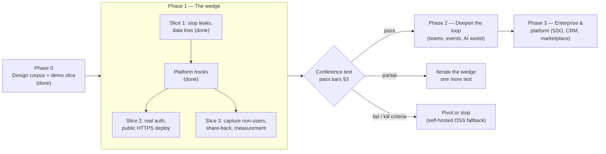

# Implementation Phases

> Status: v0.3 · Owner: Architecture · Last updated: 2026-09-29
> Governing decision: [ADR-0018 — Wedge-first sequencing](../adr/0018-wedge-first-sequencing.md). Debt carried between phases: [`tech-debt.md`](tech-debt.md).

The design corpus describes the target platform. This document describes **the order** we build it in, the gate between each phase, and what each deferred capability is waiting for. Every phase leaves the extension points the next one needs, and [ADR-0022](../adr/0022-architecture-fitness-tests.md)'s fitness tests keep them from eroding.

## 1. Overview

## 2. Phases

### Phase 0 — Design corpus and demo slice (done, v0.1–v0.2)
The design corpus (16 modules, 16 ADRs, the experience rulebook) was written first. A thin vertical slice was then built on it:

- cards with four field visibilities;
- scoped, expiring shares;
- field requests;
- contacts with private notes;
- the company directory and owner-private org trees;
- an offline-capable installable web app;
- a static demo build.

### Phase 1 — The wedge (in progress)

| Step | Scope | Status | Blocked on |
|---|---|---|---|
| **Slice 1** | Notes private to their author (ADR-0020); idempotent offline replays; correct recency; migrations (ADR-0021); backups; restart policies; demo identities off by default; company edits closed | Done | — |
| **Platform hooks** | `tenant_id` everywhere; outbox events; `/api/v1` + OpenAPI; `interaction.visibility`; message catalogue; fitness tests (ADR-0022) | Done | — |
| **Slice 2** | Magic-link auth (ADR-0017); session cookie; sign-out clears cache and queue; the queue keeps items on 401/403; rate limits; CORS locked to the web origin; Caddy + TLS in front of `web` | Not started | A public domain with TLS, an email-sending account (Postmark/Resend) with DNS access, the event date |
| **Slice 3** | Manual capture of non-users (offline); share-back form on the recipient page; vCard `URL:` to a share link; `product_event` measurement from the outbox; privacy notice; data-deletion script | Not started | Nothing — can run before Slice 2 |
| **Dress rehearsal** | Card in under two minutes; share to a phone with no signal; share-back; capture three people; `report.sql` computes every bar | — | Slices 2 and 3 |

### Phase 2 — Deepen the loop (gated on the conference test)
Chosen by the result, not in advance. The candidates, with what they build on:

| Candidate | Unlocked by | Builds on (already in code) |
|---|---|---|
| Reconnection nudges by email or push | Testers return, but only when reminded | Outbox `interaction.logged`; per-contact recency |
| Workspaces / team sharing (rulebook §10.5) | A tester asks to share contacts with a colleague | `tenant` table (`kind = organization`); `interaction.visibility = organization` |
| Events as a primitive (ADR-0013) | Testers tag captures by event without being asked | `contact.capture_context`; outbox |
| AI follow-up drafts and enrichment (ADR-0005) | Capture volume ≥ 5 per participant, and notes are being written | Outbox as context feed; `ModelRouter` seam; `enrichment_source = 'ai'` reserved |
| Outbox relay + webhooks (ADR-0007) | The first automation or integration request | `outbox_event` with `published_at` |
| RLS enabled (ADR-0001) | Before any organization tenant exists, or 1,000 users | `tenant_id NOT NULL` on every tenant table |
| Native wrapper (ADR-0019) | NFC/Wallet requested unprompted; push reach on iOS | PWA; layered `api.ts` / `types.ts` |

### Phase 3 — Enterprise and platform
- CIAM with SSO/SCIM (ADR-0008 as written).
- CRM pipeline and integrations.
- GraphQL aggregation (ADR-0003).
- Marketplace.
- Database-per-tenant and regional pods (ADR-0001, ADR-0012).
- The ten condensed modules, promoted by demand.

## 3. The Phase 1 gate (fixed before the event)

**Participants:** about fifteen independent professionals at one event. **Journey:** create a card beforehand → share by QR, including with no signal → capture the people you meet → return within fourteen days.

| Signal | Pass |
|---|---|
| Participants who capture 5+ people during the event | ≥ 60% |
| Participants who reopen a captured contact within 14 days | ≥ 40% |
| Recipients who submit the share-back form | ≥ 20% |

**Kill criteria:**
- If fewer than three testers log a second interaction on any contact by day 21, the relationship layer is not a habit.
- If share-back is near zero, the capture positioning fails.
- If a $5/month pre-order page converts under 1% of about 300 targeted visitors, fall back to the self-hosted open-source framing.

The 90-day revisit rate stays the confirming measure.

## 4. Mapping the brief to phases

| Brief pillar | Phase | Current state |
|---|---|---|
| Identity (cards, visibility) | 1 | Built |
| Networking (contacts, notes, reconnection) | 1 | Built; non-user capture in Slice 3 |
| Offline-first, mobile-first | 1 | Built for capture (PWA) |
| Privacy by design | 1 | Built; notes private by construction; outbox carries no content |
| Security by design | 1 | Partial: auth is interim (TD-03) |
| API-first, versioned, documented | 1 | Built: `/api/v1` + OpenAPI; SDK/CLI later |
| Event-driven | 1 → 2 | Producing side built; relay and consumers in Phase 2 |
| Multi-language | 1 | Catalogue built; one language |
| Multi-tenant | 1 → 2 | Column-level built; RLS in Phase 2 |
| AI-first | 2 | Seams only |
| Automation, workflows | 2 | Seams only (outbox) |
| CRM, collaboration, meetings, documents, knowledge, reputation, portfolio, certifications, communication | 2–3 | Designed, unbuilt |
| Enterprise (SSO, SCIM, residency) | 3 | Designed, unbuilt |
| Multi-region | 3 | Single region, documented DR (ADR-0012 note) |
